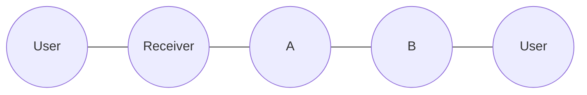
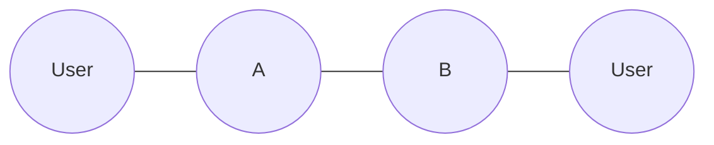
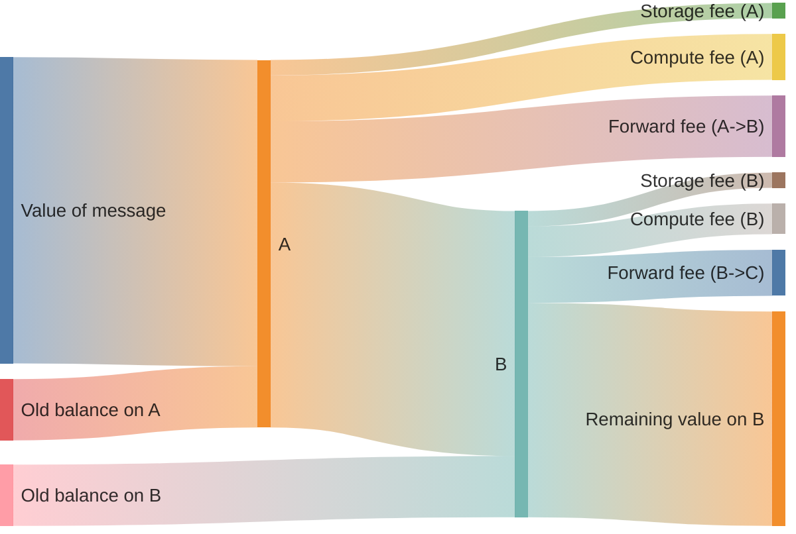

import { Aside } from "/snippets/aside.jsx";

Contracts which receive a user's message are referred to as **receiver** contracts. Other contracts in the same system are called **internal** contracts. This terminology is local to the current article. Consider a contract system with three contracts: receiver, and internal contracts **A** and **B**. In that system the typical trace looks like this (transactions move from left to right):



<Aside type="tip">
  This article covers abstract contracts system, not connected to any existing project. However, it's primarily applicable to contract systems that use a carry-value pattern.
</Aside>

It is important to understand that there is _no separate_ message balance and contract balance. After the message is received, coins from the message are stored to the contract balance, and then the contract is executed. [Sending message modes](/foundations/messages/modes) and [reserve actions](/foundations/actions/reserve) help to properly divide contract balance in the action phase. This diagram of a possible value flow illustrates this.





Receiver contracts must verify that the attached Toncoin is sufficient to cover fees for all contracts in the subsequent trace. If an entry contract accepts a user message it must guarantee that the message will not later fail due to insufficient attached TON. "Accept" doesn't mean the call to `accept_message()`, but semantic acceptance, i.e., no throw and no asset returns.

The reason for this requirement is that reverting the contract system state is usually not possible, because the Toncoin is already spent.

When a contract system's correctness depends on successful execution of the remaining transaction trace, it must guarantee that an incoming message carries enough attached Toncoin to cover all fees. This article describes how to compute those fees.

Define variables for limits and initialize them with zero. We will set them to actual values afterwards.

Use descriptive names for the operation and the contract. It's best to store them in a dedicated file with constants.

```tact
const GasSwapRequest: Int = 0;
```

- Run tests covering all execution paths. Missing a path might hide the most expensive one.
- Extract resource consumption from the `send()` method's return value. The sections below describe ways to compute consumption of different kinds of resources.
- Use `expect(extractedValue).toBeLessThanOrEqual(hardcodedConstant)` to verify that the hardcoded limit was not exceeded.

```ts
import {findTransactionRequired} from "@ton/test-utils";

const result = await contract.send(/* params */);
const vaultTx = findTransactionRequired(result.transactions, {
    on: contract.address,
    op: 0x12345678,
});
expect(
    getComputeGasForTx(vaultTx),
).toBeLessThanOrEqual(GasSwapRequest);
```

After the first run, use the displayed error message to find the actual value for the constant.

```text
expect(received).toBeLessThanOrEqual(expected)

Expected: <= 0n
Received:    11578n
```

```tact
const GasSwapRequest: Int = 12000;
```

### Compute fees

There are two kinds of values: gas units and Toncoin. The price of contract execution is fixed in gas units. However, the price of the gas itself is determined by the blockchain configuration.

Conversion of gas to Toncoin on-chain using currently set blockchain config parameters can be performed with

```tact
let fee = getComputeFee(hardcodedGasValue, isAccountInMasterchain);
```

This function uses the [`GETGASFEE`](/tvm/instructions#f836-getgasfee) TVM opcode.

### Forward fees

Forward fee is calculated with this formula:

```
fwdFee = lumpPrice
       + priceForCells * (msgSizeInCells - 1)
       + priceForBits * (msgSizeInBits - bitsInRoot)
```

where

- `lumpPrice` is the fixed value [from config](/foundations/config#param-24-and-25%3A-message-price) paid once for the message.
- `msgSizeInCells` is the number of cells in the message.
- `msgSizeInBits` is the number of bits in all the cells of the message.

In Tolk, `cell.calculateSizeStrict()` can be used to compute `msgSizeInCells` and `msgSizeInBits`. In TVM, it's implemented as [`CDATASIZE`](/tvm/instructions#f941-cdatasize) instruction.

In Tolk, the formula above is implemented in `calculateForwardFee()`. In TVM, it's implemented as [`GETFORWARDFEE`](/tvm/instructions#f838-getforwardfee) instruction.

```tact
let sizeMsg = computeDataSize(
    msg.toCell(),
    8192
);

let fwdFee = getForwardFee(
    sizeMsg.cells - 1,
    sizeMsg.bits - msg.toCell().bits(),
    isAccountInMasterchain
);
```

<Aside
  type="caution"
>
  The `computeDataSize()` function consumes large, unpredictable amount of gas. If at all it is possible to precompute the size, it is recommended to do so.

  If required, the function has the second argument: maximum number of cells to visit. Usually it is set to 8192 since it is the [limit for message size](/foundations/limits#message-and-transaction-limits). It might be used to limit amount of spent gas.
</Aside>

In Tolk, both computations can be performed with a call to `msg.send()` with mode 1024. In TVM, it's implemented as [`SENDRAWMSG`](/tvm/instructions#fb00-sendrawmsg). It will consume approximately the same amount of gas.

### Optimized forward fee calculation

If the size of the outgoing message is bounded by the size of the incoming message, we can estimate the forward fee of an outgoing message to be no larger than the forward fee of the incoming message, that was already computed by TVM. Thus, we don't have to calculate it again. Note that this estimation is correct only for a contract system in the same workchain, because gas prices depend on the workchain.

```tolk
fun onInternalMessage(in: InMessage) {
    val fwdFee = in.originalForwardFee;
    // ...
}
```

### Complex forward fee calculation

Assume the contract receives a message with an unknown size and forwards it further adding fields with total of `a` bits and `b` cells to the message, e.g., [`StateInit`](/foundations/messages/deploy).

For this case, in Tolk, there is a function `calculateForwardFeeWithoutLumpPrice()`. In TVM, it's implemented as [`GETFORWARDFEESIMPLE`](/tvm/instructions#f83c-getforwardfeesimple). This function does not take `lumpPrice` into account.

```tolk
fun onInternalMessage(in: InMessage) {
    val origFwdFee = in.originalForwardFee;

    // "Out" message will consist of fields from
    // "in" message, and some extra fields.
    // Forward fee for "out" message is estimated
    // from a forward fee for "in" message
    val additionalFwdFee = getSimpleForwardFee(
        additionalFieldsSize.cells,
        additionalFieldsSize.bits,
        isAccountInMasterchain
    );
    val totalFwdFee = origFwdFee + additionalFwdFee;

    // Remember to multiply totalFwdFee by the number
    // of hops in the trace
}
```

### Storage fees

<Aside>
  For calculating storage fees, maximum possible size of the contract in `cells` and `bits` should be known. Calculating it manually might be hard, if the contract stores a hashmap or some other complex data structure in its state.

  It might be easier to compute it by writing a test that will occupy maximum possible size, and use the measured value. There are [helper functions](#helper-functions) for doing these measurements.
</Aside>

We cannot predict storage fees that we have to pay for sending messages because it depends on how long the target contract didn't pay storage fee. Storage fees differ in this way from forward and compute fees, as they should be handled both in receiver and internal contracts.

#### Maintain a positive reserve

Always keep a minimum balance on all contracts in the system. Storage fees get deducted from this reserve. The reserve get replenished with each user interaction. Do not hardcode Toncoin values for fees. Instead, hardcode the maximum possible contract size in cells and bits.

This approach affects code of internal contracts.

<Aside type="tip">
  It is the developer's decision for how long the storage fees should be reserved. Popular options are 5 and 10 years.
</Aside>

```tact
const secondsInFiveYears: Int = 5 * 365 * 24 * 60 * 60;
receive(msg: Transfer) {
    let minTonsForStorage: Int = getStorageFee(
        maxCells,
        maxBits,
        secondsInFiveYears,
        isAccountInMasterchain
    );
    nativeReserve(
        max(oldBalance, minTonsForStorage),
        ReserveAtMost
    );
    // Process operation with remaining value...
}
// Also this contract probably will require some code, that will allow owner to withdraw TONs from this contract.
```

In this approach, a receiver contract should calculate maximum possible storage fees for all contracts in trace.

```tact
const secondsInFiveYears: Int = 5 * 365 * 24 * 60 * 60;
receive(msg: UserIn) {
    // Suppose trace will be
    // receiver -> A -> B
    let storageForA = getStorageFee(
        maxCellsInA,
        maxBitsInA,
        secondsInFiveYears,
        isAccountInMasterchain
    );
    let storageForB = getStorageFee(
        maxCellsInB,
        maxBitsInB,
        secondsInFiveYears,
        isAccountInMasterchain
    );
    let totalStorageFees = storageForA + storageForB;
    // compute compute + forward fees here
    let otherFees = 0;
    require(
        messageValue() >= totalStorageFees + otherFees,
        "Not enough TONs"
    );
}
```

<Aside
  type="caution"
>
  Verify the hardcoded contract size in tests.
</Aside>

#### Cover storage on demand

The order of phases [depends](/foundations/phases) on the `bounce` flag of an incoming message. If all messages in the protocol are unbounceable, then the storage phase comes after the credit phase. So, the contract's storage fees are deducted from the joint balance of the contract and incoming message. In this case the pattern where the contract's balance is zero and incoming messages cover storage fees can be applied.

It is impossible to know in advance what the storage fee due will be on the contract, so a threshold must be selected depending on the network configuration. It is a good practice to use [`freeze_due_limit`](/foundations/config#param-20-and-21%3A-gas-prices) as the threshold. Otherwise, the contract likely is already frozen and a transaction chain is likely to fail anyway.

This pattern can be generalized to both bounceable and unbounceable messages with `myStorageDue()` function that returns [`storage_fees_due`](/foundations/phases#storage-phase)

This approach affects code of internal contracts.

```tact
receive(msg: Operation) {
    // Reserve original balance plus any storage debt
    nativeReserve(
        myStorageDue(),
        ReserveAddOriginalBalance | ReserveExact
    );

    // Send remaining value onward
    send(SendParameters{
        value: 0,
        mode: SendRemainingBalance,
        // ...
    });
}
```

If we expect that the rest of trace uses `n` unique contracts, then it won't take more than `n` freeze limits to pay their storage fees. So, in the receiver contract, the check should be:

```tact
receive(msg: Operation) {
    // The trace is still receiver -> A -> B
    let freezeLimit = getFreezeLimit(isAccountsInMasterchain);
    let otherFees = ...;
    // n equals 3 because receiver -> A -> B
    require(
        messageValue() >= freezeLimit * 3 + otherFees,
        "Not enough TONs"
    );
}
```

For contracts using this approach, confirm there is no excess accumulation:

```typescript
it("should not accumulate excess balance", async () => {
    await pool.sendSwap(amount);
    const contract = await blockchain.getContract(
        pool.address,
    );
    const balance = contract.balance;
    expect(balance).toEqual(0n);
});
```

This confirms that all incoming value was consumed or forwarded, with none left behind. It helps identify any bugs that cause accumulation of TON on any contract.

## Implement fee validation

The final code in the receiver contract could look like this:

```tact
receive(msg: SwapRequest) {
    let ctx = context();
    let fwdFee = ctx.readForwardFee();

    // Count all messages in the operation chain
    // IMPORTANT: We know that each of messages is
    // less or equal to `SwapRequest`.
    let messageCount = 3;  // receiver -> vault → pool → vault

    // Calculate minimum required
    let minFees =
        messageCount * fwdFee +
        // Operation in first vault
        getComputeFee(GasSwapRequest, isInMasterchain) +
        // Operation in pool
        getComputeFee(GasPoolSwap, isInMasterchain) +
        // Operation in second vault
        getComputeFee(GasVaultPayout, isInMasterchain) +
        3 * getFreezeLimit();

    require(
        ctx.value >= msg.amount + minFees,
        "Insufficient TON attached"
    );

    // Send remaining value for fees...

    // It may also be necessary to handle fees on this exact
    // contract if it is not supposed to hold users' TONs.
    // That can be done in either of the two approaches
    // described above.
}
```

## Helper functions

Getting gas for transaction in sandbox is quite easy:

```ts
function getComputeGasForTx(tx: Transaction): bigint {
    if (tx.description.type !== "generic") {
        throw new Error("Expected generic transaction");
    }
    if (tx.description.computePhase.type !== "vm") {
        throw new Error("Expected VM compute phase");
    }
    return tx.description.computePhase.gasUsed;
}
```

To calculate the size of a message in cells, use this function:

```ts
const calculateCellsAndBits = (
    root: Cell,
    visited: Set<string> = new Set<string>()
) => {
    const hash = root.hash().toString("hex");
    if (visited.has(hash)) {
        return { cells: 0, bits: 0 };
    }
    visited.add(hash)
    let cells = 1;
    let bits = root.bits.length;
    for (const ref of root.refs) {
        const childRes = calculateCellsAndBits(
            ref,
            visited,
        );
        cells += childRes.cells;
        bits += childRes.bits;
    }
    return { cells, bits, visited };
};
```

To extract a contract's size in tests, use this function:

```ts
export async function getStateSizeForAccount(
    blockchain: Blockchain,
    address: Address,
): Promise<{cells: number; bits: number}> {
    const contract = await blockchain.getContract(address);
    const accountState = contract.accountState;
    if (!accountState || accountState.type !== "active") {
        throw new Error("Account state not found");
    }
    if (!accountState.state.code || !accountState.state.data) {
        throw new Error("Account state code or data not found");
    }
    const accountCode = accountState.state.code;
    const accountData = accountState.state.data;
    const codeSize = calculateCellsAndBits(
        accountCode,
    );
    const dataSize = calculateCellsAndBits(
        accountData,
        codeSize.visited,
    );
    return {
        cells: codeSize.cells + dataSize.cells,
        bits: codeSize.bits + dataSize.bits,
    };
};
```

Message-size constants should be verified across all possible paths in tests. Otherwise, the resulting gas estimates might be wrong.
