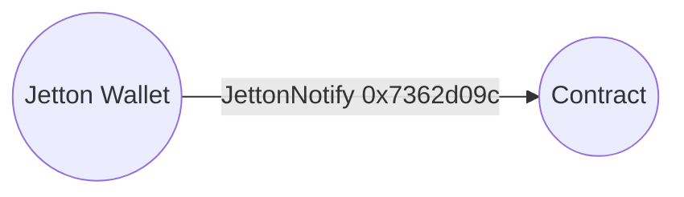
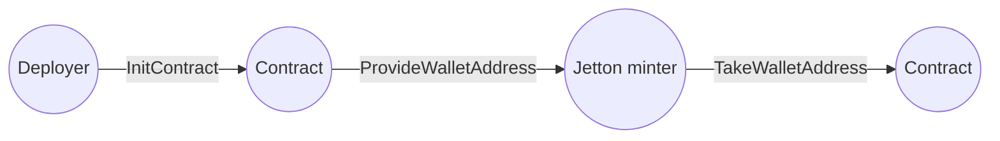

import { Aside } from '/snippets/aside.jsx';

<Aside>
  Read this article after understanding the [Jetton](/standard/tokens/jettons/overview) architecture.
</Aside>

Contracts routinely process jettons for DEX, escrow, and lending protocols. Each contract must determine which jetton type arrived when a `JettonNotify` message shows up.



## Known Jetton, trusted deployer

When someone does a Jetton transfer, they deploy a new `JettonWallet`, that has an address depending on the address of `JettonMinter` and the address of the receiver, and then send a message with a type `JettonNotify` to the regular wallet (or other kind of contract) that tells the transfer succeeded. The attacker might send a `JettonNotify` message from a contract that is not a valid `JettonWallet`, so handling it requires care.

To handle the `JettonNotify` message, it's preferable to precompute the address of the `JettonWallet` for a specific minter (i.e. Jetton type) in advance, so that the validation only consists of checking two addresses for equality.

Here is an example of a contract that handles `JettonNotify` messages. It's deployed along with a `SetTrustedJettonWallet` message with an address of `JettonWallet` that is owned by this same contract.

When deploying with this pattern, [calculate](/standard/tokens/jettons/find) the Jetton wallet address that must receive top-ups. It is impossible to hardcode the jetton wallet address in the contract's [`StateInit`](/foundations/messages/deploy), because the wallet address depends on the contract address and creates a circular dependency.

To handle several Jetton types with a single contract, `trustedJettonWallet` should be modified to store several addresses.

The `jettonMinter` address is included in `Storage`, because otherwise every instance of this contract owned by the same owner will deploy to the same address, even if there was an intent to have them with different `trustedJettonWallet`s.

This approach is used by [Bidask](https://bidask.finance/en/).

```tolk expandable
tolk 1.2;

struct Storage {
    owner: address;
    trustedJettonWallet: address?;
    jettonMinter: address;
}

fun Storage.load(): Storage {
    return Storage.fromCell(contract.getData());
}

fun Storage.save(self) {
    return contract.setData(self.toCell())
}

struct (0x7362d09c) JettonNotify {
    queryId: uint64
    jettonAmount: coins
    transferInitiator: address
    jettonVaultPayload: RemainingBitsAndRefs
}

struct (0x12345678) SetTrustedJettonWallet {
    trustedJettonWallet: address
}

type AllowedMessage = JettonNotify | SetTrustedJettonWallet;

fun onInternalMessage(in: InMessage) {
    val msg = lazy AllowedMessage.fromSlice(in.body);
    match (msg) {
        SetTrustedJettonWallet => {
            var storage = Storage.load();
            if (storage.owner != in.senderAddress || storage.trustedJettonWallet != null) {
                return;
            }
            storage.trustedJettonWallet = msg.trustedJettonWallet;
            storage.save();
        },
        JettonNotify => {
            var storage = Storage.load();
            if (storage.trustedJettonWallet == null || storage.trustedJettonWallet != in.senderAddress) {
                return;
            }
            // Process jettons
        }
    }
}
```

## Unknown TEP-89 Jetton or untrusted deployer

In the previous example, addresses of `jettonMinter` and `trustedJettonWallet` are chosen off-chain by a deploying party. Someone who depends on this contract has to trust that the wallet belongs to this minter, which is not a problem, for example, for an exchange. If deployer might be monetarily interested to break this invariant, the previous approach is not suitable, and the address of the `trustedJettonWallet` address must be computed on-chain.

Most modern Jettons implement [TEP-89](https://github.com/ton-blockchain/TEPs/blob/66675fc7ecda1e3dc1524159d6bfcaa2ed2372fe/text/0089-jetton-wallet-discovery.md), that defines a message `provide_wallet_address` that requests a Jetton wallet address for an arbitrary owner, and `take_wallet_address` message with a response.

The contract works similarly to the example above, except it's deployed along with a `InitContract` message, that asks a `JettonMinter` what `jettonWalletAddress` should be.

This approach is used by [DeDust](https://dedust.io/).



The contract that initializes the jetton wallet with this pattern can look like this:

```tolk expandable
tolk 1.2

struct Storage {
    jettonMinterAddress: address
    jettonWalletAddress: address?
}

fun Storage.load(): Storage {
    return Storage.fromCell(contract.getData());
}

fun Storage.save(self) {
    return contract.setData(self.toCell())
}

struct (0x2c76b973) ProvideWalletAddress {
    queryId: uint64
    ownerAddress: address
    includeAddress: bool
}

struct (0xd1735400) TakeWalletAddress {
    queryId: uint64
    walletAddress: address
    ownerAddress: Cell<address>?
}

struct (0x7362d09c) JettonNotify {
    queryId: uint64
    jettonAmount: coins
    transferInitiator: address
    jettonVaultPayload: RemainingBitsAndRefs
}

// Unlike other opcodes here, this can be set arbitrarily
struct (0x12345678) InitContract {}

type AllowedMessage = InitContract | TakeWalletAddress | JettonNotify

fun onInternalMessage(in: InMessage) {
    val msg = lazy AllowedMessage.fromSlice(in.body);
    match (msg) {
        InitContract => {
            var storage = Storage.load();
            val msg = createMessage({
                bounce: true,
                value: 0,
                dest: storage.jettonMinterAddress,
                body: ProvideWalletAddress {
                    queryId: 0,
                    ownerAddress: contract.getAddress(),
                    includeAddress: false,
                },
            });
            msg.send(SEND_MODE_CARRY_ALL_REMAINING_MESSAGE_VALUE);
        }
        TakeWalletAddress => {
            var storage = Storage.load();
            if (storage.jettonMinterAddress != in.senderAddress) {
                return;
            }
            storage.jettonWalletAddress = msg.walletAddress;
            storage.save();
            // After receiving such message contract is initialized
        }
        JettonNotify => {
            var storage = Storage.load();
            if (storage.jettonWalletAddress == null || storage.jettonWalletAddress != in.senderAddress) {
                return;
            }
            // Process jettons
        }
    }
}
```

## Unknown TEP-74 Jetton and untrusted deployer

Jettons that do not have TEP-89 methods for computing a wallet address on-chain are rare. [TONCO DEX](https://tonco.io/) rejects them, while platforms such as [DeDust](https://dedust.io/) allow them after a manual approval flow. There are two approaches, both using get-method emulation.

### Running get-method on-chain

Given a Jetton minter state, we can emulate execution of the minter on-chain via [RUNVM](/tvm/instructions#db4-runvm) instruction. During the emulation, it calls the `get_wallet_address` [get-method](/tvm/get-method) to derive the wallet address for any owner.

This helper uses [Fift](/languages/fift/overview), because it's impossible to assign a type to `c7`.

```tolk expandable
fun calculateJettonWallet(owner: address, jettonData: cell, jettonCode: cell, jettonMinter: address): address asm """
    c7 PUSHCTR
    // Unpack environment information from c7
    // https://docs.ton.org/tvm/registers#c7-%E2%80%94-environment-information-and-global-variables
    0 INDEX
    SWAP
    8 SETINDEX
    SWAP
    DUP
    ROTREV
    10 SETINDEX
    // Make it singleton
    1 TUPLE
    // owner md mc c7
    ROTREV
    CTOS            // owner_addr c7 md mc"
    2 PUSHINT       // owner_addr c7 md mc args"
    103289 PUSHINT  // owner_addr c7 md mc args get_jwa_method_id"
    5 0 REVERSE     // owner_addr get_jwa_method_id args mc md c7"
    // Moves the top stack value (ONE) to the third position: [A, B, C] -> [B, C, A]. We expect only 1 return value. Flag +256 for runvm enables this argument
    ONE 2 -ROLL
    // We use only these modes:
    // +1 = same_c3 (set c3 to code)
    // +4 = load c4 (persistent data) from stack and return its final value
    // +16 = load c7 (smart-contract context)
    // +256 = pop number N, return exactly N values from stack (only if res=0 or 1; if not enough then res=stk_und)
    // Mode 256 is crucial, because it ignores all stack values except the first one, and protects us from stack poisoning
    277 RUNVM        // address exit_code c4'"
    2 BLKDROP       // address";
"""
```

### Approach 1: Non-vanity addresses

If the `JettonMinter` was not deployed with a [vanity](/contract-dev/vanity) contract, address and `StateInit` match. The logic for the contract that handles `JettonNotify` messages is thus

1. get the `StateInit` of `JettonMinter` off-chain;
1. deploy the contract with the address of `JettonMinter` in its data;
1. send a message to the contract with the `StateInit` of `JettonMinter`;
1. contract validates that this `StateInit` matches the address of the `JettonMinter`;
1. contract runs `calculateJettonWallet`
   - `owner` - address of the contract (`contract.getAddress()`);
   - `jettonData`, `jettonCode` - `StateInit` of `JettonMinter`;
   - `jettonMinter` - address of `JettonMinter`.

### Approach 2: where the previous method fails

If the `JettonMinter` was deployed with a vanity contract, or otherwise lacks `get_wallet_address` method, or `get_wallet_address` returns incorrect addresses, we have to use the current state of the contract instead.

To prove that the state is currently at the Jetton minter address, a full [state proof](/foundations/proofs/overview) is required.
