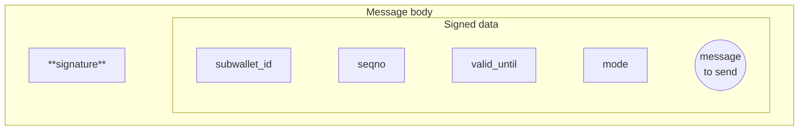
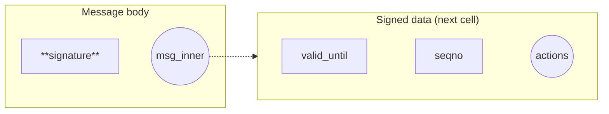

import { Aside } from '/snippets/aside.jsx';

Cryptographic signatures are the foundation of access control. Contracts verify signatures on-chain and implement their own authorization policies for [wallet operations](/standard/wallets/how-it-works#how-ownership-verification-works), server-authorized actions, [gasless transactions](/standard/wallets/v5#gasless-transactions), multisig wallets, and delegation.

## Ed25519 in TON

TON uses [Ed25519](https://en.wikipedia.org/wiki/EdDSA#Ed25519) as the [standard](/foundations/whitepapers/tblkch#a-3-10-cryptographic-ed25519-signatures) signature scheme. All [wallets](/standard/wallets/history) (v1–v5) and [highload wallets](/standard/wallets/highload/overview) rely on Ed25519.

Specification:

- Public key size: 256 bits
- Signature size: 512 bits
- Curve: Ed25519

<Aside
  type="caution"
>
  The public key is _not_ the wallet address. The address is derived from the contract's initial code and data that are included in [`StateInit`](/foundations/messages/deploy) structure. Multiple contracts can use the same public key but have [different addresses](/foundations/addresses/overview).
</Aside>

## Other primitives

TVM exposes additional cryptographic primitives beyond Ed25519. These are useful for cross-chain compatibility and advanced protocols:

| Primitive                                                                                     | Purpose                                                                      |
| --------------------------------------------------------------------------------------------- | ---------------------------------------------------------------------------- |
| [secp256k1](https://en.wikipedia.org/wiki/Secp256k1)                                          | Ethereum-style ECDSA via `ECRECOVER`; x-only pubkey operations (TVM v9+)     |
| [secp256r1 (P-256)](https://en.wikipedia.org/wiki/Elliptic_Curve_Digital_Signature_Algorithm) | ECDSA verification via `P256_CHKSIGNS` and `P256_CHKSIGNU`                   |
| [BLS12-381](https://en.wikipedia.org/wiki/BLS_digital_signature)                              | Pairing-based operations for signature aggregation and zero-knowledge proofs |
| [Ristretto255](https://en.wikipedia.org/wiki/Curve25519#Ristretto)                            | Prime-order group over Curve25519 for advanced cryptographic constructions   |

For details, see crypto instructions in [TVM instructions](/tvm/instructions).

This guide focuses on Ed25519, usually used for TON.

## Signing pipeline

Ed25519 signatures in TON typically work with hashes rather than raw data, because signing the hash takes a smaller and constant amount of time.

- Off-chain (TypeScript)
  - Serialize message data into a cell
  - Compute its hash (256 bits)
  - Sign the hash with private key
  - Signature (512 bits)
- On-chain (Tolk)
  - Contract receives signature and data
  - Recomputes the hash
  - Verifies signature matches the hash and public key

TVM provides two signature verification methods:

- [`CHKSIGNS`](/tvm/instructions#f911-chksigns) checks signature of data;
- [`CHKSIGNU`](/tvm/instructions#f910-chksignu) checks signature of hash.

Hash-based verification (`CHKSIGNU`) is preferred because `CHKSIGNS` only processes data from a single cell (up to $127 * 8 = 1016$ bits) and ignores cell references. For messages containing multiple cells or references, hashing the entire structure first is required.

## Signature interaction patterns

Signatures are used in different ways depending on who signs the message, who sends it, and who pays for execution. Here are three real-world examples.

### Example 1: Standard wallets (v1–v5)

Standard wallet contracts are [described in more detail](/standard/wallets/history) in the wallets section.

How it works:

1. User signs a message off-chain (includes replay protection data and transfer details)
1. User sends external message to blockchain
1. Wallet contract verifies the signature
1. Wallet contract checks seqno for replay protection
1. Wallet contract accepts message (pays gas from wallet balance)
1. Wallet contract increments seqno
1. Wallet contract executes the transfer

Key characteristics:

- Who signs: User
- Who sends: User (external message)
- Who pays gas: Wallet contract

This is the most common pattern.

### Example 2: Gasless transactions (Wallet v5)

How it works:

1. User signs a message off-chain that includes two transfers: one to recipient, one to service as payment
1. User sends signed message to service via API
1. Service verifies the signature
1. Service wraps signed message in internal message
1. Service sends internal message to user's wallet (pays gas in TON)
1. Wallet contract verifies user's signature
1. Wallet contract checks seqno for replay protection
1. Wallet contract increments seqno
1. Wallet contract executes both transfers (to recipient and to service)

Key characteristics:

- Who signs: User
- Who sends: Service (internal message)
- Who pays gas: Service (in TON), gets compensated in Jettons

This pattern enables users to pay gas in Jettons instead of TON.

### Example 3: Server-controlled operations

How it works:

1. User requests authorization from server
1. Server validates request and signs authorization message (includes validity period and operation parameters)
1. User sends server-signed message to contract (with payment)
1. Contract verifies server's signature
1. Contract checks validity period
1. Contract performs authorized action (deploy, mint, claim)
1. If user tries to send same message again, contract ignores it (state already changed)

Key characteristics:

- Who signs: Server
- Who sends: User (internal message with payment)
- Who pays gas: User

This pattern is useful when backend needs to authorize specific operations (auctions, mints, claims) without managing private keys for each user.

Real-world example: [telemint contract](https://github.com/TelegramMessenger/telemint) uses server-signed messages to authorize NFT deployments.

## Message structure for signing

When designing a signed message, the choice is how to organize the signed data — the message fields that will be hashed and verified. The key question: is the signed data a **slice** (part of a cell) or a **cell** (separate cell)? This affects gas consumption during signature verification.

### Approach 1: Signed data as slice

After loading the signature from the message body, the signed data remains as a **slice** — a part of the cell that may contain additional data and references.

Used in: Wallet v1-v5

Schema — Wallet v3r2:

```tlb
msg_body$_ signature:bits512 subwallet_id:uint32
           seqno:uint32 valid_until:uint32
           mode:uint8 message_to_send:^Cell
           = ExternalInMessage;
```



Verification in FunC:

```func
slice signature = in_msg_body~load_bits(512);
slice signed_data = in_msg_body;  // Remaining data

int hash = slice_hash(signed_data);  // 526 gas
throw_unless(35, check_signature(hash, signature, public_key));
```

Gas analysis:

After loading the signature, the remaining data is a **slice**. To verify the signature, the contract needs to hash this slice. In TVM, the method for hashing a slice is `slice_hash()`, which costs `526` gas.

Why expensive?\
`slice_hash()` internally rebuilds a cell from the slice, copying all data and references.

<Aside
  type="tip"
  title="Optimization available"
>
  Recent TVM versions support `builder_hash()` for efficient hashing. Convert the slice to a builder and hash it — this costs less than 100 gas total. See [Optimization: Builder hashing](#optimization-builder-hashing) below for details.
</Aside>

### Approach 2: Signed data as cell

The signed data is stored in a **separate cell**, placed as a reference in the message body.

Used in: Preprocessed Wallet v2, Highload Wallet v3

Schema — Preprocessed Wallet v2:

```tlb
_ valid_until:uint64 seqno:uint16 actions:^Cell = MsgInner;

msg_body$_ signature:bits512 msg_inner:^MsgInner = ExternalInMessage;
```



Verification in FunC:

```func
slice signature = in_msg_body~load_bits(512);
cell signed_data = in_msg_body~load_ref();  // Signed data as cell

int hash = cell_hash(signed_data);  // 26 gas
throw_unless(35, check_signature(hash, signature, public_key));
```

Gas analysis:

The signed data is loaded as a **cell** from the reference. To get its hash, the contract uses `cell_hash()`, which costs only 26 gas.

Why efficient?\
Every cell in TON stores its hash as metadata. `cell_hash()` reads this precomputed value directly — no rebuilding, no copying.

Trade-off:\
This approach adds one extra cell to the message, slightly increasing the forward fee. However, the gas savings (\~500 gas) outweigh the forward fee increase.

### Optimization: Builder hashing

Recent TVM versions introduced efficient builder hashing (`HASHBU` instruction), which makes **signed data as slice** approach much more gas-efficient.

Verification in FunC (optimized):

```func
slice signature = in_msg_body~load_bits(512);
slice signed_data = in_msg_body;

builder b = begin_cell().store_slice(signed_data);
int hash = b.builder_hash();
throw_unless(35, check_signature(hash, signature, public_key));
```

Gas comparison:

| Method                  | Gas cost  | Notes                              |
| ----------------------- | --------- | ---------------------------------- |
| `slice_hash()`          | 526 gas   | Rebuilds cell from slice           |
| Builder hashing (slice) | \<100 gas | With HASHBU: cheap builder hashing |
| `cell_hash()` (cell)    | 26 gas    | Uses precomputed cell hash         |

Conclusion:\
With builder hashing optimization, both approaches are gas-efficient. New contracts can choose based on code simplicity and forward fee considerations.

Reference: [`GlobalVersions.md` — TVM improvements](https://github.com/ton-blockchain/ton/blob/5c0349110bb03dd3a241689f2ab334ae1a554ffb/doc/GlobalVersions.md#new-tvm-instructions-4)

## How to sign messages in TypeScript

### Prerequisites

- Node.js 18+ or TypeScript environment
- `@ton/core`, `@ton/crypto` packages installed

Install required packages:

```bash
npm install @ton/core @ton/crypto
```

### Step 1: Generate or load a mnemonic

A mnemonic is the wallet's master secret. It derives the private key used to sign messages.

Generate a new mnemonic:

```typescript
import { mnemonicNew } from '@ton/crypto';

const mnemonic = await mnemonicNew(24); // Array of 24 words
```

Load an existing mnemonic:

```typescript
// Read from environment; do not inline secrets
const mnemonic = (process.env.MNEMONIC ?? 'MNEMONIC_WORDS').split(' ');
```

<Aside
  type="danger"
  title="Protect the mnemonic"
>
  Anyone with access to the mnemonic can control the wallet and all funds. Store it securely (password manager, hardware wallet, encrypted storage). Never commit it to version control.
</Aside>

### Step 2: Derive the keypair

Convert the mnemonic to an Ed25519 keypair:

```typescript
import { mnemonicToPrivateKey } from '@ton/crypto';

const keyPair = await mnemonicToPrivateKey(mnemonic);
// keyPair.publicKey  — stored in contract
// keyPair.secretKey  — used to sign messages
```

### Step 3: Build the signed data

Build the message data that will be signed:

```typescript
import { beginCell } from '@ton/core';

// Build signed data (example: wallet message)
const seqno = 5;
const validUntil = Math.floor(Date.now() / 1000) + 60; // 60 seconds from now

const signedData = beginCell()
    .storeUint(seqno, 32)
    .storeUint(validUntil, 32)
    // ... other fields (subwallet_id, actions, etc.)
    .endCell();
```

### Step 4: Create the signature

Sign the hash of the signed data:

```typescript
import { sign } from '@ton/crypto';

const signature = sign(signedData.hash(), keyPair.secretKey);
// signature is a Buffer with 512 bits
```

### Step 5: Build the message body

Choose the structure based on the contract design (see [Message structure for signing](#message-structure-for-signing) above):

```typescript
// Approach 1: Signed data as slice
const messageBodyInline = beginCell()
    .storeBuffer(signature)             // 512 bits
    .storeSlice(signedData.asSlice())   // Signed data as slice
    .endCell();

// Approach 2: Signed data as cell
const messageBodySeparate = beginCell()
    .storeBuffer(signature)             // 512 bits
    .storeRef(signedData)               // Signed data as cell
    .endCell();
```
