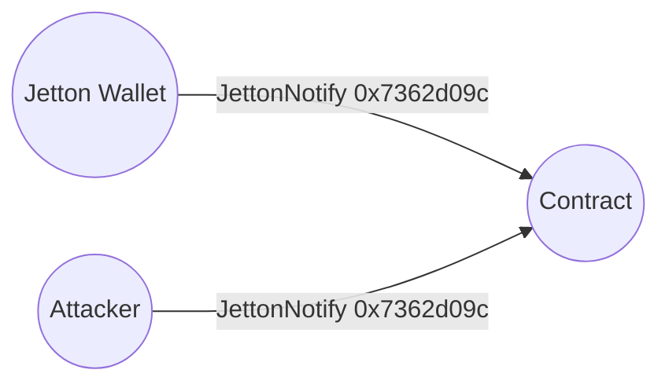
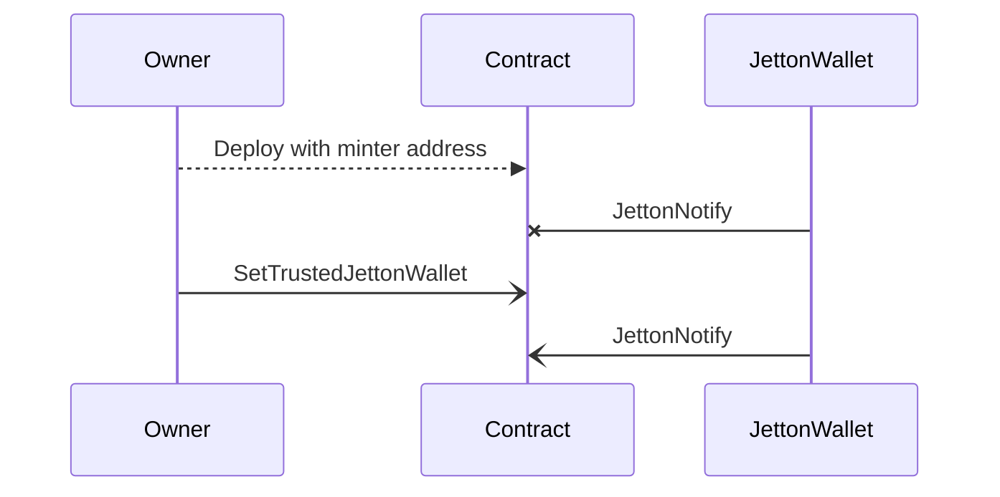
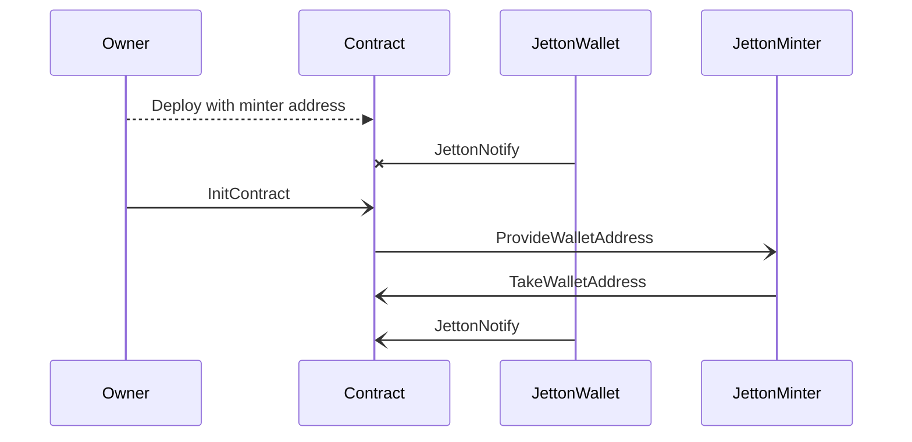
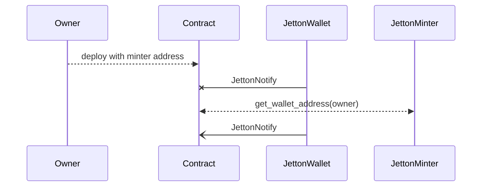

import { Aside } from '/snippets/aside.jsx';

<Aside type="note">
  Understand [the jetton architecture](/standard/tokens/jettons/overview) before reading this article.
</Aside>

Jetton contracts use the `JettonNotify` message to notify receiving contracts of incoming jetton transfers, allowing them to react by crediting user accounts or triggering other actions. However, since anyone can send a `JettonNotify` message, receiving contracts must verify that it comes from the correct jetton wallet address.



## Comparison of approaches

There are three approaches to verify `JettonNotify` messages, depending on the level of trust in the contract deployer and whether the approach requires TEP-89.

| Requirement                 | [Manual management](#manual-wallet-management) | [Automatic discovery](#automatic-wallet-discovery) | [Get-method emulation](#on-chain-get-method-emulation) |
| --------------------------- | ---------------------------------------------- | -------------------------------------------------- | ------------------------------------------------------ |
| Jetton type known           | Yes                                            | No                                                 | No                                                     |
| Trust in deployer           | High                                           | Medium                                             | Low                                                    |
| Jetton is TEP-89 compatible | No                                             | Yes                                                | No                                                     |
| Implementation complexity   | Low                                            | Medium                                             | High                                                   |

## Manual wallet management

If the receiving contract knows the jetton type in advance, it must only check that the message comes from the correct jetton wallet address. This is the most efficient approach, because it only requires one address comparison.

The following example of a receiving contract handles `JettonNotify` messages for a trusted jetton wallet address that can be set by the owner of the contract.



```tolk title="Tolk" expandable
tolk 1.2;

struct Storage {
    owner: address;
    trustedJettonWallet: address?;
    jettonMinter: address;
}

fun Storage.load(): Storage {
    return Storage.fromCell(contract.getData());
}

fun Storage.save(self) {
    return contract.setData(self.toCell())
}

struct (0x7362d09c) JettonNotify {
    queryId: uint64
    jettonAmount: coins
    transferInitiator: address
    jettonVaultPayload: RemainingBitsAndRefs
}

struct (0x12345678) SetTrustedJettonWallet {
    trustedJettonWallet: address
}

type AllowedMessage = JettonNotify | SetTrustedJettonWallet;

fun onInternalMessage(in: InMessage) {
    val msg = lazy AllowedMessage.fromSlice(in.body);
    match (msg) {
        SetTrustedJettonWallet => {
            var storage = Storage.load();
            if (storage.owner != in.senderAddress || storage.trustedJettonWallet != null) {
                return;
            }
            storage.trustedJettonWallet = msg.trustedJettonWallet;
            storage.save();
        },
        JettonNotify => {
            var storage = Storage.load();
            if (storage.trustedJettonWallet == null || storage.trustedJettonWallet != in.senderAddress) {
                return;
            }
            // Process jettons
        }
    }
}
```

This contract uses `SetTrustedJettonWallet` messages to set the trusted jetton wallet address whose owner is the receiving contract address.

When deploying with this pattern, [calculate the jetton wallet address](/standard/tokens/jettons/find) that must receive top-ups. It is impossible to hardcode the jetton wallet address in the contract's [`StateInit`](/foundations/messages/deploy), because the wallet address depends on the contract address and creates a circular dependency.

Including `jettonMinter` in the contract's `Storage` ensures that each instance of the contract is unique to a specific jetton, and thus has a unique address. This allows deploying multiple instances of the contract for different jettons, even if they share the same owner. Each instance can then set its own `trustedJettonWallet` address corresponding to its `jettonMinter`.

Modify `trustedJettonWallet` to store several addresses, to handle several jetton types with a single contract.

<Aside type="tip">
  [The Bidask Finance DEX](https://bidask.finance/en/) uses manual wallet management.
</Aside>

## Automatic wallet discovery

In the first approach, the deploying party chooses addresses of the jetton minter and wallet contracts off-chain. The contract's dependents have to trust that the wallet belongs to the corresponding minter, which is not a problem for an exchange. However, if the deployer is not trustworthy, the first approach is not suitable, and the contract must compute the `trustedJettonWallet` address on-chain.

Most modern jetton contracts implement [TEP-89](https://github.com/ton-blockchain/TEPs/blob/66675fc7ecda1e3dc1524159d6bfcaa2ed2372fe/text/0089-jetton-wallet-discovery.md), which defines a `provide_wallet_address` message that requests a jetton wallet address for an arbitrary owner, and a `take_wallet_address` message with a response.

The receiving contract works similarly to the first approach, except it is initialized with an `InitContract` message that asks the jetton minter which jetton wallet address it should use.

The following example of a receiving contract handles `JettonNotify` messages for a jetton wallet address that is unknown at the moment of deployment, and is set by the `JettonMinter` in response to the `ProvideWalletAddress` message sent during initialization.



```tolk title="Tolk" expandable
tolk 1.2

struct Storage {
    jettonMinterAddress: address
    jettonWalletAddress: address?
}

fun Storage.load(): Storage {
    return Storage.fromCell(contract.getData());
}

fun Storage.save(self) {
    return contract.setData(self.toCell())
}

struct (0x2c76b973) ProvideWalletAddress {
    queryId: uint64
    ownerAddress: address
    includeAddress: bool
}

struct (0xd1735400) TakeWalletAddress {
    queryId: uint64
    walletAddress: address
    ownerAddress: Cell<address>?
}

struct (0x7362d09c) JettonNotify {
    queryId: uint64
    jettonAmount: coins
    transferInitiator: address
    jettonVaultPayload: RemainingBitsAndRefs
}

// Unlike other opcodes here, this can be set arbitrarily
struct (0x12345678) InitContract {}

type AllowedMessage = InitContract | TakeWalletAddress | JettonNotify

fun onInternalMessage(in: InMessage) {
    val msg = lazy AllowedMessage.fromSlice(in.body);
    match (msg) {
        InitContract => {
            var storage = Storage.load();
            val msg = createMessage({
                bounce: true,
                value: 0,
                dest: storage.jettonMinterAddress,
                body: ProvideWalletAddress {
                    queryId: 0,
                    ownerAddress: contract.getAddress(),
                    includeAddress: false,
                },
            });
            msg.send(SEND_MODE_CARRY_ALL_REMAINING_MESSAGE_VALUE);
        }
        TakeWalletAddress => {
            var storage = Storage.load();
            if (storage.jettonMinterAddress != in.senderAddress) {
                return;
            }
            storage.jettonWalletAddress = msg.walletAddress;
            storage.save();
            // After receiving such message contract is initialized
        }
        JettonNotify => {
            var storage = Storage.load();
            if (storage.jettonWalletAddress == null || storage.jettonWalletAddress != in.senderAddress) {
                return;
            }
            // Process jettons
        }
    }
}
```

<Aside type="tip">
  [The DeDust DEX](https://dedust.io/) uses automatic wallet discovery.
</Aside>

## On-chain get-method emulation

If a jetton contract doesn't implement TEP-89, it is possible to compute the jetton wallet address on-chain by executing the `get_wallet_address` method of the jetton minter. This approach doesn't require any trust in the jetton deployer and works for jettons that don't implement TEP-89.

<Aside type="note">
  Jettons that do not implement the TEP-89 messages for computing a wallet address on-chain are rare. [TONCO DEX](https://tonco.io/) rejects them, while platforms such as [DeDust](https://dedust.io/) only allow them after a manual approval.
</Aside>

With the state of a jetton minter, the [RUNVM](/tvm/instructions#db4-runvm) instruction can emulate the execution of the `get_wallet_address` [get-method](/tvm/get-method) to derive the wallet address for any owner.

Use the following helper function. It relies on [Fift](/languages/fift/overview) because it's impossible to assign a type to `c7`. It executes the `get_wallet_address` method of a jetton minter on-chain, and calculates the corresponding wallet address for a given owner.



```tolk title="Tolk/Fift" expandable
fun calculateJettonWallet(owner: address, jettonData: cell, jettonCode: cell, jettonMinter: address): address asm """
    c7 PUSHCTR
    // Unpack environment information from c7
    // https://docs.ton.org/tvm/registers#c7-%E2%80%94-environment-information-and-global-variables
    0 INDEX
    SWAP
    8 SETINDEX
    SWAP
    DUP
    ROTREV
    10 SETINDEX
    // Make it singleton
    1 TUPLE
    // owner md mc c7
    ROTREV
    CTOS            // owner_addr c7 md mc"
    2 PUSHINT       // owner_addr c7 md mc args"
    103289 PUSHINT  // owner_addr c7 md mc args get_jwa_method_id"
    5 0 REVERSE     // owner_addr get_jwa_method_id args mc md c7"
    // Moves the top stack value (ONE) to the third position: [A, B, C] -> [B, C, A]. We expect only 1 return value. Flag +256 for runvm enables this argument
    ONE 2 -ROLL
    // We use only these modes:
    // +1 = same_c3 (set c3 to code)
    // +4 = load c4 (persistent data) from stack and return its final value
    // +16 = load c7 (smart-contract context)
    // +256 = pop number N, return exactly N values from stack (only if res=0 or 1; if not enough then res=stk_und)
    // Mode 256 is crucial, because it ignores all stack values except the first one, and protects from stack poisoning
    277 RUNVM        // address exit_code c4'"
    2 BLKDROP       // address";
"""
```

### Minters without vanity addresses

Minter address and `StateInit` will match if the jetton minter was not deployed with [a vanity contract](/contract-dev/vanity). The logic for the contract that handles `JettonNotify` messages is thus:

1. Get the `StateInit` of the jetton minter off-chain.
1. Deploy the receiver contract with the address of the jetton minter in its data.
1. Send a message to the contract with the `StateInit` of the jetton minter.
1. Validate that `StateInit` matches the address of the jetton minter.
1. Run `calculateJettonWallet` with the following arguments:
   - `owner`: address of the contract (e.g., `contract.getAddress()`).
   - `jettonData` and `jettonCode`: `StateInit` of the jetton minter.
   - `jettonMinter`: address of the jetton minter.

### Minters with vanity addresses or invalid get-methods

If the jetton minter was deployed with a vanity contract, or otherwise lacks `get_wallet_address` method, or `get_wallet_address` returns incorrect addresses, use the current state of the contract instead.

A full [state proof](/foundations/proofs/overview) is required to prove that the state is currently at the jetton minter address.
