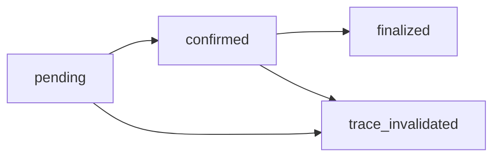

import { Aside } from '/snippets/aside.jsx';

The TON Center **Streaming API** (v2) provides developer access to TON Blockchain through [Server-Sent Events (SSE)](https://en.wikipedia.org/wiki/Server-sent_events) and [WebSockets](https://en.wikipedia.org/wiki/WebSocket). It delivers low-latency, real-time updates on transactions and actions observed on the TON blockchain. Clients can subscribe to updates for monitoring a wallet, some contract addresses, or a specific trace of transactions.

Streaming API serves as a real-time, streaming version of the [indexed access layer](/ecosystem/api/toncenter/v3/overview). Use it when building wallets, explorers, monitoring systems, or automation tools.

<Aside type="tip">
  [AppKit](/ecosystem/appkit/overview) and [WalletKit](/ecosystem/walletkit/overview) support for Streaming API v2 is in development and will be available soon. Projects using these SDKs should follow the [sub-second adoption guide](/ecosystem/subsecond) until native support is available.
</Aside>

<Aside
  type="note"
  title="Version naming"
>
  The [API v2](/ecosystem/api/toncenter/v2/overview) and [API v3](/ecosystem/api/toncenter/v3/overview) include their major version numbers in their product names. For the Streaming API, `v2` means the current protocol version and doesn't refer to different APIs.
</Aside>

## Event groups

The Streaming API emits the following event groups:

- Trace-based events: `transactions`, `actions`, `trace`
- State updates: `account_state_change` and `jettons_change`
- Invalidation signal: `trace_invalidated`

The [event types section](/ecosystem/api/toncenter/streaming/reference#event-types) and [notification schemas section](/ecosystem/api/toncenter/streaming/reference#notification-schemas) provide the exact payload structure for each event.

## Finality model

Trace-based events carry a `finality` field according to their finality level:

```json
"finality": "pending" | "confirmed" | "finalized"
```

Each trace moves through the following monotonic lifecycle:



- `pending` — result of emulation or speculative execution. This state can be invalidated (`trace_invalidated`).
- `confirmed` — trace or transactions are included in a candidate shard block. Rollback chance is very small, but still possible.
- `finalized` — committed in the masterchain and will not be updated nor invalidated.

Non-trace events behave differently:

- `account_state_change` and `jettons_change` are emitted only when `finality` field is set to either `confirmed` or `finalized`.
- `trace_invalidated` applies to previously emitted trace-based data and is not emitted after `finalized`.

## Delivery behavior

The `min_finality` field is used to control how early the server emits trace-based updates:

- `pending` — receive every trace snapshot as it moves from `pending` to `confirmed` to `finalized`.
- `confirmed` — skip pure emulation results and start at `confirmed` or later.
- `finalized` — receive only finalized trace-based events.

Choose the setting based on the tolerance for speculative data:

- Use `pending` for the lowest latency.
- Use `confirmed` for lower rollback risk with near-real-time delivery.
- Use `finalized` when only settled data is acceptable.

The [delivery semantics section](/ecosystem/api/toncenter/streaming/reference#delivery-semantics) and [event invalidation section](/ecosystem/api/toncenter/streaming/reference#event-invalidation) document the exact behavior for each event type.

## Supported interfaces

The Streaming API exposes two transports: SSE and a WebSocket. Choose either of the transports to proceed with its usage:

<Columns cols={2}>
  <Card
    title="SSE: Server-Sent Events"
    icon="server"
    href="/ecosystem/api/toncenter/streaming/sse"
  >
    Recommended for browser environments or clients that prefer HTTP streaming and a fixed subscription.
  </Card>

  <Card
    title="WebSocket"
    icon="signal-stream"
    href="/ecosystem/api/toncenter/streaming/wss"
  >
    Preferred for persistent, bidirectional communication with dynamic subscription patterns.
  </Card>
</Columns>

## See also

- [Notification reference](/ecosystem/api/toncenter/streaming/reference)
- [API key](/ecosystem/api/toncenter/get-api-key)
- [API authentication](/ecosystem/api/toncenter/v3-authentication)
