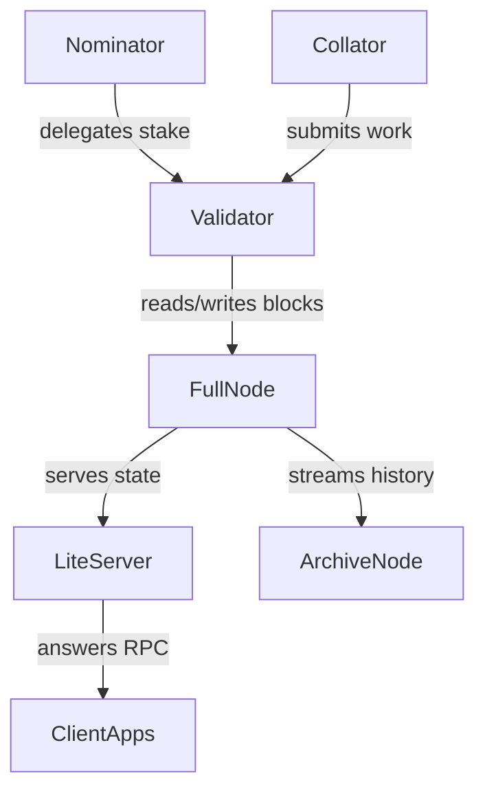

Running a node on The Open Network (TON) means assuming responsibility for validator uptime, security, and user access to the chain. Start by choosing the environment that matches your goal, then plan for the operational work that keeps the node healthy.

## Pick your target environment

| If you need | Run | Why |
| --- | --- | --- |
| A production validator, liteserver, or archive node | [Setting up a node using MyTonCtrl](./setup-mytonctrl) | Production-hardened wrapper around the TON toolchain with automation for validator wallets, overlays, and upgrades. |
| A disposable development network on your laptop | [Setting up a local blockchain using MyLocalTon](./setup-mylocalton) | Spins up a local shard, explorer, and APIs for rapid testing with no mainnet impact. |
| Nomination services for other stakers | MyTonCtrl in [nominator](./mytonctrl#nominator-pool-mode) or [single nominator](./mytonctrl#single-nominator-mode) mode | Pools TON safely while delegators keep custody of their funds. |

> **Tip:** Check [status.toncenter.com](https://status.toncenter.com/d/SxowRJ14k/validators-map?orgId=1&refresh=10s) before deploying new validators and distribute capacity across regions. Providers in Western Europe already run many TON validators; prefer underutilized zones to avoid centralizing block production.

## Topics

- [Node types](#node-types) and the responsibilities attached to each role.
- [How network roles interact](#network-roles-and-flows) with a diagram of data and stake relationships.
- [Decide whether to run your own node](#do-you-need-your-own-node) versus relying on community endpoints.

## Node types

| Role | What it does | When to use it |
| --- | --- | --- |
| Full Node | Stores the latest shards, tracks the masterchain, and serves data to lite-clients. | Required for custom infrastructure, analytics, or to back your own APIs. |
| Archive Node | Extends a full node with long-term block storage. | Run when you need historical state replay, compliance exports, or research datasets. |
| Validator | Produces and signs blocks, participates in elections, and earns rewards. | Needed to secure the network with your stake or to operate a nominator pool service. |

## Network roles and flows

- **Validators** depend on **full nodes** for canonical state and publish new blocks that client applications later read.
- **Nominators** delegate stake to validators but retain custody; MyTonCtrl automates this hand-off.
- **Collators** share pre-built blocks that validators validate and sign.
- **Lite-servers** expose a read-only RPC surface for wallets, explorers, and integrations while relying on upstream full nodes.
- **Archive nodes** extend the retention horizon so analytics stacks can scan every block.

## Minimum environment

- **Validator hardware.** Allocate at least 8 dedicated vCPUs, 128 GB RAM, 1 TB NVMe-class SSD, a stable public IP, and 1 Gb/s symmetric bandwidth. Underpowered validators reduce network stability and are subject to penalties.
- **Archive storage.** Plan for 10–12 TB of fast NVMe storage and proactive capacity monitoring if you retain the full block history.
- **Operating system.** MyTonCtrl targets Ubuntu or Debian servers. Create a non-root user with `sudo` access and run the installer from that account.
- **Local development.** MyLocalTon requires Java 21+, Python 3 for the optional HTTP API bridge, and the Microsoft Visual C++ 2015+ Redistributable on Windows.
- **Wallet funding.** Keep at least 200 TON per month in a validator wallet to cover election and fee traffic. Test networks need a small buffer to activate wallets and pools.

## Operating responsibilities

- **Keep software current.** Track TON releases and run `update`/`upgrade` in MyTonCtrl after verifying config changes. Apply operating-system security patches and reboot during off-peak windows.
- **Monitor health.** Use MyTonCtrl status reports, validator efficiency metrics, and system logs. Configure external monitoring for CPU, disk, network throughput, and incoming validator penalties.
- **Maintain overlays.** Validators join several overlay subnets. Register custom overlays only when needed, document the peers you add, and prune unused overlay records to reduce gossip load.
- **Protect credentials.** Back up wallet mnemonics and validator keys offline. Do not store nominator wallets on the validator host. Rotate console passwords regularly, and restrict SSH access to trusted administrators.
- **Plan for storage growth.** Configure state retention (`state-ttl`, `archive-ttl`) based on your role. Archive nodes require larger disks; liteservers can keep shorter TTL values to stay lean.

## Do you need your own node?

- **Run your own full node** when you need guaranteed uptime, custom telemetry, or to serve high-volume workloads without third-party rate limits. Validators and staking services must control their node to satisfy security and compliance requirements.
- **Rely on public endpoints** when building prototypes or light integrations. Community liteservers and APIs such as [Toncenter](../rpc/toncenter) or other [RPC providers](../rpc/overview) already expose the blockchain for read access and transaction submission. Load the TON Foundation config (`https://ton.org/global-config.json` for mainnet, `https://ton.org/testnet-global.config.json` for testnet) when you connect to the public mesh.
- **Hybrid approach.** Many teams start on public APIs, add their own full node for production readiness, and keep the public endpoints as a fallback.

Remember that operating a node introduces 24/7 responsibilities: hardware maintenance, security hardening, and incident response. If those costs outweigh the control benefits, evaluate managed or third-party infrastructure before deploying your own servers.

:::caution Public liteservers in production
Public liteservers are rate-limited and frequently saturated. Keep them for testing and fallbacks—production workloads need your own full or archive node with liteserver mode enabled.
:::

## Next steps

- Consult the [MyTonCtrl Reference](./mytonctrl) for command-level help while operating nodes.
- Follow [Setting up a node using MyTonCtrl](./setup-mytonctrl) for production provisioning and [Setting up a local blockchain using MyLocalTon](./setup-mylocalton) when you need a disposable devnet.
- Review the [node maintenance guidelines](https://docs.ton.org/guidelines/nodes-guidelines) for deeper operational checklists.
