To interact with TON Center’s API at higher rate limits, you’ll need to generate an API key via the official [Telegram bot](https://t.me/toncenter).

## Open the TON Center bot

Open the [`@toncenter`](https://t.me/toncenter) bot in Telegram. Click “Start” to begin the setup.

## Open the API keys manager

Once the bot greets you, press “Manage API Keys”.

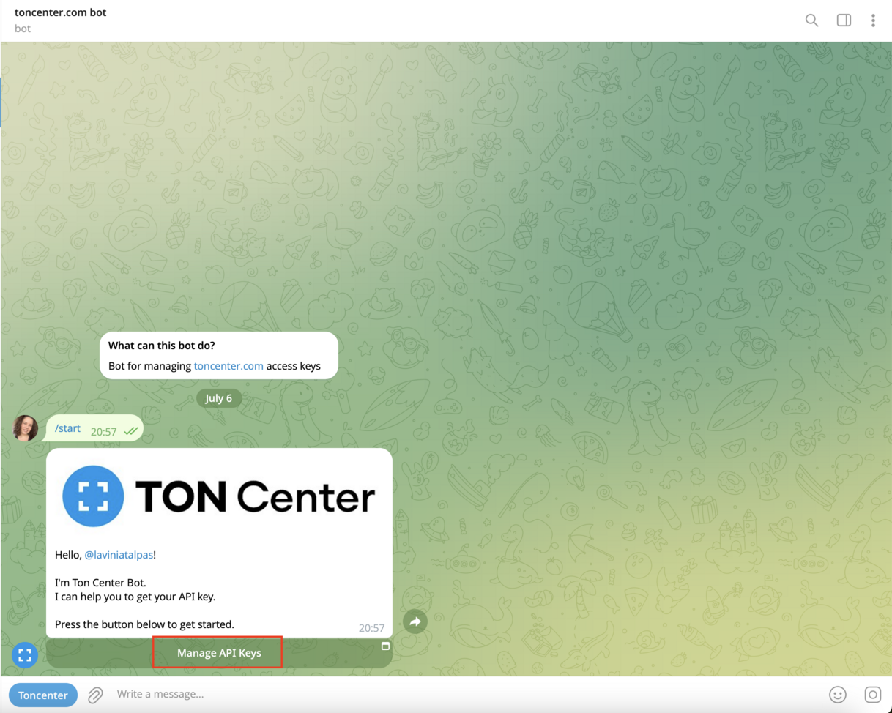

## Choose a subscription plan

Click “Manage” to open your current subscription details. The default API subscription is the “Free” plan.

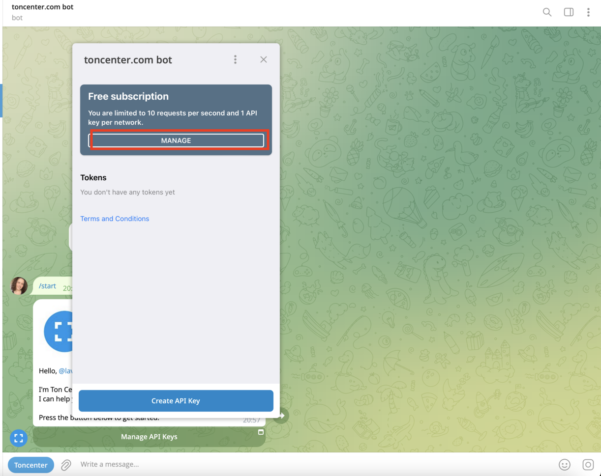
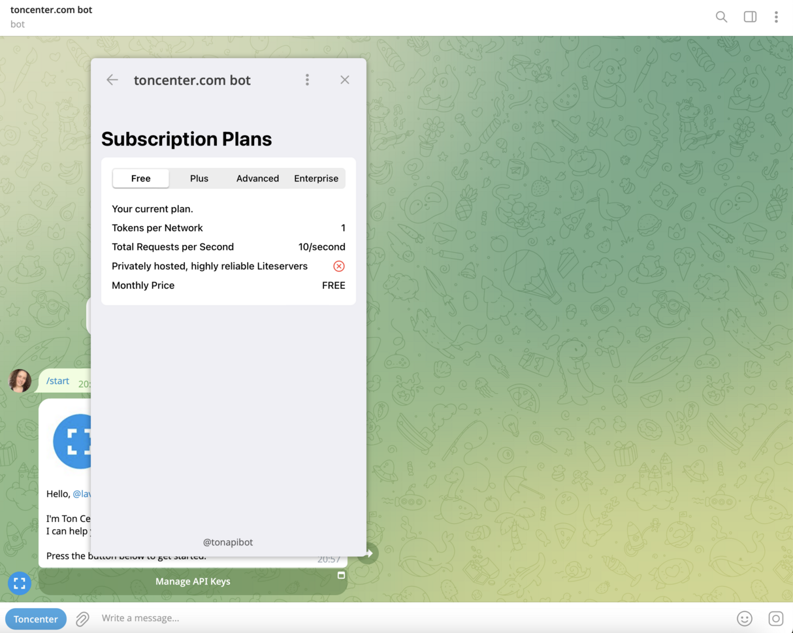

You’ll see different tiers available:

- **Free** – 10 requests/sec, 1 token per network
- **Plus** – 25 requests/sec, 3 tokens per network (2.5 TON/month)
- **Advanced** – 100 requests/sec, 10 tokens per network (25 TON/month)
- **Enterprise** – Tailored rate limits, priority support

<Tabs>
  <Tab
    title="Free"
  >
    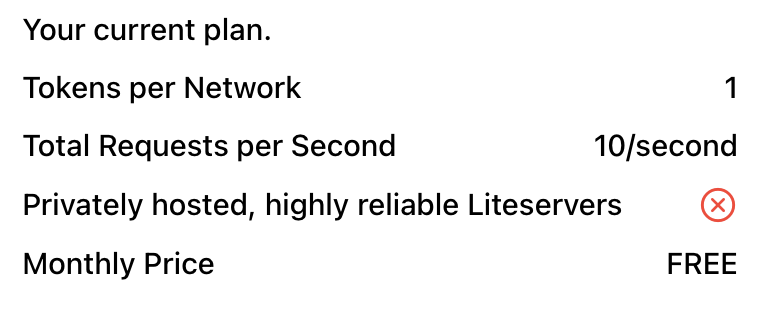
  </Tab>

  <Tab
    title="Plus"
  >
    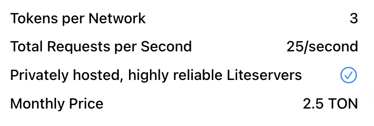
  </Tab>

  <Tab
    title="Advanced"
  >
    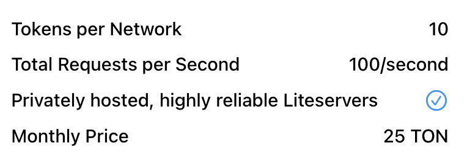
  </Tab>

  <Tab
    title="Enterprise"
  >
    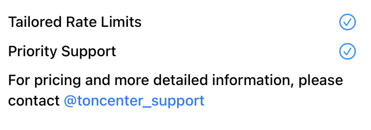
  </Tab>
</Tabs>

## Upgrade your plan

This step is optional.

To upgrade:

1. Select your desired plan in the bot interface and click “Purchase Subscription”.

1. You’ll be shown payment instructions like the following.

   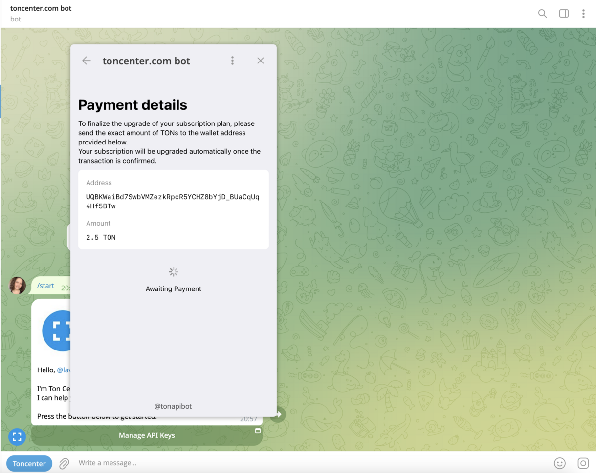

1. Send the **exact amount** of TON to the address provided.

1. Your subscription will upgrade automatically once the transaction is confirmed.

## Create your API key

After subscribing (or staying on Free), click “Create API Key” to generate your key.

Once created, your token will appear in the list and can be used in all authenticated requests.

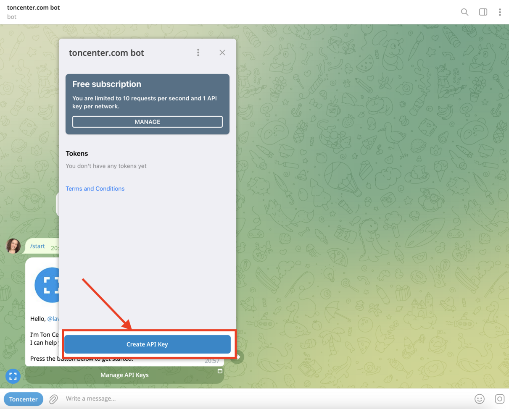
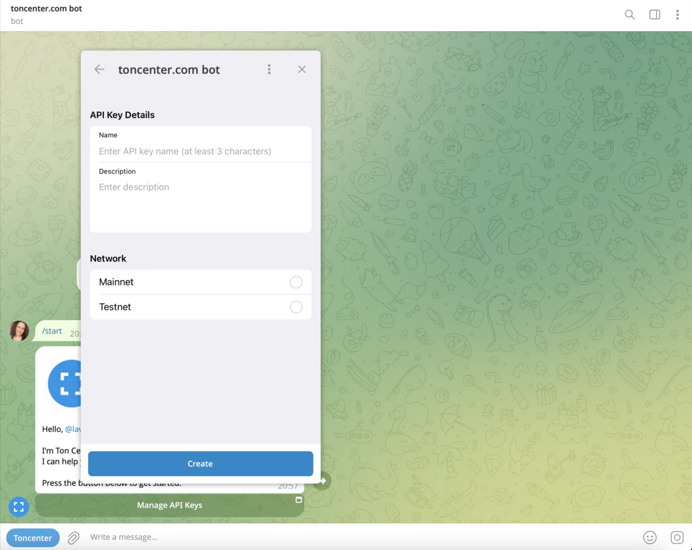
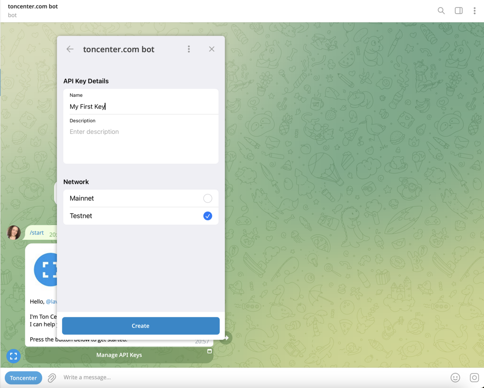
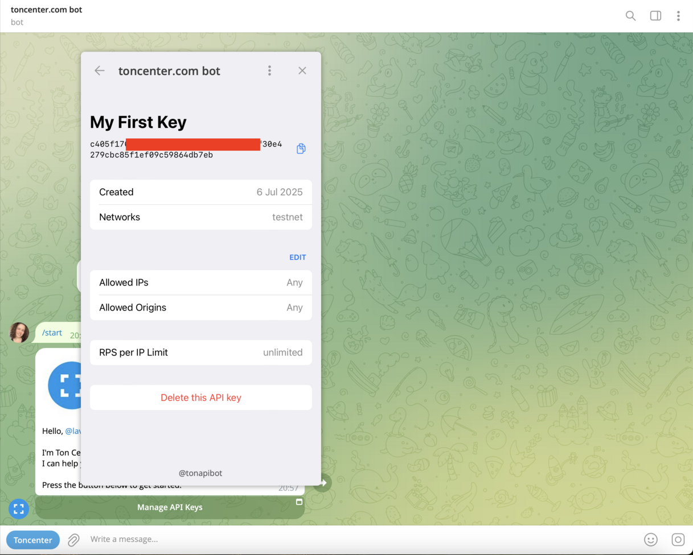

## Get help

- General help: [`@toncenter_help_bot`](https://t.me/toncenter_help_bot)
- Support for enterprise and custom plans: [`@toncenter_support`](https://t.me/toncenter_support)
