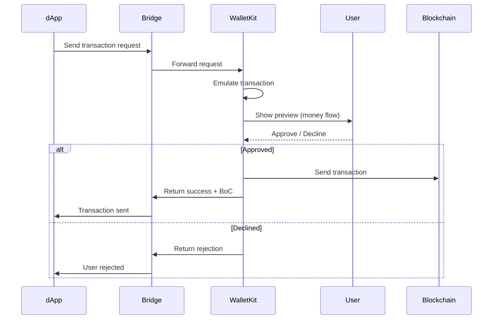

import { Aside } from '/snippets/aside.jsx';

<Aside>
  [Initialize the WalletKit](/ecosystem/ton-connect/walletkit/web/init), [set up at least one TON wallet](/ecosystem/ton-connect/walletkit/web/wallets), handle [connection requests](/ecosystem/ton-connect/walletkit/web/connections) and [transaction requests](/ecosystem/ton-connect/walletkit/web/events) before using examples on this page.
</Aside>

To work with Toncoin, the wallet service needs to handle [contract balances](#balances) and perform transfers initiated [from dApps](#transfers-from-dapps) and [from within the wallet service itself](#transfers-from-the-wallet-service).

## Balances

Blockchain state changes constantly as new blocks are produced. This has implications for when and how to check TON wallet contract balances:

- [Discrete one-off checks](#on-demand-balance-check) have almost no value on their own — the state might change immediately after the query completes, invalidating its results. Thus, such checks are only practical when handling `transaction` requests.
- [Continuous monitoring](#continuous-balance-monitoring) is useful for UI display, showing the most recent balance to users, but should not be used for transaction confirmations.

Notice that both cases require querying the blockchain data via the API client set during the [WalletKit initialization](/ecosystem/ton-connect/walletkit/web/init#param-networks). Obtain and provide the key from the selected client to access higher requests-per-second limits.

### On-demand balance check

Use the `getBalance()` method to check the wallet contract balance in TON wallets managed by WalletKit. The balance is returned in nanoToncoin, with 1 Toncoin equal to $10^9$ nanoToncoin.

<Aside
  type="caution"
>
  Do not store the balance check results anywhere in the wallet service's state, as they become outdated very quickly. For UI purposes, do [continuous balance monitoring](#continuous-balance-monitoring).
</Aside>

```ts title="TypeScript"
async function getBalance(walletId: string): Promise<bigint | undefined> {
  // Get TON wallet instance
  const wallet = kit.getWallet(walletId);
  if (!wallet) return;

  // Query its balance in nanoToncoin
  return await wallet.getBalance();
}
```

The most practical use of one-off balance checks is right before approving a transaction request. At this point, the actual wallet contract balance usually is not less than the checked amount, though it might be higher if new funds arrived right after the check.

<Aside>
  Despite this check, the transaction may still fail due to insufficient balance at the time of transfer.
</Aside>

```ts title="TypeScript"
// An enumeration of various common error codes
import { SEND_TRANSACTION_ERROR_CODES } from '@ton/walletkit';

kit.onTransactionRequest(async (event) => {
  const wallet = kit.getWallet(event.walletId ?? '');
  if (!wallet) {
    console.error('Wallet not found for a transaction request', event);
    await kit.rejectTransactionRequest(event, {
      code: SEND_TRANSACTION_ERROR_CODES.UNKNOWN_ERROR,
      message: 'Wallet not found',
    });
    return;
  }

  // Calculate the minimum balance needed for this transaction
  const balance = await wallet.getBalance();
  const minNeededBalance = event.request.messages.reduce(
    (acc, message) => acc + BigInt(message.amount),
    0n,
  );

  // Reject early if balance is clearly insufficient
  if (balance < minNeededBalance) {
    await kit.rejectTransactionRequest(event, {
      code: SEND_TRANSACTION_ERROR_CODES.BAD_REQUEST_ERROR,
      message: 'Insufficient balance',
    });
    return;
  }

  // Proceed with the regular transaction flow
  // ...
});
```

### Continuous balance monitoring

Poll the balance at regular intervals to keep the displayed value up to date. Use an appropriate interval based on UX requirements — shorter intervals provide fresher data but increase API usage.

This example should be modified according to the wallet service's logic:

```ts title="TypeScript" expandable
// Configuration
const POLLING_INTERVAL_MS = 10_000;

/**
 * Starts the monitoring of a given `walletId`,
 * calling `onBalanceUpdate()` each `intervalMs` milliseconds
 *
 * @returns a function to stop monitoring
 */
export function startBalanceMonitoring(
  walletId: string,
  onBalanceUpdate: (balance: string) => void,
  intervalMs: number = POLLING_INTERVAL_MS,
): () => void {
  let isRunning = true;

  const poll = async () => {
    while (isRunning) {
      const wallet = kit.getWallet(walletId);
      if (wallet) {
        const balance = await wallet.getBalance();
        onBalanceUpdate(balance);
      }
      await new Promise((resolve) => setTimeout(resolve, intervalMs));
    }
  };

  // Start monitoring
  poll();

  // Return a cleanup function to stop monitoring
  return () => {
    isRunning = false;
  };
}

// Usage
const stopMonitoring = startBalanceMonitoring(
  walletId,
  // The updateUI() function is exemplary and should be replaced by
  // a wallet service function that refreshes the
  // state of the balance displayed in the interface
  (balance) => updateUI(balance),
);

// Stop monitoring once it is no longer needed
stopMonitoring();
```

## Transfers from dApps

When a connected dApp requests a Toncoin transfer, the wallet service follows this flow:



### Emulation and preview

WalletKit tries to automatically emulate every incoming transaction request before presenting it to the user. The emulation result is available in the `event.preview.data` object, which can be `undefined` if emulation was skipped:

```ts title="TypeScript"
kit.onTransactionRequest(async (event) => {
  if (!event.preview.data) {
    console.log('Transaction emulation skipped');
  } else if (event.preview.data.result === 'success') {
    // Emulation succeeded — show the predicted money flow
    const { ourTransfers } = event.preview.data.moneyFlow;

    // This is an array of values,
    // where positive amounts mean incoming funds
    // and negative amounts — outgoing funds
    console.log('Predicted transfers:', ourTransfers);
  } else {
    // Emulation failed — warn the user but allow proceeding
    console.warn('Transaction emulation failed:', event.preview);
  }

  // Present the preview to the user and await their decision
  // ...
});
```

<Aside>
  Emulation uses the API client configured during [WalletKit initialization](/ecosystem/ton-connect/walletkit/web/init#param-networks).
</Aside>

### Approve or reject

After showing the preview, handle the user's decision:

```ts title="TypeScript" expandable
import {
  // An enumeration of various common error codes
  SEND_TRANSACTION_ERROR_CODES,
  // The transfer type
  type TransactionTraceMoneyFlowItem,
} from '@ton/walletkit';

kit.onTransactionRequest(async (event) => {
  try {
    // Show the emulation preview to the wallet service user
    const preview = event.preview;
    const isEmulationSuccessful = preview.data?.result === 'success';

    // Build a confirmation message
    let confirmMessage = 'Confirm this transaction?';
    if (isEmulationSuccessful) {
      const transfers = preview.data.moneyFlow?.ourTransfers || [];
      confirmMessage = `Send ${formatTransfers(transfers)}?`;
    } else {
      confirmMessage = 'Emulation failed or skipped. Proceed anyway?';
    }

    // Handle user's decision
    if (confirm(confirmMessage)) {
      // Approve — this sends the transaction to the blockchain
      // and returns the signed message BoC to the dApp
      await kit.approveTransactionRequest(event);
      console.log('Transaction approved and sent');
    } else {
      // Reject — notify the dApp that the user declined
      await kit.rejectTransactionRequest(event, {
        code: SEND_TRANSACTION_ERROR_CODES.USER_REJECTS_ERROR,
        message: 'User rejected the transaction',
      });
    }
  } catch (error) {
    console.error('Transaction handler error:', error);
    await kit.rejectTransactionRequest(event, {
      code: SEND_TRANSACTION_ERROR_CODES.UNKNOWN_ERROR,
      message: 'Transaction processing failed',
    });
  }
});

function formatTransfers(transfers: Array<TransactionTraceMoneyFlowItem>): string {
  const formatNano = (value: string, decimals: number = 9): string => {
    const bigintValue = BigInt(value);
    const isNegative = bigintValue < 0n;
    const absoluteValue = bigintValue < 0n ? -bigintValue : bigintValue;
    const str = absoluteValue.toString().padStart(decimals + 1, '0');

    const intPart = str.slice(0, -decimals) || '0';
    const fracPart = str.slice(-decimals).replace(/0+$/, '');

    const formatted = fracPart ? `${intPart}.${fracPart}` : intPart;
    return `${isNegative ? '-' : ''}${formatted}`;
  };

  return transfers.map((t) => `${formatNano(t.amount)} ${t.assetType}`).join(', ');
}
```

### Confirm transaction delivery

TON achieves transaction [finality](https://en.wikipedia.org/wiki/Blockchain#Finality) after a single masterchain block confirmation, where new blocks are produced approximately every 3 seconds. Once a transaction appears in a masterchain block, it becomes irreversible.

Therefore, to reliably confirm the transaction delivery and status, one needs to check whether a transaction has achieved masterchain finality using the selected API client.

That said, the wallet service should not block the UI while waiting for such confirmation. After all, with [continuous wallet balance monitoring](#continuous-balance-monitoring) and subsequent transaction requests, users will receive the latest information either way. Confirmations are only needed to reliably display a list of past transactions, including the most recent ones.

For detailed transaction tracking, message lookups, and payment processing, the [message lookup guide](/ecosystem/ton-connect/message-lookup) covers finding transactions by external message hash, waiting for confirmations, and applying message normalization.

## Transfers in the wallet service

Transactions can be created directly from the wallet service (not from dApps) and fed into the regular approval flow via `handleNewTransaction()` method of the WalletKit. It creates a new [transaction request event](/ecosystem/ton-connect/walletkit/web/events#handle-ontransactionrequest), enabling the same UI confirmation-to-transaction flow for both dApp-initiated and wallet-initiated transactions.

This example should be modified according to the wallet service's logic:

```ts title="TypeScript"
import type { TONTransferRequest, Base64String } from '@ton/walletkit';

async function sendToncoin(
  // Sender's TON `walletId` as a string
  walletId: string,
  // Recipient's TON wallet address as a string
  recipientAddress: string,
  // Amount in nanoToncoins
  nanoAmount: BigInt,
  // Optional comment string
  comment?: string,
  // Optional payload body as a BoC in Base64-encoded string
  payload?: Base64String,
) {
  if (comment && payload) {
    console.error('Cannot attach both a comment or a payload body');
    return;
  }

  const fromWallet = kit.getWallet(walletId);
  if (!fromWallet) {
    console.error('No wallet contract found');
    return;
  }

  const transferParams: TONTransferRequest = {
    recipientAddress: recipientAddress,
    transferAmount: nanoAmount.toString(),
    // Optional comment OR payload, not both
    ...(comment && { comment }),
    ...(payload && { payload }),
  }

  // Build transaction content
  const tx = await fromWallet.createTransferTonTransaction(transferParams);

  // Route into the normal flow,
  // triggering the onTransactionRequest() handler
  await kit.handleNewTransaction(fromWallet, tx);
}
```

<Aside
  type="caution"
>
  To avoid triggering the `onTransactionRequest()` handler and send the transaction directly, use the `sendTransaction()` method of the wallet instead of the `handleNewTransaction()` method of the WalletKit, modifying the last part of the previous code snippet:

  ```ts title="TypeScript"
  // Instead of calling kit.handleNewTransaction(fromWallet, tx)
  // one can avoid routing into the normal flow,
  // skip the transaction requests handler,
  // and make the transaction directly.
  await fromWallet.sendTransaction(tx);
  ```

  Do not use this approach unless it's imperative to complete a transaction without the user's direct consent. Funds at risk: test this approach using testnet and proceed with utmost caution.
</Aside>

## See also

- [Handle transaction requests](/ecosystem/ton-connect/walletkit/web/events#handle-ontransactionrequest)
- [Transaction fees](/foundations/fees)
- [WalletKit overview](/ecosystem/ton-connect/walletkit)
- [TON Connect overview](/ecosystem/ton-connect)
