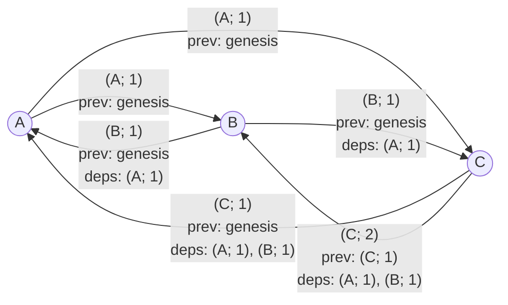

import {Aside} from "/snippets/aside.jsx";

Catchain is a communication protocol between actors. It does not execute the consensus algorithm itself but prepares the data required for the decision-making of a higher-level component: [BCP - Block Consensus Protocol](/foundations/consensus/bcp-overview). The main purpose of the protocol is to allow validators to send messages that explicitly depend on other messages, possibly produced by different actors. Dependencies are encoded in such a way that a node receiving a message can download the referenced messages and verify their validity. The protocol defines how to select the neighbors of a node. Neighbors of node A are the nodes, that A communicates with directly.

## Problem

In a fully asynchronous network there are no guarantees that a message will ever be delivered, nor in which order it will arrive. Even if node A sends two messages to node B, there is no guarantee that they will be delivered in the same order, or that they will be delivered at all. Moreover, some actors in the network are assumed to behave in a [Byzantine](https://en.wikipedia.org/wiki/Byzantine_fault) way. The system must avoid situations where Byzantine nodes prevent honest nodes from making progress.

## Assumptions

All participants of the network are known. Each validator knows the [ADNL](/foundations/network/adnl) address and the public key of every other validator. Messages can therefore be encrypted and signed with private keys, and every signature can be verified by every other participant.

## Protocol goals

Catchain helps to address the issues above by describing:

- how to choose "neighbor" nodes;
- the format of messages with explicit dependencies (other messages);
- how to fetch dependencies;
- how to detect and penalize nodes that try to disrupt the system.

## Choosing neighbor nodes

Catchain selects five neighbors at random and periodically refreshes the list (every random interval between 60 and 120 seconds in the current configuration). The neighbor relation is not symmetric: if B is a neighbor of A, it does not imply that A is also a neighbor of B.

## Message identification

Every catchain message is uniquely identified by the pair `(sender; sender's sequence number)`.
Also, every catchain message has a reference to previous message from the same sender.
If this is the first message from the current node, then the previous message for it is `genesis`.

<Aside type="note">
  Strictly speaking, the same set of participants can take part in multiple catchain rounds, so the message identifier is extended with the round identifier to distinguish messages from previous rounds. However, for the sake of this overview the possibility of multiple rounds is omitted.
</Aside>

Each actor is responsible for indexing its own messages and increasing the sequence counter. Because nodes can be Byzantine, honest validators must verify that counters are monotonically increasing.

### Example message flow

### Detecting forks (duplicate message IDs)

If an actor issues two messages with the same identifier `(A; i)` but different payloads, the situation is called a fork. Any honest validator who observes it construct a proof consisting of the block identifier and two distinct signatures. Since all public keys are known, this proof can be broadcast to the neighbors, and then further across the network. Every honest participant who receives the proof starts ignoring all messages from node A, as well as all messages that depend on A's messages.

<Aside type="tip">
  According to the original design, when Catchain is used for the TON blockchain consensus, a fork proof can be submitted to the [Elector](/foundations/system#elector) smart contract. However, this idea has not been implemented.
</Aside>

### Detecting skipped sequence numbers

Every message `(X; i)` (except the genesis message `(X; 0)`) depends on `(X; i - 1)`. If a node produces `(X; i)` and later emits `(X; i + j)` with `j > 1`, an honest node will not be able to obtain `(X; i + j - 1)` and therefore will not process `(X; i + j)`. Skipping sequence numbers is thus pointless: all messages following the missing one are ignored by honest validators.

## Node state

State holds the information about all processed messages by the current node. Since messages are ordered for each node, denote this information by the vector
<code>(Ai, Bj, Ck, Dm ...)</code>
This vector hold an information about the last processed message for the validator. So, if Ai is stored, and Ai+2 comes, than Ai+1 should be downloaded.

## Dependency retrieval process

Every 0.1–0.2 seconds a node selects three random neighbors out of five and starts a synchronization round with them. Synchronization can be performed in two ways:

- Send a vector of Node state. If the neighbor has more recent blocks, it provides them.
- Perform targeted downloads of specific messages. This is usually used if, after the bulk synchronization above, there are still individual missing dependencies.

## Encryption

All the steps above happen inside a [private ADNL overlay](/foundations/network/adnl). There is no shared session key; instead each pair of nodes derives its own key that is used to encrypt message bodies. In practice this means that an external observer in the TON blockchain cannot read the messages that validators exchange with each other.
