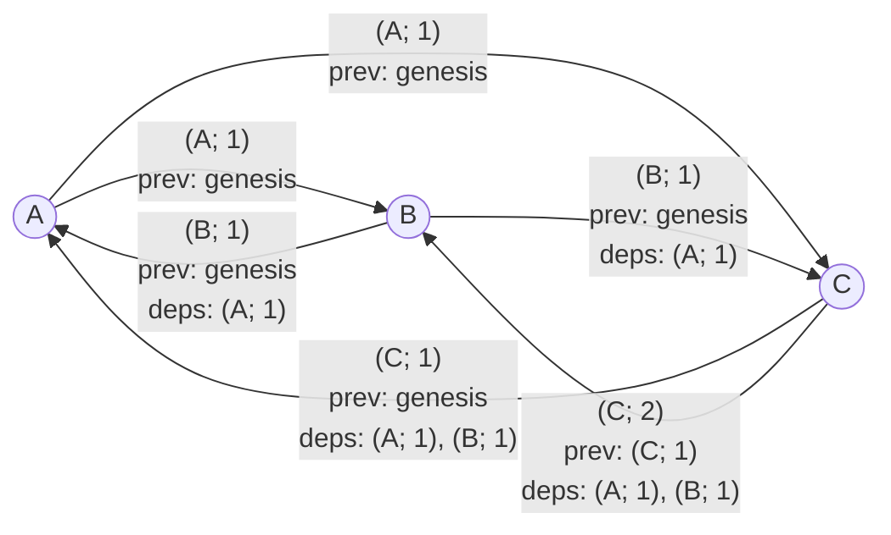

import {Aside} from "/snippets/aside.jsx";

Catchain is a communication protocol between actors. It does not execute the consensus algorithm itself but prepares the data required for the decision-making of a higher-level component: [BCP - Block Consensus Protocol](/foundations/consensus/bcp-overview). The main purpose of the protocol is to allow validators to send messages that explicitly depend on other messages, possibly produced by different actors. Dependencies are encoded in such a way that a node receiving a message can download the referenced messages and verify their validity.

## Problem

No network can guarantee that

- messages will be delivered,
- messages will arrive in the order they were sent,
  - even if it's 2 messages between 2 nodes.

Actors are assumed to [intentionally try](https://en.wikipedia.org/wiki/Byzantine_fault) to break consensus. The system must avoid situations where such actors prevent honest actors from making progress.

## Assumptions

Each node knows the [ADNL](/foundations/network/adnl) address and the public key of every other node. Thus, every pair of nodes can ensure each other's authenticity and establish an encrypted channel. The ADNL protocol is used to set up a [private ADNL overlay network](//foundations/network/adnl), which allows a node to send encrypted messages to a specific address or broadcast messages.

## Protocol capabilities

### Logical capabilities

At the logical level, the protocol provides causality preservation when sending messages. In other words, it lets a validator declare which messages cause other messages and guarantees that processing message A, which depends on messages B and C, only happens after messages B and C are processed.

### Formal capabilities

The protocol implements a [CRDT](https://en.wikipedia.org/wiki/Conflict-free_replicated_data_type) over the set of messages known to each node and achieves [eventual consistency](https://en.wikipedia.org/wiki/Eventual_consistency). As a synchronization mechanism, it uses the idea similar to [vector clock](https://en.wikipedia.org/wiki/Vector_clock) with modifications that preserve eventual consistency even when some nodes are Byzantine.

<Aside type="note">
  The [ADNL](/foundations/network/adnl) protocol is responsible for message integrity, at-least-once delivery guarantees, and message authenticity.
</Aside>

## Choosing neighbor nodes

Catchain selects [five](https://github.com/ton-blockchain/ton/blob/34823b1ea378edbe3bc59f3bcc48126480a0b768/catchain/catchain-receiver.cpp#L36) neighbors at random and periodically refreshes the list each random interval between [60 and 120 seconds](https://github.com/ton-blockchain/ton/blob/34823b1ea378edbe3bc59f3bcc48126480a0b768/catchain/catchain-receiver.cpp#L988) in the current configuration. Note, that the neighbor relation is not symmetric: if B is a neighbor of A, it does not imply that A is also a neighbor of B.

<Aside type="tip">
  In the current implementation, [Mersenne Twister](https://en.wikipedia.org/wiki/Mersenne_Twister) is used to pick the random interval for refreshing the neighbor list. It is seeded with values from [std::random\_device](https://en.cppreference.com/w/cpp/numeric/random/random_device.html), whose behavior is platform-dependent.
</Aside>

## Message identification

Let's say that `seqno` of each node is a number of messages this node already sent in this round. Node must increment this number after each round. Nodes, not following that rule are considered Byzantine. Such nodes are detected by Catchain protocol. Exact detection mechanism is described further.

Every catchain message is uniquely identified by the pair `(sender; sender's seqno, body hash)`.

Catchain message can declare any other messages by any node as a dependency. These dependencies are stored in `body` of the message. Every catchain message must declare previous message from the same node as a dependency. Otherwise, message is considered malformed and ignored by honest nodes. If catchain message have `seqno` equal to 0 then the previous message for it is `genesis`: the name for some initial state of the system.

<Aside type="note">
  The same set of participants can take part in multiple catchain rounds, so the message identifier is extended with the round identifier to distinguish messages of this round from messages of previous rounds. However, for the sake of this overview the possibility of multiple rounds is omitted.
</Aside>

### Example message flow

These messages do not have an order by default. In asynchronous system they can be received in any order. Declaring message dependencies helps to establish a particial ordering on all messages in general and on each of node in particular. This is possible because in catchain "dependency" relation is antisymmetric, transitive and reflexive.

## Handling Byzantine nodes

The key goal is not to allow Byzantine nodes break the particial order of the messages in the Cathcain. It theoretically can be broken by violating one of three key properties.

### Antisymmetry

This property means, that $\forall A, B depends(A, B) -> !depends(B, A)$. Catchain preserves this property, as when `A` depends on `B`, `B` is included in the `body hash` field of `A`. Therefore `B` can't depend on `A` as it's `body hash` mush include `A`.

### Transitivity

CHECK
This property means, that $\forall A B C depends(A, B) && depends(B, C) -> depends(A, C)$. This property is preserved implicitly by honest nodes because if `A` depends on `B`, `A` will wait in queue for processing of `B`. Imagine a situation, when \`

### Detecting forks (duplicate message IDs)

If an actor issues two messages with the same identifier `(A; i)` but different payloads, the situation is called a fork. Any honest validator who observes it constructs a proof consisting of the block identifier and two distinct signatures. Since all public keys are known, this proof can be broadcast to the neighbors, and then further across the network. Every honest participant who receives the proof starts ignoring all messages from node A starting from `(A, i)`, as well as all messages that depend on `(A, j) where j >= i` messages.

<Aside type="tip">
  According to the original design, when Catchain is used for the TON blockchain consensus, a fork proof can be submitted to the [Elector](/foundations/system#elector) smart contract. However, this idea has not been implemented.
</Aside>

### Detecting skipped sequence numbers

Every message `(X; i)` (except the genesis message `(X; 0)`) depends on `(X; i - 1)`. If a node produces `(X; i)` and later emits `(X; i + j)` with `j > 1`, an honest node will not be able to obtain `(X; i + j - 1)` and therefore will not process `(X; i + j)`. Skipping sequence numbers is thus pointless: all messages following the missing one are ignored by honest validators.

## Node state

The node state stores information about all messages processed by the current node. Since messages are ordered for each node, denote this information by the vector
<code>(Ai, Bj, Ck, Dm ...)</code>
This vector tracks the last processed message for each validator. So, if Ai is stored and Ai+2 arrives, the node must download Ai+1.

(Link to [https://en.wikipedia.org/wiki/Vector\_clock](https://en.wikipedia.org/wiki/Vector_clock))

## Dependency retrieval process

Roughly every 0.1–0.2 seconds a node selects three random neighbors out of its five and starts a synchronization round with them. Synchronization can be performed in two ways:

- Send its node-state vector. If the neighbor has more recent blocks, it provides them.
- Perform targeted downloads of specific messages. This is usually used if, after the bulk synchronization above, there are still individual missing dependencies.

## Encryption

All the steps above happen inside a [private ADNL overlay](/foundations/network/adnl). There is no shared session key; instead each pair of nodes derives its own key that is used to encrypt message bodies. In practice this means that an external observer in the TON blockchain cannot read the messages that validators exchange with each other.
