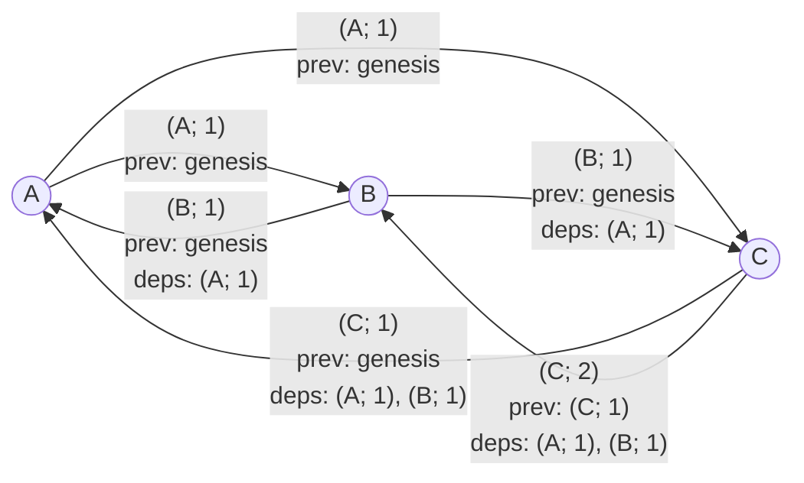

import {Aside} from "/snippets/aside.jsx";

Catchain is a communication protocol between actors. It does not execute the consensus algorithm itself but prepares the data required for the decision-making of a higher-level component: [BCP - Block Consensus Protocol](/foundations/consensus/bcp-overview). The main purpose of the protocol is to allow validators to send messages that explicitly depend on other messages, possibly produced by different actors. Dependencies are encoded in such a way that a node receiving a message can download the referenced messages and verify their validity.

## Problem

No network can guarantee that
- messages will be delivered,
- messages will arrive in the order they were sent,
  - even if it's 2 messages between 2 nodes.

Actors are assumed to [intentionally try](https://en.wikipedia.org/wiki/Byzantine_fault) to break consensus. The system must avoid situations where such actors prevent honest actors from making progress.

## Assumptions

Each node knows the [ADNL](/foundations/network/adnl) address and the public key of every other node. Thus, every pair of nodes can ensure each other's authenticity and establish an encrypted channel. The ADNL protocol is used to set up a [private ADNL overlay network](//foundations/network/adnl), which allows node to send encrypted messages to a specific address or broadcast messages.

## Возможности протокола

### Логические возможности

На логическом уровне протокол обеспечивает Causality Preservation при отправке сообщений. Другими словами, протокол позволяет задать, какие сообщения являются причиной других сообщений, и гарантирует, что обработка сообщения A, зависящего от сообщений B и C, будет выполнена только после того, как будут обработаны сообщения B и C.

### Формальные возможности

Протокол имплементирует [CRDT](https://en.wikipedia.org/wiki/Conflict-free_replicated_data_type) относительно множества сообщений известных каждой нод и позволяет добиться [eventual consistency](https://en.wikipedia.org/wiki/Eventual_consistency). Как способ сихронизации, протокол использует [vector clock](https://en.wikipedia.org/wiki/Vector_clock) с модификациями, позволяющими добиться eventual consistency, даже если некоторые nodes являются Византийскими.

<Aside type="node">
  За целостность сообщений, гарантии доставки at least once, а так же authenticity сообщений отвечает протокол [ADNL](/foundations/network/adnl).
</Aside>

## Choosing neighbor nodes

Catchain selects [five](https://github.com/ton-blockchain/ton/blob/34823b1ea378edbe3bc59f3bcc48126480a0b768/catchain/catchain-receiver.cpp#L36) neighbors at random and periodically refreshes the list (random interval between 60 and 120 seconds in the current configuration). The neighbor relation is not symmetric: if B is a neighbor of A, it does not imply that A is also a neighbor of B.

<Aside type="tip">
  In current implementation, [Mersenne Twister](https://en.wikipedia.org/wiki/Mersenne_Twister) is used for selecting random interval of neighbor list refreshing. It is initialized by values from [std::random_device](https://en.cppreference.com/w/cpp/numeric/random/random_device.html), which behaviour is platform-dependent.
</Aside>

## Message identification

(Words in CAPS are unclear)

Every catchain message is uniquely identified by the pair `(sender; sender's SEQUENCE NUMBER)`. Also, every catchain message has a REFERENCE to the previous message from the same sender. If this is the first message from the current node, then the previous message for it is `genesis`: the name for some initial state of the system.

<Aside type="note">
  The same set of participants can take part in multiple catchain rounds, so the message identifier is extended with the round identifier to distinguish messages of this round from messages of previous rounds. However, for the sake of this overview the possibility of multiple rounds is omitted.
</Aside>

Each actor is responsible for indexing its own messages and increasing the sequence counter. Because nodes can be Byzantine, honest validators must verify that counters are monotonically increasing.

(Is it sequence number or sequence counter?)

### Example message flow

### Detecting forks (duplicate message IDs)

If an actor issues two messages with the same identifier `(A; i)` but different payloads, the situation is called a fork. Any honest validator who observes it constructs a proof consisting of the block identifier and two distinct signatures. Since all public keys are known, this proof can be broadcast to the neighbors, and then further across the network. Every honest participant who receives the proof starts ignoring all messages from node A, as well as all messages that depend on A's messages.

<Aside type="tip">
  According to the original design, when Catchain is used for the TON blockchain consensus, a fork proof can be submitted to the [Elector](/foundations/system#elector) smart contract. However, this idea has not been implemented.
</Aside>

### Detecting skipped sequence numbers

Every message `(X; i)` (except the genesis message `(X; 0)`) depends on `(X; i - 1)`. If a node produces `(X; i)` and later emits `(X; i + j)` with `j > 1`, an honest node will not be able to obtain `(X; i + j - 1)` and therefore will not process `(X; i + j)`. Skipping sequence numbers is thus pointless: all messages following the missing one are ignored by honest validators.

## Node state

State holds the information about all processed messages by the current node. Since messages are ordered for each node, denote this information by the vector
<code>(Ai, Bj, Ck, Dm ...)</code>
This vector hold an information about the last processed message for the validator. So, if Ai is stored, and Ai+2 comes, than Ai+1 should be downloaded.

(Link to https://en.wikipedia.org/wiki/Vector_clock)

## Dependency retrieval process

("Every 0.1–0.2 seconds" -- why a range?)

Every 0.1–0.2 seconds a node selects three random neighbors out of five and starts a synchronization round with them. Synchronization can be performed in two ways:

- Send a vector of Node state. If the neighbor has more recent blocks, it provides them.
- Perform targeted downloads of specific messages. This is usually used if, after the bulk synchronization above, there are still individual missing dependencies.

## Encryption

All the steps above happen inside a [private ADNL overlay](/foundations/network/adnl). There is no shared session key; instead each pair of nodes derives its own key that is used to encrypt message bodies. In practice this means that an external observer in the TON blockchain cannot read the messages that validators exchange with each other.
