import { Aside } from '/snippets/aside.jsx';

Arbitrary data are represented in TON Blockchain by trees of cells.

```mermaid
graph TD
  n["🔵 0x1111"] --> 0x2222
  n["🔵 0x1111"] --> 0x3333
  0x2222 --> d1["0x4444"]
  0x3333 --> d2["0x4444"]
```



Such a tree of cells is transformed into a [DAG](https://en.wikipedia.org/wiki/Directed_acyclic_graph) of cells by identifying cells in the tree that have the same hash.

```mermaid
graph TD
  n["🔵 0x1111"] --> 0x2222
  n["🔵 0x1111"] --> 0x3333
  0x2222 --> 0x4444
  0x3333 --> 0x4444
```



After that, each of the references of each cell might be replaced by the 32-byte [representation hash](/foundations/serialization/cells#standard-cell-representation-and-its-hash) of the cell referred to. Thus a _bag of cells (BoC)_ is obtained.

```
🔵 Roots: [0x1111]

0x1111
  Refs: [0x2222, 0x3333]
0x2222
  Refs: [0x4444]
0x3333
  Refs: [0x4444]
0x4444
  Refs: []
```

In general, a BoC can be obtained from several trees of cells, thus forming a forest.

```mermaid
graph TD
  n["🔵 0x1111"] --> 0x3333
  m["🔵 0x2222"] --> 0x3333
```



By convention, the roots of the original trees of cells are marked elements of the resulting bag of cells, so that anybody receiving this bag of cells and knowing the marked elements can reconstruct the original forest. However, this BoC needs to be serialized into a file, suitable for disk storage or network transfer.

```
🔵 Roots: [0x1111, 0x2222]

0x1111
  Refs: [0x3333]
0x2222
  Refs: [0x3333]
0x3333
  Refs: []
```

There may be many different ways to serialize such a data structure, each of which has its own goals and is convenient for specific cases. This page provides a general serialization algorithm and specification of the corresponding [TL-B](/languages/tl-b/overview) schemes, followed by the example and specific implementation used in the TON Blockchain.

<Aside type="note">
  Even though the syntax looks very much like TL-B, it cannot be used in most of the TL-B tooling. Unlike in real TL-B, these schemas serialize to a bitstring with no 1023 bit length limit, and without any refs.
</Aside>

## General scheme

### Internal references, absent cells, and complete BoCs

For an arbitrary cell `c` in a given BoC, references to it can be either:

- _internal_ if the cell corresponding to the reference is also represented in BoC,
- _external_ if it's not in BoC. Such cell `c` is called _absent_ from this BoC.

A BoC is called _complete_ if it does not contain any external references. Most real-world BoCs are complete.

### Outline of serialization process

<Aside type="note">
  This paragraphs provide a textual description of the BoC serialization process. The specific implementation of the serialization and TL-B schemes is left to the choice of developers.

  For a specific example of TL-B schema and pseudocode of related cell serialization, see [TL-B schema](/foundations/serialization/boc#tl-b-schema).
</Aside>

The serialization process of a BoC `B` consisting of `n` cells can be outlined as follows.

- List the cells from B in a [topological order](https://en.wikipedia.org/wiki/Topological_sorting): `c1, ..., cn`(with `c1, ..., ck` as root cells, if `B` is a forest).
- Choose the smallest number of bytes `s` that can contain the binary representation of `n`. Serialize each cell `ci` in a way similar to [standard representation algorithm](/foundations/serialization/cells#standard-cell-representation-and-its-hash), with exceptions:
  - `d1 = r + 8s + 16h + 32l` where `h = 1` if the cell's hashes are explicitly included into the serialization; otherwise, `h = 0` (when `r = 7`, `h` must be `1`);
  - if `h = 1`, after bytes `b1` and `b2` the serialization is continued by `l + 1` 32-byte higher hashes of `c`;
  - unsigned big-endian s-bit integer `j` used instead of hash `Hash(cj)` to represent internal references to cell `cj`.
- Concatenate the representations of cells `ci` thus obtained in the increasing order of `i`.
- Optionally, an _index_ can be constructed that consists of `n` `t`-bytes integer entries $L_{1}, \ldots, L_{n}$ where:
  - $L_{i}$ is the total length in bytes of the representations of cells `cj` with `j ≤ i`;
  - `t` is the smallest number of bytes that can contain the binary representation of $L_{n}$.
- An optional [CRC32C](https://en.wikipedia.org/wiki/Cyclic_redundancy_check) may be appended to the serialization for integrity verification purposes.

If the index is included, any cell `ci` the serialized bag of cells may be easily accessed by its index `i` without deserializing all other cells, or even without loading the entire serialized bag of cells in memory.

A final serialization of the bag of cells must include a magic number indicating the precise format of the serialization, followed by integers `s`, `t`, `n`, an optional index consisting of `n * t` bytes, $L_n$ bytes with the cell representations, and an optional `CRC32C` checksum. Each specific implementation of the serialization process must comply with these fields and their order but, for example, may take into account number of roots, number of absent cells, and so one.

## TL-B schema

Only one [serialization scheme of BoCs](https://github.com/ton-blockchain/ton/blob/24dc184a2ea67f9c47042b4104bbb4d82289fac1/crypto/tl/boc.tlb#L25) is used in TON Blockchain (there are also two outdated BoC serialization schemes in the file):

```tlb
serialized_boc#b5ee9c72 has_idx:(## 1) has_crc32c:(## 1) 
  has_cache_bits:(## 1) flags:(## 2) { flags = 0 }
  size:(## 3) { size <= 4 }
  off_bytes:(## 8) { off_bytes <= 8 } 
  cells:(##(size * 8)) 
  roots:(##(size * 8)) { roots >= 1 }
  absent:(##(size * 8)) { roots + absent <= cells }
  tot_cells_size:(##(off_bytes * 8))
  root_list:(roots * ##(size * 8))
  index:has_idx?(cells * ##(off_bytes * 8))
  cell_data:(tot_cells_size * [ uint8 ])
  crc32c:has_crc32c?uint32
  = BagOfCells;
```

Fields `size` is `s`, `off_bytes` is `t`, `cells` is `n`, `tot_cells_size` is $L_n$ (the total size of the serialization of all cells in bytes), `index` is the optional index $L_{1}, \ldots, L_{n}$, `cell_data` is the concatenation of the cells representations, and `crc32c` is the optional 4-bytes CRC32C checksum.

This schema additionally includes:

- the 1-bit `has_idx` flag that indicates whether the index is included in the serialization;
- the 1-bit `has_crc32c` flag that indicates whether the CRC32C checksum is included in the serialization;
- the 1-bit `has_cache_bits` and 2-bit `flags` fields that are reserved for future use (`flags` must be zero);
- the `roots` field that indicates the number of root cells in the BoC;
- the `absent` field that indicates the number of absent cells in the BoC;
- the `root_list` field that is an indices sequence of the root cells in the BoC.

Finally, the pseudocode for obtaining `cell_data` is as follows:

```c
// d1
uint3 level_mask;
uint1 has_hashes;
uint1 is_exotic;
uint3 ref_count;

// d2
if (ref_count < 7) {
    uint7 byte_size;
    uint1 has_padding;
}

if (has_hashes) {
    uint256 hashes[GetLevel(level_mask) + 1];
    uint16 depths[GetLevel(level_mask) + 1];
}

if (ref_count < 7) {
    if byte_size + has_padding != 0 {
        uint8 data_bits[byte_size + has_padding];
    }
    ref refs[ref_count];
}
```

## An example of a manual serialization

Consider the following example of a tree of cells:

```json
01
  0aaaaa
  fe
    0aaaaa
```

So, there is a 2-bit root cell that references two other cells:

- The first is a 24-bit cell.
- The second is a 8-bit cell that itself references a 24-bit cell.

After identifying of unique cells, we have the following:

```json
01
0aaaaa
fe
```

Next, the unique cells are arranged in a topological order:

```json
01     -> index 0 (root cell)
fe     -> index 1
0aaaaa -> index 2
```

Now, let’s calculate the descriptor bytes `b1` and `b2` for each of the three unique cells.

So, we obtain:

```json
01     -> 0201
fe     -> 0102
0aaaaa -> 0006
```

Then the data bits are serialized as $\lceil\frac{b}{8}\rceil$ bytes. Remember, if `b` is not a multiple of eight, a binary `1` and up to six binary `0s` are appended to the data bits. After that, the data is split into $\lceil\frac{b}{8}\rceil$ 8-bit groups.

```json
01     -> 01100000 = 0x60
fe     -> do not change (full groups)
0aaaaa -> do not change (full groups)
```

Next come the depths for the refs in two bytes:

```json
01     -> 0002
fe     -> 0001
0aaaaa -> 0000
```

Now specify which cells each one references:

```json
0: 01     -> 0201: refers to 2 cells with such indexes
1: fe     -> 02: refers to cells with index 2
2: 0aaaaa -> no refs
```

For each cell we have its hexadecimal representation:

```json
01     -> 02016000020201
fe     -> 0102fe000102
0aaaaa -> 00060aaaaa0000
```

Finally, we concatenate all parts into a single hexadecimal array:
`0x020160000202010102fe00010200060aaaaa0000`.

Now that we've serialized our cells into a flat 20-byte array, it's time to pack them into a complete BoC format.

```text
0xb5ee9c72                                 -> TL-B id of the BoC structure
0b1                                        -> has indexes
0b0                                        -> does not have CRC32C
0b0                                        -> does not have cache bits
0b00                                       -> flags are 0
0b001                                      -> the number of bytes needed to store the number of cells is 1
0b00000001                                 -> the number of bytes used to represent offset of a serialization is 1
0b00000011                                 -> the number of cells is 3
0b00000001                                 -> the number of roots is 1
0b00000000                                 -> the number of absent cells is 0
0b00010100                                 -> tot_cells_size is 20 bytes
0b00000000                                 -> the root list; we have one root with number 0 after the topological sort
0b000001110000111000010100                 -> the three 8-bits group of indexes for cells accorging to the topological sort
0x020160000202010102fe00010200060aaaaa0000 -> the cells data
_                                          -> CRC32C is not serialized
```

By combining everything into a single bit string, we get the result of serialization.

## SDK from @ton/core

According to the TL-B scheme above there is the [SDK](https://github.com/ton-org/ton-core/blob/4577e94/src/boc/cell/serialization.ts#L1) for serialization and parsing BoC.

Only serialization of BoCs with one root and no absent cells is supported. There are two main functions:

- `serializeBoc` for serialization. It has two parameters: `root` and options object with two boolean flags: `idx` and `crc32`. They indicate whether indexes and CRC32C will be included in serialization. The output is a Buffer with serialization.
- `deserializeBoc` for parsing. It has one parameter: `src`, a Buffer that contains a serialized BoC. The output is a roots list of a given BoC.

```typescript
import { beginCell, serializeBoc, deserializeBoc } from "@ton/core";

const innerCell = beginCell()
  .storeUint(456, 16)
  .endCell();
const rootCell = beginCell()
  .storeUint(0, 64)
  .storeRef(innerCell)
  .endCell();

const boc = serializeBoc(
  rootCell,
  {
    // do not include index
    idx: false,
    // do not include CRC-32
    crc32: false,
  },
);
const decodedRootCell = deserializeBoc(boc)[0];
```
