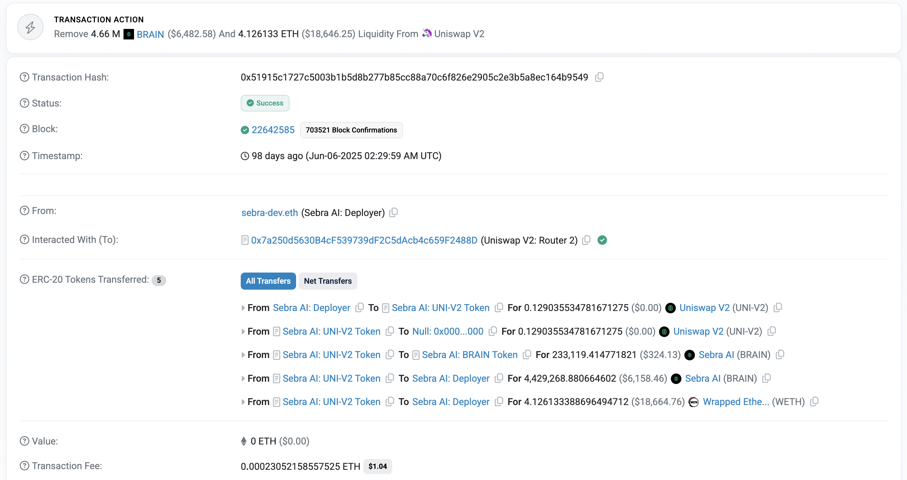
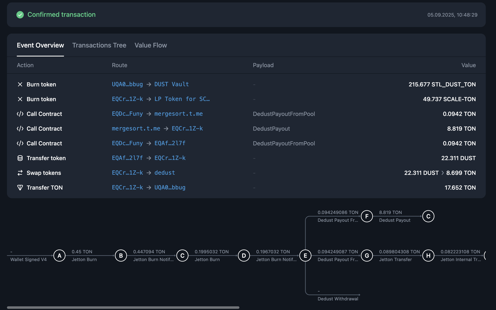

TODO: 
- priority gas
- account vs contract
- block limit for tx size

import { Aside } from "/snippets/aside.jsx";

Learn how to develop and build on TON coming from the Ethereum (EVM) ecosystem.

<Aside>
  This guide only covers basic principles and tooling around them. If you want
  more practical example, check out [Tokens on Ton](./dapp.mdx)
</Aside>

## Execution model

### Asynchronous blockchain

One of the biggest stepping stones to learn TON development is asynchronous execution model. Messages sent by one contract take time to arrive to another, meaning that the resulting transaction, for incoming message processing, will happen after the current transaction terminates.

So compared to Ethereum, where you can have multiple processed messages and state changes on different contracts in the same atomic transaction, on TON transaction represents state change only for one account and single message processing. That means that a signed, included-in-block unit is called a "transaction" in both chains, however having the differences in execution models, it has different impact.

Here is table for comparison:

| Action description                                                                             | Ethereum                               | TON                              |
|------------------------------------------------------------------------------------------------|----------------------------------------|----------------------------------|
| Single message processing with state change on one contract                                    | Message call or "internal transaction" | Transaction                      |
| Number of state changes and messages on different accounts produced from initial contract call | Transaction                            | Chain of transactions or "trace" |

Let's explore practical example, liquidity withdrawal on DEX.

On Ethereum it will look like this, single atomic transaction, with multiple contract calls inside it. You can see that this transaction has a single hash and included in one block:

The same operation on TON will be different, it will consist of more than 10 transaction, triggered by one another. Each arrow on this image represents a distinct finalized transaction, with its own hash, inclusion block and all other properties:

### On-chain get methods

Another radical difference between two chains is get methods, a way to retrieve some data from the contracts without paying any fees. In TON you *can't* synchronously retrieve data from another contract - you can't call get method from another contracts during the transaction. 

If you wonder how we can make any DeFi protocol or complicated on-chain system work with this limitation, read article about on-chain [Request-Response pattern](./examples.mdx).

### Limited contract storage

You can read more about TON architecture design choices 