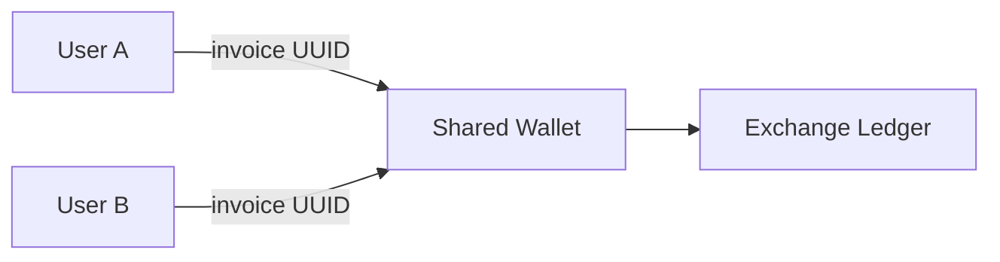
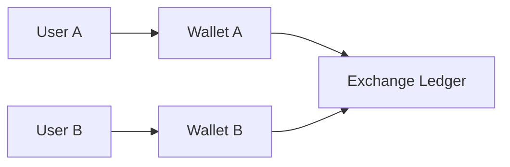

import { Aside } from "/snippets/aside.jsx";

Processing Toncoin payments requires choosing between two architectural approaches:

- invoice-based deposits to a single address, common to all users
- unique deposit addresses per user.

<Aside type="tip">
  Wallets in Ton are smart-contracts, not external accounts [like in Ethereum](/from-ethereum#account-model). Each wallet has its own address, code, and storage. Deposits are incoming messages to these wallet contracts.
</Aside>

<Aside
  type="caution"
>
  Do not send funds to a wallet address that you cannot initialize. Derive addresses deterministically based on contracts [initial state](/foundations/addresses/overview).
</Aside>

## Deposit methods comparison

**Invoice-based flow**

**Unique deposit address flow**

**Comparison table**

| Criteria                     | Invoice-based deposits                                                                                      | Unique deposit addresses                                                                 |
| ---------------------------- | ----------------------------------------------------------------------------------------------------------- | ---------------------------------------------------------------------------------------- |
| Security exposure            | One shared hot wallet; a key leak drains the full pool                                                      | Each wallet isolates funds; compromise affects only the impacted user                    |
| User input requirements      | User must include an invoice ID comment; missing or malformed comments need manual recovery workflows       | User only needs the destination address                                                  |
| Parsing and validation       | Backend parses comments on every deposit and matches to invoices                                            | No parsing; deposit attribution is address-based                                         |
| Deployment and storage costs | Deploy and maintain a single wallet; [storage rent](/foundations/fees#storage-fee) limited to that contract | Deploy many wallets; storage rent and deployment gas scale with user count               |
| Monitoring workload          | Poll one address; comment parsing adds CPU but [RPC calls](/ecosystem/api/overview) stay low                | Track many addresses; RPC queries and state tracking grow with the active user base      |
| Withdrawal handling          | [Highload wallet](/standard/wallets/highload/overview) can batch withdrawals from one balance               | Need sweeps or coordinated withdrawals from many wallets; extra gas and sequencing logic |
| Sharding behavior            | All activity hits [one shard](/foundations/shards); throughput limited by that shard                        | Wallets are distributed across shards; helps spread load                                 |

## Invoice-based deposits

Invoice-based processing uses one wallet address to receive payments from all users. Each payment includes a unique identifier in the transaction comment field, allowing the service to attribute deposits to specific users.

The implementation deploys one wallet contract (typically [Highload](/standard/wallets/highload/overview)) and generates unique invoice identifiers for each deposit. Users send Toncoin to this shared address with their invoice identifier as the comment. The service polls the wallet's transaction history, extracts comments from incoming messages, matches them against stored invoices, and credits user accounts accordingly.

Transaction comments in TON use the text message format; read more in [How TON wallets work](/standard/wallets/how-it-works).

<Aside
  type="danger"
  title="Funds at risk"
>
  Risk: deposits without the correct invoice identifier may be lost.
  Scope: incoming transfers to the shared deposit address.
  Mitigation: enforce invoice format; reject or hold unmatched deposits; provide a recovery workflow; document comment entry in the UI.
  Environment: validate the full flow on testnet before enabling mainnet.
</Aside>

**Advantages**:

- Single wallet simplifies key management
- Reduced gas costs for deployments
- Withdrawals can batch multiple user requests into one transaction using a Highload wallet

**Disadvantages**:

- Access leak to the single hot wallet could lead to all user funds loss
- Users must correctly input the invoice identifier, and mistakes result in lost or misdirected funds
- Comment parsing adds complexity
- Some user wallet applications don't support comments, limiting accessibility
- Single wallet network load [won't be sharded](/foundations/shards)

Use the following TypeScript implementation for educational purposes only: [Invoice-based Toncoin deposits](https://github.com/ton-org/docs-examples/blob/processing/guidebook/toncoin-processing/src/deposits/invoices.ts)

## Unique deposit addresses

Unique address deposits use a separate wallet contract for each user. The user deposits to their dedicated address, and the service monitors all deployed wallets for incoming transactions. No comment parsing is required since each address maps to exactly one user.

Implementation requires a wallet generation strategy. A common approach uses a deterministic scheme based on a single master [keypair](/standard/wallets/mnemonics) and user identifiers, deriving unique addresses for V4 and V5 wallets using different [`subwallet_id`](/standard/wallets/how-it-works#subwallet-id) values. Alternatively, generate a unique keypair per user, though this increases key management complexity.

<Aside
  type="danger"
  title="Funds at risk"
>
  Funds sent to a [non-existent or wrong address](/foundations/addresses/overview) are irrecoverable. Derive addresses deterministically and double check.
</Aside>

Wallet deployment happens lazily when users first request their deposit address. Generate the address deterministically without deploying the contract. When the user sends their first deposit to the not deployed address, send the transaction in [non-bounceable mode](/foundations/messages/overview). The contract doesn't exist yet, so bounceable messages would return the funds. After the first deposit arrives, deploy the contract using funds from that deposit or from an external source.

<Aside>
  Sending non-bounceable messages to nonexistent accounts without testing it first is particularly bad practice. Always test to ensure the address is correct and the deployment flow works as expected.
</Aside>

Monitor all user wallets by maintaining a list of deployed addresses and polling their transactions. For large user bases, this becomes resource-intensive. Optimization strategies include monitoring only active wallets (those with recent deposits), using batched RPC calls to check multiple wallets per request.

TON's sharding mechanism splits the network across multiple chains based on address prefixes. The shard prefix comes from the first bits of the address hash. Deploying wallets in the same shard reduces cross-shard communication overhead.

<Aside
  type="danger"
  title="Keys and funds at risk"
>
  Risk: leaked or mishandled private keys enable wallet takeover and fund loss.
  Scope: generation, storage, and access to per-user wallet keys and deployment workflow.
  Mitigation: encrypt keys at rest; restrict access; rotate keys; monitor deployment status; verify destination addresses before crediting deposits.
  Environment: validate key management and deployment flow on testnet before mainnet.
</Aside>

Withdrawal processing must gather funds from multiple wallets. Either maintain a minimum balance in each wallet for gas fees or implement a fund collection system that periodically sweeps deposits to a central hot wallet. Highload wallets handle batch withdrawals efficiently, while standard V4/V5 wallets process messages sequentially using `seqno`, creating bottlenecks under high load.

**Advantages**:

- No comment parsing removes a major source of user error
- Better security since each user has a unique keypair
- Transaction monitoring is straightforward - any incoming transaction to a user's address is their deposit

**Disadvantages**:

- Higher operational complexity managing multiple wallets
- Deployment costs multiply by the number of users
- Withdrawal processing requires coordination across wallets
- Storage fees apply to each deployed contract (currently \~0.001 TON per year per contract)

Use the following TypeScript implementation for educational purposes only: [Unique address Toncoin deposits](https://github.com/ton-org/docs-examples/blob/processing/guidebook/toncoin-processing/src/deposits/unique-addresses.ts)

## Withdrawal batching

<Aside
  type="caution"
>
  When withdrawing, do not send funds to a wallet address that you cannot initialize later, based on contracts [initial state](/foundations/addresses/overview).
</Aside>

[Highload wallets](/standard/wallets/highload/overview) support parallel message processing by storing processed request identifiers instead of sequential `seqno`. This enables batching multiple withdrawals into one transaction, reducing fees and improving throughput.

## Common abuse patterns

- Reusing a previously settled invoice identifier to trigger duplicate credits when the backend does not invalidate the invoice after the first use.
- Changing the Toncoin amount but leaving the original invoice identifier to obtain services at a lower price if expected amounts are not enforced.
- Crafting comments that mimic another users invoice identifier in order to hijack their pending credit.
- Submitting large numbers of dust payments to inflate processing costs or exhaust rate limits on transaction polling.

## Monitoring best practices

Implement exponential backoff for RPC failures. Network issues or node maintenance can interrupt transaction polling. When [`getTransactions`](/ecosystem/api/toncenter/v2/accounts/list-account-transactions) fails, wait before retrying with increasing delays to avoid overwhelming the endpoint.

Store transaction state persistently. Record the last processed `lt` value (`lt` here is logical time) and transaction hash to resume monitoring after restarts without reprocessing transactions. This prevents duplicate deposit credits.

Use multiple RPC endpoints for reliability. TON has several public API providers and liteserver networks. Implement fallback logic to switch endpoints if the primary becomes unavailable. Compare results across endpoints to detect potential inconsistencies.

Log all processing decisions including deposit credits, withdrawal submissions, and failed transactions. These logs are essential for debugging user reports and auditing system behavior. Include transaction hashes, logical times, amounts, and user identifiers in logs.
