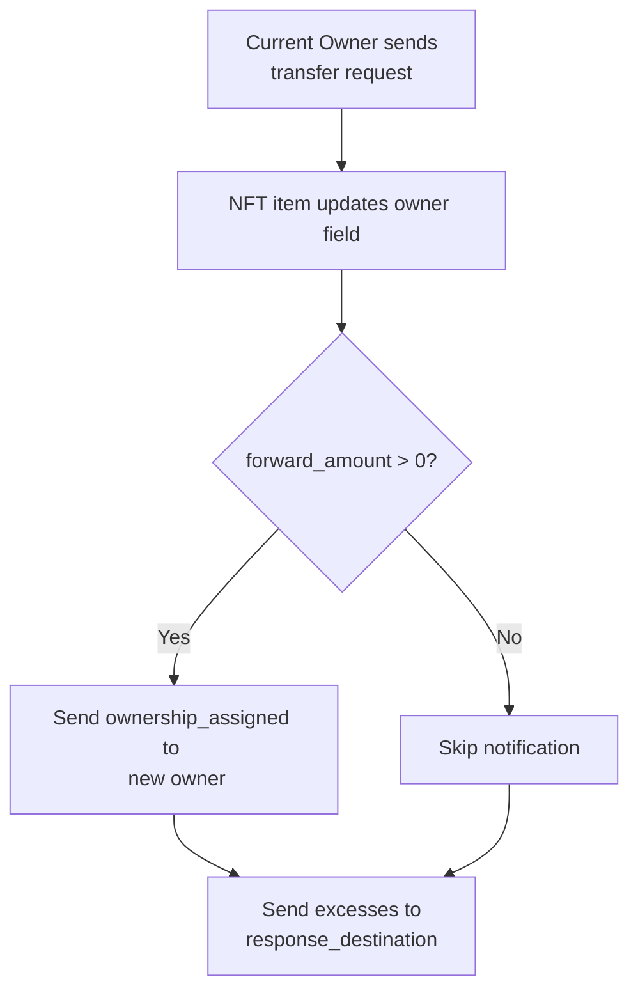

import { Aside } from '/snippets/aside.jsx';
import { Image } from '/snippets/image.jsx';

This article describes the basic ideas and processes behind the implementation of Non‑Fungible Tokens (NFTs) in the TON Blockchain, aligned with [TEP‑62](https://github.com/ton-blockchain/TEPs/blob/1fbc23cac69723c53251f686ec90d81bf0e83443/text/0062-nft-standard.md).

## Related smart contracts

Standardized NFTs on TON are implemented using a set of smart contracts, including:

- NFT collection smart contract
- NFT item smart contract

The NFT standard provides only a general interaction scheme, leaving specific implementation details to developers.

<Image
  src="/resources/images/nft/collection_light.svg"
  darkSrc="/resources/images/nft/collection_dark.svg"
  alt="NFT collection"
/>

### NFT collection

The collection is the source of truth for items. It should provide each NFT item's address, its own collection metadata, and, given an index and individual item metadata, can provide full item metadata.

### NFT item

Following TON's [contract sharding](/contract-dev/contract-sharding) approach, each NFT item is its own smart contract account. It provides the collection address, index, current owner, and individual metadata. On a valid transfer from the current owner, it updates the owner, optionally notifies the new owner, and returns excess Toncoin to the specified address.

<Aside
  type="caution"
>
  Not every NFT that stores a collection address actually belongs to that collection. [Verify](/standard/tokens/nft/how-to-verify-item) that the collection returns the item's address for the item's index.
</Aside>

## Transfer NFT item

The current owner sends a transfer message to the NFT item contract. The item updates its owner field and, optionally, sends a notification and/or excess Toncoin to the specified addresses.



Transfer message body contains the following data:

| Field                  | Type                | Description                                                              |
| ---------------------- | ------------------- | ------------------------------------------------------------------------ |
| `transfer`             | `uint32`            | tag equal to `0x5fcc3d14`                                                |
| `query_id`             | `uint64`            | arbitrary request number                                                 |
| `new_owner`            | `MsgAddress`        | address of the new owner of the NFT item                                 |
| `response_destination` | `MsgAddress`        | optional address to receive excess Toncoin, usually the sender's address |
| `custom_payload`       | `Maybe ^Cell`       | optional custom data                                                     |
| `forward_amount`       | `VarUInteger 16`    | the amount of Toncoin to be sent to the new owner                        |
| `forward_payload`      | `Either Cell ^Cell` | optional data that should be forwarded to the new owner                  |

```tlb TL-B
transfer#5fcc3d14 query_id:uint64 
                  new_owner:MsgAddress 
                  response_destination:MsgAddress 
                  custom_payload:(Maybe ^Cell) 
                  forward_amount:(VarUInteger 16) 
                  forward_payload:(Either Cell ^Cell) 
                  = InternalMsgBody;
```

Ownership notification message body (`ownership_assigned`) contains the following data:

| Field                | Type                | Description                                    |
| -------------------- | ------------------- | ---------------------------------------------- |
| `ownership_assigned` | `uint32`            | tag equal to `0x05138d91`                      |
| `query_id`           | `uint64`            | should be equal to request's `query_id`        |
| `prev_owner`         | `MsgAddress`        | address of the previous owner of this NFT item |
| `forward_payload`    | `Either Cell ^Cell` | should be equal to request's `forward_payload` |

```tl-b TL-B 
ownership_assigned query_id:uint64 
                   prev_owner:MsgAddress 
                   forward_payload:(Either Cell ^Cell) 
                   = InternalMsgBody;

```

Excess message body (`excesses`) contains the following data:

| Field      | Type     | Description                             |
| ---------- | -------- | --------------------------------------- |
| `excesses` | `uint32` | tag equal to `0xd53276db`               |
| `query_id` | `uint64` | should be equal to request's `query_id` |

```tl-b TL-B 
excesses query_id:uint64 = InternalMsgBody;
```

The transfer must be rejected if:

1. The inbound message is not from the current owner.
1. There are not enough coins (considering storage fee guidelines) to process the operation and send `forward_amount`.

## Get static data

Anyone can send a `get_static_data` message to an NFT item to request its static data (index and collection address). The item responds with `report_static_data` message using send-mode `64` (return message amount except gas fees).

Get static data message body contains the following data:

| Field             | Type     | Description               |
| ----------------- | -------- | ------------------------- |
| `get_static_data` | `uint32` | tag equal to `0x2fcb26a2` |
| `query_id`        | `uint64` | arbitrary request number  |

```tl-b TL-B
get_static_data#2fcb26a2 query_id:uint64 = InternalMsgBody;
```

Report static data message body contains the following data:

| Field                | Type         | Description                                                               |
| -------------------- | ------------ | ------------------------------------------------------------------------- |
| `report_static_data` | `uint32`     | tag equal to `0x8b771735`                                                 |
| `query_id`           | `uint64`     | should be equal to request's `query_id`                                   |
| `index`              | `uint256`    | numerical index of this NFT in the collection                             |
| `collection`         | `MsgAddress` | address of the smart contract of the collection to which this NFT belongs |

```tl-b TL-B
report_static_data#8b771735 query_id:uint64 index:uint256 collection:MsgAddress = InternalMsgBody;
```

## Best practices

- Metadata referenced by each link should be permanent. If you need to change it, send a transaction that updates the reference.
- Be mindful of TON’s asynchronous nature: on‑chain “current owner” reads may become stale by the time you act on them.
