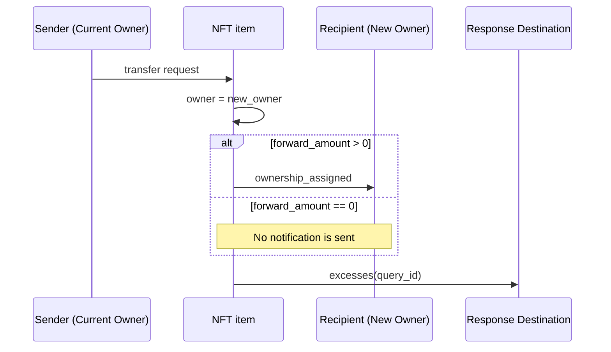

import { Aside } from '/snippets/aside.jsx';

This article describes the basic ideas and processes behind the implementation of Non‑Fungible Tokens (NFTs) in the TON Blockchain, aligned with [TEP‑62](https://github.com/ton-blockchain/TEPs/blob/1fbc23cac69723c53251f686ec90d81bf0e83443/text/0062-nft-standard.md).

## Related smart contracts

Standardized NFTs on TON are implemented using a set of smart contracts, including:

- [NFT collection](https://github.com/ton-blockchain/token-contract/blob/31876c659f157df0f5d013b7b33851d1d2a9c3f7/nft/nft-collection.fc) smart contract
- [NFT item](https://github.com/ton-blockchain/token-contract/blob/31876c659f157df0f5d013b7b33851d1d2a9c3f7/nft/nft-item.fc) smart contract

It is important to keep in mind that the NFT standard provides only a general interaction scheme, leaving specific implementation details to developers.

### NFT collection

Think of the collection as the factory for the whole collection. It tracks the next item index, deterministically computes an item address from its index, and stores shared metadata and the item code. It also stores an owner (admin/creator) who can send messages to deploy new NFT items, update metadata, or configure royalties (see [TEP‑66](https://github.com/ton-blockchain/TEPs/blob/1e5b2c4c8290d88d6bc3ddc4729812e3ac232c00/text/0066-nft-royalty-standard.md)).

### NFT item

Each NFT item is its own smart contract. It remembers its collection and index, and stores the current owner and item-specific content. On a valid transfer from the current owner, it updates the owner, optionally notifies the new owner, and returns excess Toncoin to the specified address. [Explanation of why one item equals one contract](/techniques/contract-sharding). 

<Aside type="caution">
Not every NFT that stores a collection address actually belongs to that collection. Verify that the collection returns the item's address for the item's index.
</Aside>

## Message layouts

Common interactions with NFT contracts are:

- Deploy NFT Item
- Transfer NFT item

**Note: In the diagrams below you will see the `query_id` field. Today this field is largely deprecated and protocols do not require it. It remains useful for off‑chain parsing and other Web2 processing.**

### Deploy NFT item

The creator sends a message to the collection contract, which then deploys a new NFT item with the specified data (initial owner and item‑specific content). The standard does not prescribe exactly how these data must be supplied; typically the creator provides the initial owner and item‑specific content for each NFT, or this information is derived from the collection itself (see [cNFT](/standard/tokens/nft/cNFT-how-it-works)).

### Transfer NFT item

The current owner sends a transfer message to the NFT item contract. The item updates its owner field and, optionally, sends a notification and/or excess Toncoin to the specified addresses.

Transfer message body contains the following data:

| Name                  | Type             | Description                                                                                                 |
| --------------------- | ---------------- | ----------------------------------------------------------------------------------------------------------- |
| `query_id`            | uint 64          | Links transfer, ownership notification, and excesses together.                                              |
| `new_owner`           | MsgAddress       | Address that should receive ownership.                                                                      |
| `response_destination`| maybe MsgAddress | Optional address to receive an excess Toncoin message, usually it is sender address.                                                      |
| `custom_payload`      | maybe Cell       | Optional custom data passed to the NFT, can be used by higher‑level protocols. Typically, the NFT item does not read this field.              |
| `forward_amount`      | VarUInteger 16   | Toncoin amount to forward to the new owner. If `> 0`, a notification with `forward_payload` will be sent.   |
| `forward_payload`     | maybe Cell       | Optional payload delivered with the ownership notification.                                                  |

Notes:

- If `forward_amount > 0`, the item sends an ownership notification (often named `ownership_assigned`) to `new_owner`.
- If there is remaining Toncoin after fees, the item sends an `excesses(query_id)` message to `response_destination` (if provided).

Forward payload formatting:

- If the first 32 bits of `forward_payload` equal `0x00000000`, the remainder is a text comment that wallets may display.
- If the comment begins with byte `0xff`, it is considered a binary comment and should not be displayed as plain text.
- If `forward_payload` carries a binary message for interaction with another contract (e.g. DEX), there are no special prefixes.

Ownership notification message body (`ownership_assigned`) contains the following data:

| Name              | Type     | Description                                                                 |
| ----------------- | -------- | --------------------------------------------------------------------------- |
| `query_id`        | uint 64  | Links transfer, ownership notification, and excesses together.              |
| `prev_owner`      | MsgAddress | Address of the previous owner of this NFT item.                           |
| `forward_payload` | Cell     | Optional data for the recipient. same formatting rules as above apply.     |

Excess message body (`excesses`) contains the following data:

| Name       | Type    | Description                                                                 |
| ---------- | ------- | --------------------------------------------------------------------------- |
| `query_id` | uint 64 | Links transfer, ownership notification, and excesses together.              |

Note: `forward_amount` in NFTs is analogous in meaning to jetton's `forward_ton_amount` (different name, same idea: Toncoin forwarded with the notification).

Transfer must be rejected if:

1. The inbound message is not from the current owner.
1. There are not enough coins (considering storage fee guidelines) to process the operation and send `forward_amount`.
1. The contract cannot guarantee sending to `response_destination`.

Otherwise, the contract:

1. Change owner to `new_owner`.
1. If `forward_amount > 0`, send `ownership_assigned(query_id, prev_owner, forward_payload)` to `new_owner` with `forward_amount` attached.
1. Send `excesses(query_id)` to `response_destination` containing the remaining Toncoin of the inbound message.

## Off-chain layouts 
Often, off‑chain data are what give popular NFTs their value. In practice, you need to know precisely:

- Which collection an item belongs to
- What exactly is stored in each item's metadata

You can obtain all of this via the [get methods](/guidebook/first-smart-contract#6-2-reading-contract-data-with-get-methods).

### Verify NFT item

There [API method](/api-reference/nfts/get-nft-items#parameter-collection-address) that can perform this verification off‑chain, just put addresses of NFT item and NFT collection.

Because the collection is the source of truth, verification should go through it. To do this:

1. Read the NFT item index from the item contract (via `get_nft_data`).
1. Query the collection with `get_nft_address_by_index(index)`.
1. If the returned address equals the NFT item address, the item belongs to the collection.

### How to get full metadata of an NFT item

There are [API method](/api-reference/accounts/get-account-metadata?playground=open) that quickly return an item's metadata, but here's how it works under the hood (which can look a bit tricky):

Metadata is split into two parts: the collection stores collection‑wide data, and the item stores item‑specific data. To obtain full metadata:

1. Resolve the NFT item address by index from the collection (if needed).
1. Get item metadata from the item contract.
1. Get full metadata from the collection contract with `get_(index, individualData)`.

## Best practices

- Metadata referenced by each link should be permanent. If you need to change it, send a transaction that updates the reference.
- Be mindful of TON’s asynchronous nature: on‑chain “current owner” reads may become stale by the time you act on them.

## See also // TODO: do we really need it?????? 
- NFT Item: Get static Data 
- Get Collection Royalty 
- Collection metadata
