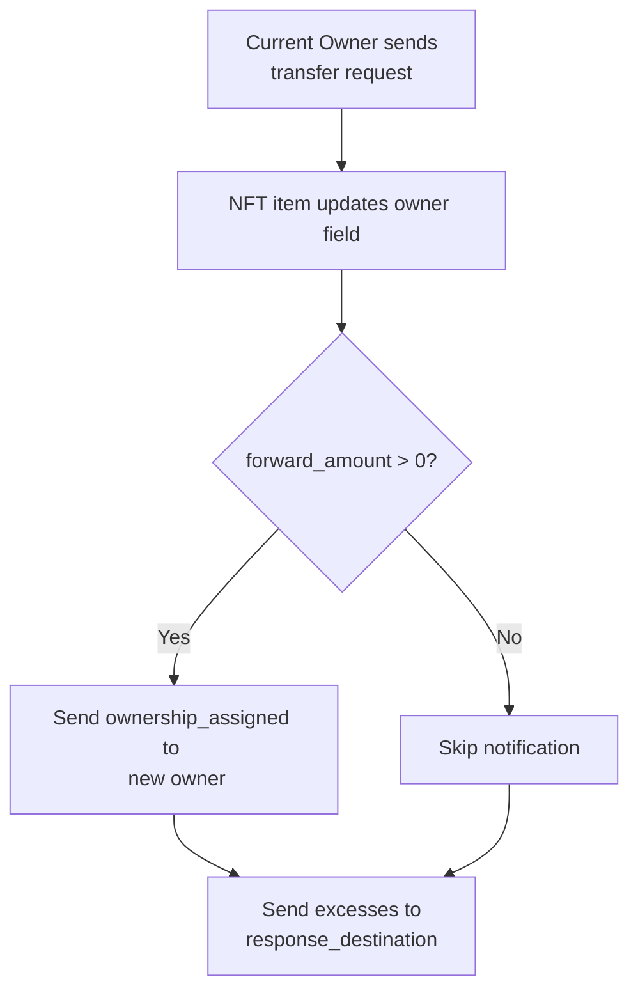

import { Aside } from '/snippets/aside.jsx';
import { Image } from '/snippets/image.jsx';

This article describes the basic ideas and processes behind the implementation of Non‑Fungible Tokens (NFTs) in the TON Blockchain, aligned with [TEP‑62](https://github.com/ton-blockchain/TEPs/blob/1fbc23cac69723c53251f686ec90d81bf0e83443/text/0062-nft-standard.md).

## Related smart contracts

Standardized NFTs on TON are implemented using a set of smart contracts, including:

- NFT collection smart contract
- NFT item smart contract

The NFT standard provides only a general interaction scheme, leaving specific implementation details to developers.

<Image
  src="/resources/images/nft/collection_light.svg"
  darkSrc="/resources/images/nft/collection_dark.svg"
  alt="NFT collection"
/>

### NFT collection

The collection is the source of truth for items. It should provide each NFT item's address, its own collection metadata, and, given an index and individual item metadata, can provide full item metadata.

### NFT item

Each NFT item is its own smart contract account ([Explanation of why one item equals one contract](/contract-dev/contract-sharding)). It provides the collection address, index, current owner, and individual metadata. On a valid transfer from the current owner, it updates the owner, optionally notifies the new owner, and returns excess Toncoin to the specified address.

<Aside
  type="caution"
>
  Not every NFT that stores a collection address actually belongs to that collection. [Verify](/standard/tokens/nft/how-to-verify-item) that the collection returns the item's address for the item's index.
</Aside>

## Transfer NFT item

The current owner sends a transfer message to the NFT item contract. The item updates its owner field and, optionally, sends a notification and/or excess Toncoin to the specified addresses.



Transfer message body contains the following data:

| Name                   | Type               | Description                                                                                                                      |
| ---------------------- | ------------------ | -------------------------------------------------------------------------------------------------------------------------------- |
| `query_id`             | `uint 64`          | Links transfer, ownership notification, and excesses together.                                                                   |
| `new_owner`            | `MsgAddress`       | Address that should receive ownership.                                                                                           |
| `response_destination` | `Maybe MsgAddress` | Optional address to receive excess Toncoin, usually the sender's address.                                                        |
| `custom_payload`       | `Maybe Cell`       | Optional custom data passed to the NFT, can be used by higher‑level protocols. Typically, the NFT item does not read this field. |
| `forward_amount`       | `VarUInteger 16`   | Toncoin amount to forward to the new owner. If `> 0`, a notification with `forward_payload` will be sent.                        |
| `forward_payload`      | `Maybe Cell`       | Optional payload delivered with the ownership notification.                                                                      |

```tlb TL-B
transfer#5fcc3d14 query_id:uint64 
                  new_owner:MsgAddress 
                  response_destination:MsgAddress 
                  custom_payload:(Maybe ^Cell) 
                  forward_amount:(VarUInteger 16) 
                  forward_payload:(Either Cell ^Cell) 
                  = InternalMsgBody;
```

Ownership notification message body (`ownership_assigned`) contains the following data:

| Name              | Type         | Description                                                    |
| ----------------- | ------------ | -------------------------------------------------------------- |
| `query_id`        | `uint 64`    | Links transfer, ownership notification, and excesses together. |
| `prev_owner`      | `MsgAddress` | Address of the previous owner of this NFT item.                |
| `forward_payload` | `Cell`       | Optional data for the recipient.                               |

```tl-b TL-B 
ownership_assigned query_id:uint64 
                   prev_owner:MsgAddress 
                   forward_payload:(Either Cell ^Cell) 
                   = InternalMsgBody;

```

Excess message body (`excesses`) contains the following data:

| Name       | Type      | Description                                                    |
| ---------- | --------- | -------------------------------------------------------------- |
| `query_id` | `uint 64` | Links transfer, ownership notification, and excesses together. |

```tl-b TL-B 
excesses query_id:uint64 = InternalMsgBody;
```

The transfer must be rejected if:

1. The inbound message is not from the current owner.
1. There are not enough coins (considering storage fee guidelines) to process the operation and send `forward_amount`.

## Best practices

- Metadata referenced by each link should be permanent. If you need to change it, send a transaction that updates the reference.
- Be mindful of TON’s asynchronous nature: on‑chain “current owner” reads may become stale by the time you act on them.
