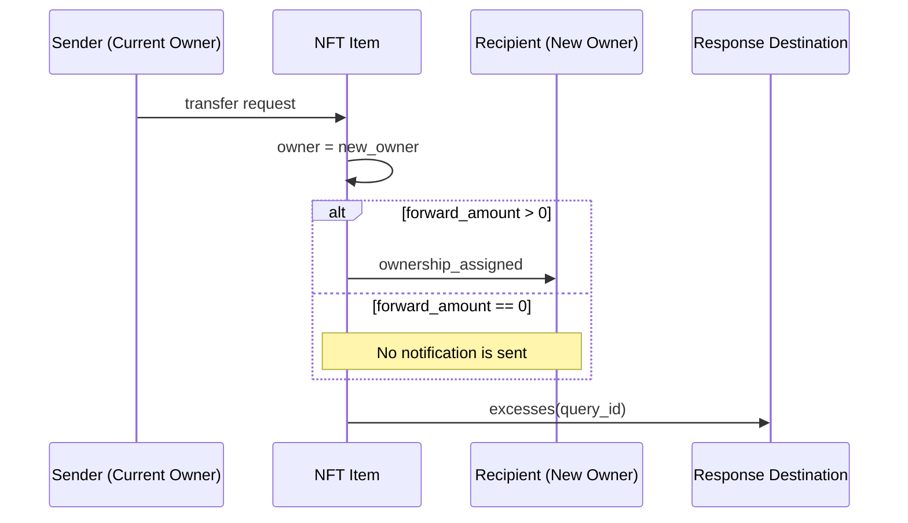
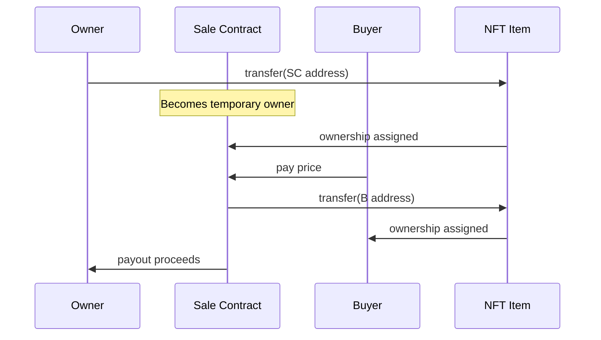

In TON there is a collection smart contract and a separate smart contract for every NFT item — each item is its own contract see more [why](/techniques/contract-sharding.mdx).


Each NFT knows its collection, its index, and its item-specific part of the [metadata](/standard/tokens/metadata.mdx). The initial owner is assigned by the collection.

## NFT deployment
The collection deploys NFT items with the initial owner and the item-specific metadata.


## How to verify an NFT belongs to a collection?
### High level
You can do it with a single request:
```ts TypeScript
const itemAddress = "EQD3LzasMd4GAmhIEkCQ4k6LnziTqNZ6VPtRfeZKHu0Fmkho";
const collectionAddress = "EQCOtGTvX-RNSaiUavmqNcDeblB3-TloZpvYuyGOdFnfy-1N";

const url = `https://toncenter.com/api/v3/nft/items?limit=1&address=${itemAddress}&collection_address=${collectionAddress}`;
const options = { method: "GET", body: undefined };

try {
const response = await fetch(url, options);
const data = await response.json();

if (data["nft_items"].length > 0) {
    console.log("✅ item in collection");
} else {
    console.log("❌ item not in collection");
}
} catch (error) {
console.error(error);
}
```

### Low level
First read the NFT item index. If the collection, for that index, returns the same NFT item address, the item belongs to the collection.

```ts TypeScript
const itemAddress = "EQD3LzasMd4GAmhIEkCQ4k6LnziTqNZ6VPtRfeZKHu0Fmkho";
  const collectionAddress = "EQCOtGTvX-RNSaiUavmqNcDeblB3-TloZpvYuyGOdFnfy-1N";

  const url = "https://toncenter.com/api/v2/runGetMethod";

  const itemPayload = {
    address: itemAddress,
    stack: [] as any[],
    method: "get_nft_data",
  };

  const headers = {
    "Content-Type": "application/json",
  };

  try {
    const itemResp = await fetch(url, {
      method: "POST",
      headers,
      body: JSON.stringify(itemPayload),
    });

    if (!itemResp.ok) {
      throw new Error(
        `Item request failed: ${itemResp.status} ${itemResp.statusText}`,
      );
    }

    const itemJson: any = await itemResp.json();

    const itemStack = itemJson?.result?.stack;
    if (!Array.isArray(itemStack) || !Array.isArray(itemStack[1])) {
      throw new Error("Unexpected item stack format");
    }
    const hex = String(itemStack[1][itemStack[1].length - 1] ?? "");
    const itemIndex = Number.parseInt(
      hex.startsWith("0x") ? hex.slice(2) : hex,
      16,
    );

    const collectionPayload = {
      address: collectionAddress,
      stack: [["int", itemIndex]],
      method: "get_nft_address_by_index",
    };

    await new Promise((resolve) => setTimeout(resolve, 2000));

    const colResp = await fetch(url, {
      method: "POST",
      headers,
      body: JSON.stringify(collectionPayload),
    });

    if (!colResp.ok) {
      throw new Error(
        `Collection request failed: ${colResp.status} ${colResp.statusText}`,
      );
    }

    const realAddress = await colResp.json();
    console.log("itemIndex:", itemIndex);

    const b64 = realAddress?.result?.stack?.[0][1].bytes as string;
    console.log(b64);
    const boc = Buffer.from(b64, "base64");

    const cell = Cell.fromBoc(boc)[0];
    const slice = cell.beginParse();
    const resAddress = slice.loadAddress();

    if (resAddress.toString() == Address.parse(itemAddress).toString()) {
      console.log("✅ item in collection");
    } else {
      console.log("❌ item not in collection");
    }
  } catch (error) {
    console.error(error);
  }
```


## How to get full metadata of an NFT
### High level
[Playground link for metadata](/api-reference/accounts/metadata?playground=open)

### Low level
Metadata is split into two parts: one part is stored on the item, another on the collection. We need to merge them.

To get metadata for an NFT of a particular index, first fetch the NFT item address from the collection, then read the item metadata, then combine it with the collection metadata to get the final result.


## NFT transfer

```ts wrap
transfer(query_id, new_owner, response_destination, custom_payload, forward_amount, forward_payload)
```

### transfer parameters

| Parameter | Purpose | Value |
| --- | --- | --- |
| `query_id` | Request identifier | Any number (e.g., timestamp or counter), usually 0 |
| `new_owner` | Address that should receive ownership | New owner address |
| `response_destination` | Where to send confirmation and excess | Address to receive confirmation/excess |
| `custom_payload` | Custom information passed to the NFT | Not used in standard NFTs; can be used by protocols |
| `forward_amount` | Amount to forward to the new owner with a notification | 0 if no notification; >0 to send notification |
| `forward_payload` | Message for the new owner | Any payload; leave empty if not required |

The NFT updates its owner field and now belongs to the new owner.

### Optional
To send a notification to the new owner from the NFT, set a positive forward_amount.
If you want to receive the excess (all remaining TON), set response_destination accordingly.



## NFT sale
Often a sale contract is created. First, the sale contract becomes the owner; upon successful purchase, it transfers the NFT to the buyer.



See more:
- NFT Standard [TEP-62](https://github.com/ton-blockchain/TEPs/blob/1fbc23cac69723c53251f686ec90d81bf0e83443/text/0062-nft-standard.md)

## Best practices
- Metadata referenced by each link should be permanent. If you need to change it, send a transaction that updates the reference.