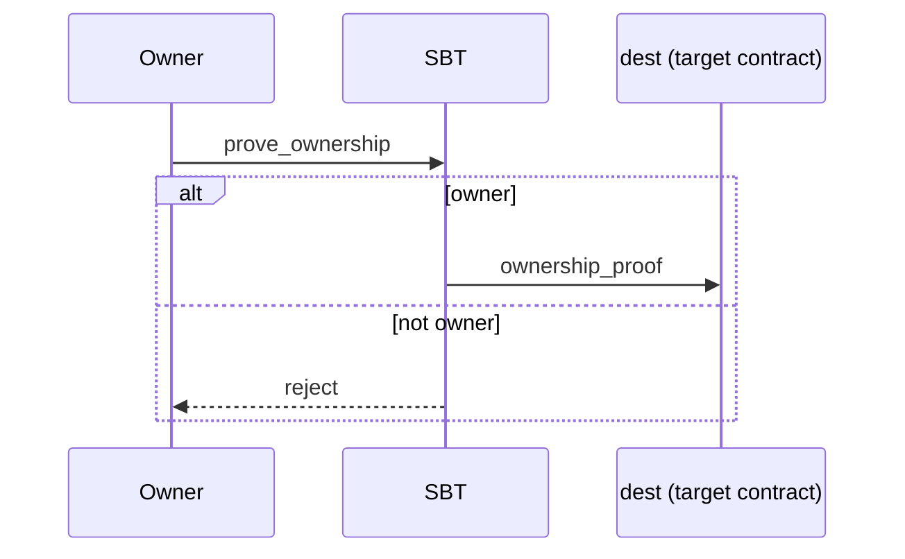
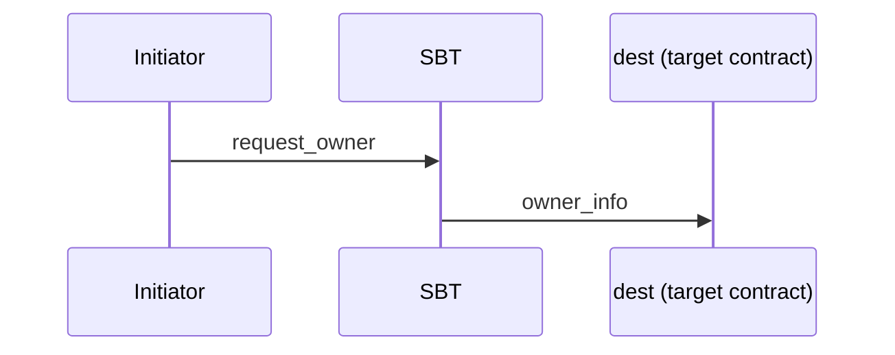
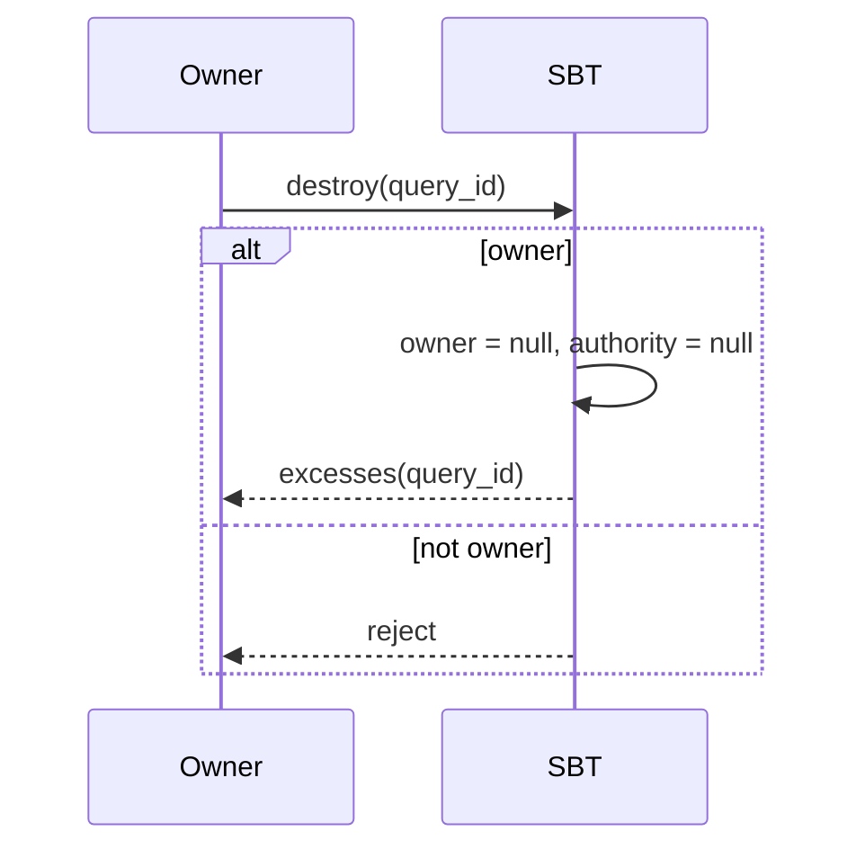
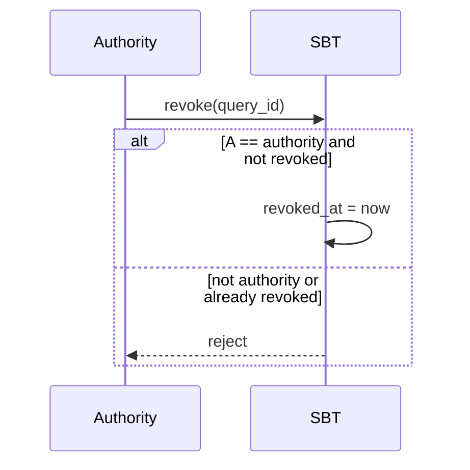

import { Aside } from '/snippets/aside.jsx';

This article describes the basic ideas and processes behind the implementation of SBT (Soul-Bound Token) in the TON Blockchain.

SBT is a variation of an NFT Item, but has some differences. The canonical specification is defined in [TEP-85](https://github.com/ton-blockchain/TEPs/blob/c5bfe285ef91810fab02c5352593f5a1455458bf/text/0085-sbt-standard.md).

It is important to keep in mind that SBT standards provide only a general scheme of interaction, leaving the specific implementation of related contracts to developers.

## Contract data storage

The SBT standard defines what data must be stored in the contract. Each SBT contract must store the following fields:

| Field                | Type         | Description                                           |
| -------------------- | ------------ | ----------------------------------------------------- |
| `index`              | `uint256`    | SBT identifier                                        |
| `collection_address` | `MsgAddress` | Collection address                                    |
| `owner`              | `MsgAddress` | Owner address                                         |
| `content`            | `Cell`       | SBT content/metadata                                  |
| `authority`          | `MsgAddress` | Authority address that can revoke the SBT             |
| `revoked_at`         | `uint64`     | Revocation time in Unix format, or `0` if not revoked |

<Aside type="note">
  The standard defines **what** must be stored in the contract, but does not specify **how** exactly this data should be structured in storage. Developers are free to choose their own implementation.
</Aside>

## Message layouts

Interactions with SBT contracts, which are most often encountered by users and developers, are:

- prove ownership: sending proof of SBT ownership to a target contract.
- request current owner: requesting current owner information from SBT.
- destroy SBT: destroying the SBT contract and returning remaining balance.
- revoke SBT: marking the SBT as revoked by authority.

<Aside
  type="caution"
>
  In all schemes below you will see the `query_id` field. Nowadays the field is almost deprecated, and protocols themselves don't need it. It is mostly used for easier off-chain parsing and other web2 processing.
</Aside>

## Bound to single owner

The `owner` of SBT is set at the minting time and never changes. Below is a simple explanation of the key operations and their message flows.

## Prove ownership



This message flow allows the `owner` to ask the SBT to send a proof to a target contract confirming that they own this SBT. You may include arbitrary `forward_payload` and optionally attach `content`.

### Prove ownership message (inbound to SBT)

```tlb title="TL-B"
;; Inbound message to SBT
prove_ownership#04ded148 query_id:uint64 dest:MsgAddress
  forward_payload:^Cell with_content:Bool = InternalMsgBody;
```

| Name              | Type         | Description                                                                                                                                                 |
| ----------------- | ------------ | ----------------------------------------------------------------------------------------------------------------------------------------------------------- |
| `query_id`        | `uint64`     | Links the request `prove_ownership` and the response `ownership_proof` to each other. To ensure this process works correctly, always use a unique query ID. |
| `dest`            | `MsgAddress` | Address of the target contract to receive the proof.                                                                                                        |
| `forward_payload` | `Cell`       | Arbitrary data forwarded to the target contract.                                                                                                            |
| `with_content`    | `Bool`       | If `true`, attach SBT `content`.                                                                                                                            |

### Ownership proof message (SBT -> target contract)

```tlb title="TL-B"
;; SBT response to the target contract (if checks pass)
ownership_proof#0524c7ae query_id:uint64 item_id:uint256 owner:MsgAddress
  data:^Cell revoked_at:uint64 content:(Maybe ^Cell) = InternalMsgBody;
```

| Name         | Type         | Description                                                                                                                                                  |
| ------------ | ------------ | ------------------------------------------------------------------------------------------------------------------------------------------------------------ |
| `query_id`   | `uint64`     | Links the request `prove_ownership` and this `ownership_proof` response to each other. To ensure this process works correctly, always use a unique query ID. |
| `item_id`    | `uint256`    | Identifier of the SBT item.                                                                                                                                  |
| `owner`      | `MsgAddress` | Current owner address.                                                                                                                                       |
| `data`       | `Cell`       | Custom data forwarded to the target contract, equal to `forward_payload`.                                                                                    |
| `revoked_at` | `uint64`     | Revoke time if SBT is revoked, `0` otherwise.                                                                                                                |
| `content`    | `Maybe Cell` | SBT content if it was requested with `with_content=true`.                                                                                                    |

Rejected transaction if the sender is not the `owner`.

## Request current owner

This message flow allows any initiator to ask the SBT to send the current `owner` (and optionally the `content`) to a target contract.



### Request owner message (inbound to SBT)

```tlb title="TL-B"
;; Inbound message to SBT
request_owner#d0c3bfea query_id:uint64 dest:MsgAddress
  forward_payload:^Cell with_content:Bool = InternalMsgBody;
```

| Name              | Type         | Description                                                                                                                                          |
| ----------------- | ------------ | ---------------------------------------------------------------------------------------------------------------------------------------------------- |
| `query_id`        | `uint64`     | Links the request `request_owner` and the response `owner_info` to each other. To ensure this process works correctly, always use a unique query ID. |
| `dest`            | `MsgAddress` | Address of the target contract to receive the response.                                                                                              |
| `forward_payload` | `Cell`       | Arbitrary data forwarded to the target contract.                                                                                                     |
| `with_content`    | `Bool`       | If `true`, attach SBT `content` in the response.                                                                                                     |

### Owner info message (SBT -> target contract)

```tlb title="TL-B"
;; SBT response to the target contract
owner_info#0dd607e3 query_id:uint64 item_id:uint256 initiator:MsgAddress owner:MsgAddress
  data:^Cell revoked_at:uint64 content:(Maybe ^Cell) = InternalMsgBody;
```

| Name         | Type         | Description                                                                                                                                           |
| ------------ | ------------ | ----------------------------------------------------------------------------------------------------------------------------------------------------- |
| `query_id`   | `uint64`     | Links the request `request_owner` and this `owner_info` response to each other. To ensure this process works correctly, always use a unique query ID. |
| `item_id`    | `uint256`    | Identifier of the SBT item.                                                                                                                           |
| `initiator`  | `MsgAddress` | Address of the requester.                                                                                                                             |
| `owner`      | `MsgAddress` | Current owner address.                                                                                                                                |
| `data`       | `Cell`       | Custom data forwarded to the target, equal to `forward_payload`.                                                                                      |
| `revoked_at` | `uint64`     | Revoke time if revoked, `0` otherwise.                                                                                                                |
| `content`    | `Maybe Cell` | SBT content if it was requested.                                                                                                                      |

## Destroy

This message flow allows the `owner` to destroy the SBT contract. This clears the `owner` and `authority` fields, and sends remaining balance back to the sender via an `excesses` message.



### Destroy message (inbound to SBT)

```tlb title="TL-B"
;; Internal message to SBT
destroy#1f04537a query_id:uint64 = InternalMsgBody;
```

| Name       | Type     | Description                                                                                                                                  |
| ---------- | -------- | -------------------------------------------------------------------------------------------------------------------------------------------- |
| `query_id` | `uint64` | Links the request `destroy` and the response `excesses` to each other. To ensure this process works correctly, always use a unique query ID. |

### Excesses message (SBT -> sender)

```tlb title="TL-B"
;; Excess returned to the sender
excesses#d53276db query_id:uint64 = InternalMsgBody;
```

| Name       | Type     | Description                                                                                                                                   |
| ---------- | -------- | --------------------------------------------------------------------------------------------------------------------------------------------- |
| `query_id` | `uint64` | Links the request `destroy` and this `excesses` response to each other. To ensure this process works correctly, always use a unique query ID. |

Rejected transaction if the sender is not the `owner`.

## Revoke SBT

This message flow allows the `authority` to mark the SBT as revoked. Revoking twice is disallowed.



### Revoke message (inbound to SBT)

```tlb title="TL-B"
;; Inbound message to SBT
revoke#6f89f5e3 query_id:uint64 = InternalMsgBody;
```

| Name       | Type     | Description                                                                                                                  |
| ---------- | -------- | ---------------------------------------------------------------------------------------------------------------------------- |
| `query_id` | `uint64` | Identifies the `revoke` request for off-chain parsing. To ensure this process works correctly, always use a unique query ID. |

Rejected transaction if:

- the sender is not the `authority`;
- the SBT was already revoked.
