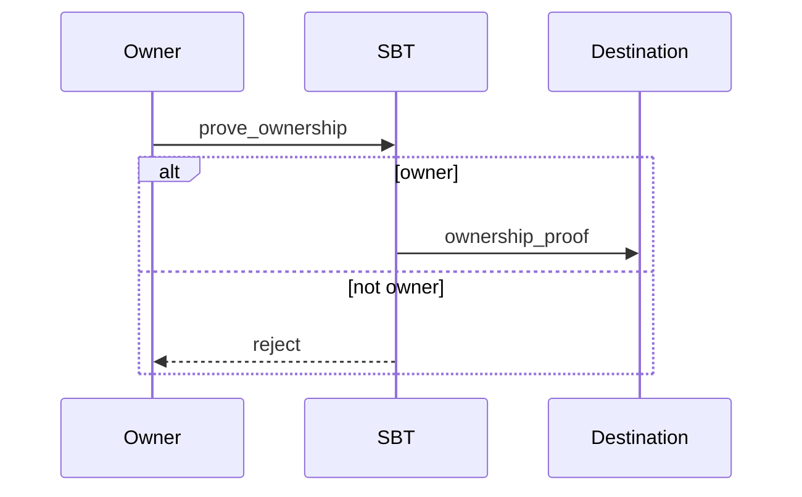
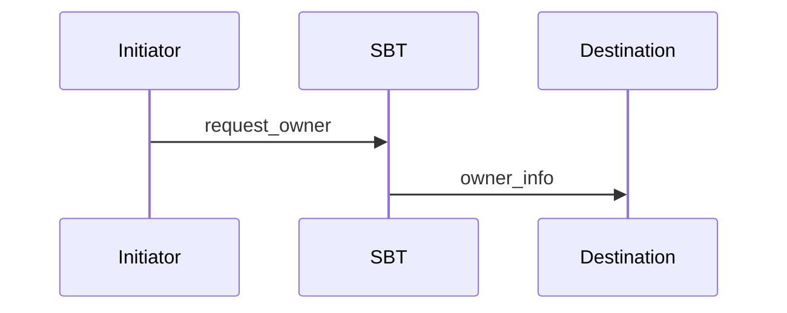
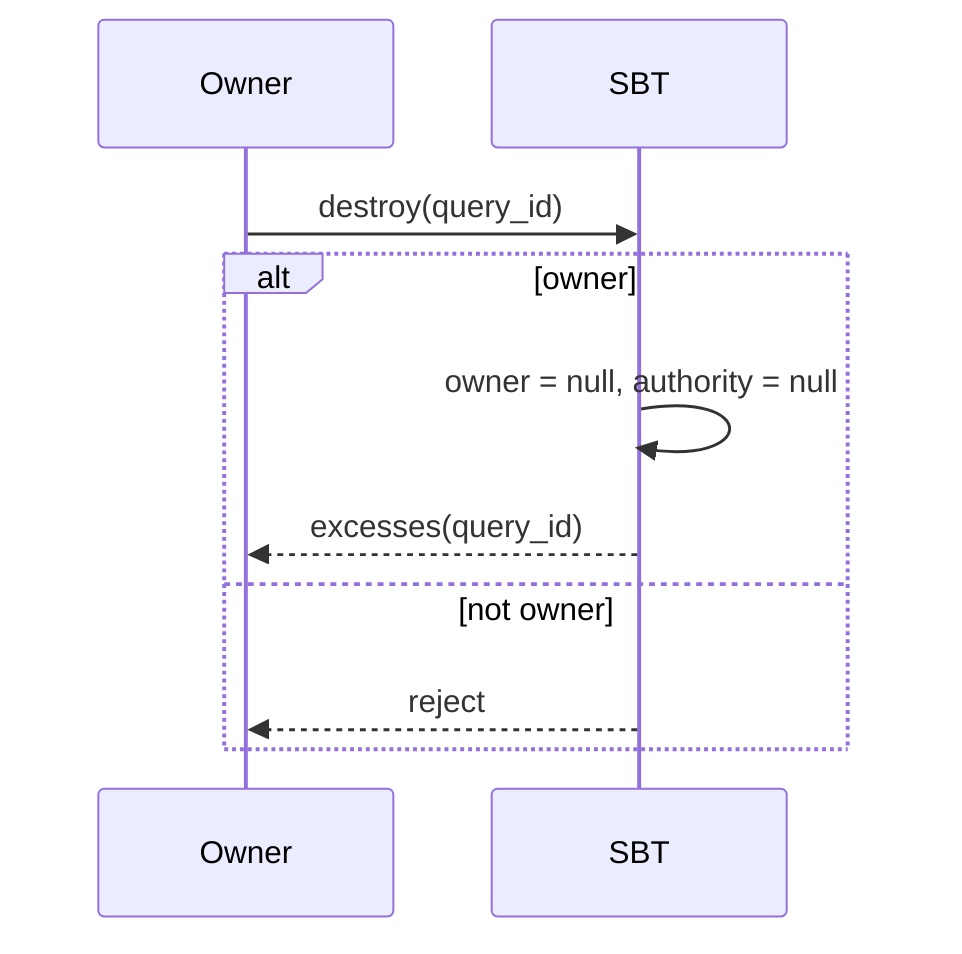
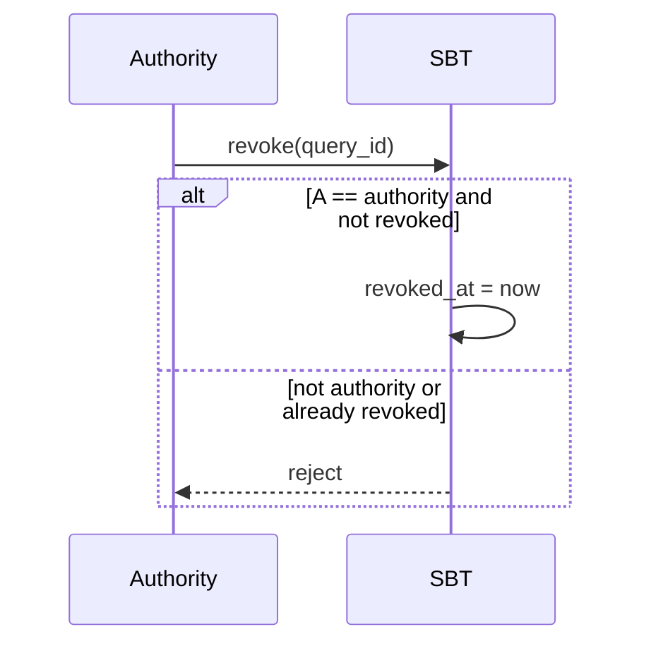

import { Aside } from '/snippets/aside.jsx';

Soul-Bound Tokens (SBTs) represent non-transferable digital credentials in the TON ecosystem. Unlike standard NFTs, SBTs are permanently bound to their owner and cannot be transferred to another address after minting. The canonical specification is defined in [TEP-85](https://github.com/ton-blockchain/TEPs/blob/c5bfe285ef91810fab02c5352593f5a1455458bf/text/0085-sbt-standard.md).

The SBT standard provides a general interaction scheme while leaving the specific implementation of related contracts to developers.

## Contract data storage

The SBT standard defines what data must be stored in the contract. Each SBT contract must store the following fields:

| Field                | Type         | Description                                           |
| -------------------- | ------------ | ----------------------------------------------------- |
| `index`              | `uint256`    | SBT identifier                                        |
| `collection_address` | `MsgAddress` | Collection address                                    |
| `owner`              | `MsgAddress` | Owner address                                         |
| `content`            | `Cell`       | SBT content/metadata                                  |
| `authority`          | `MsgAddress` | Authority address that can revoke the SBT             |
| `revoked_at`         | `uint64`     | Revocation time in Unix format, or `0` if not revoked |

<Aside type="note">
  The standard defines **what** must be stored in the contract, but does not specify **how** exactly this data should be structured in storage. Developers are free to choose their own implementation.
</Aside>

## Message layouts

Interactions with SBT contracts, which are most often encountered by users and developers, are:

- prove ownership: sending proof of SBT ownership to a destination contract.
- request current owner: requesting current owner information from SBT.
- destroy SBT: destroying the SBT contract and returning remaining balance.
- revoke SBT: marking the SBT as revoked by authority.

<Aside type="note">
  All message schemes include the `query_id` field. This field is primarily used for off-chain parsing and linking request-response pairs. The protocol itself does not require it for on-chain logic.
</Aside>

## Bound to single owner

The `owner` field is set during minting and remains immutable. The following sections describe the key operations and their message flows.

## Prove ownership



This message flow allows the `owner` to ask the SBT to send a proof to a destination contract confirming that they own this SBT. May include arbitrary `forward_payload` and optionally attach `content`.

### Prove ownership message (inbound to SBT)

```tlb title="TL-B"
;; Inbound message to SBT
prove_ownership#04ded148 query_id:uint64 destination:MsgAddress
  forward_payload:^Cell with_content:Bool = InternalMsgBody;
```

| Name              | Type         | Description                                               |
| ----------------- | ------------ | --------------------------------------------------------- |
| `query_id`        | `uint64`     | Arbitrary identifier to link request and response.        |
| `destination`     | `MsgAddress` | Address of the destination contract to receive the proof. |
| `forward_payload` | `Cell`       | Arbitrary data forwarded to the destination contract.     |
| `with_content`    | `Bool`       | If `true`, attach SBT `content` to the proof.             |

### Ownership proof message (SBT -> destination contract)

```tlb title="TL-B"
;; SBT response to the destination contract (if checks pass)
ownership_proof#0524c7ae query_id:uint64 item_id:uint256 owner:MsgAddress
  data:^Cell revoked_at:uint64 content:(Maybe ^Cell) = InternalMsgBody;
```

| Name         | Type         | Description                                        |
| ------------ | ------------ | -------------------------------------------------- |
| `query_id`   | `uint64`     | Matches the `query_id` from the request.           |
| `item_id`    | `uint256`    | Identifier of the SBT item.                        |
| `owner`      | `MsgAddress` | Current owner address.                             |
| `data`       | `Cell`       | Equals `forward_payload` from the request.         |
| `revoked_at` | `uint64`     | Revoke time if SBT is revoked, `0` otherwise.      |
| `content`    | `Maybe Cell` | SBT content if requested with `with_content=true`. |

The transaction is rejected if the sender is not the `owner`.

## Request current owner

This message flow allows any initiator to ask the SBT to send the current `owner` (and optionally the `content`) to a destination contract.



### Request owner message (inbound to SBT)

```tlb title="TL-B"
;; Inbound message to SBT
request_owner#d0c3bfea query_id:uint64 destination:MsgAddress
  forward_payload:^Cell with_content:Bool = InternalMsgBody;
```

| Name              | Type         | Description                                              |
| ----------------- | ------------ | -------------------------------------------------------- |
| `query_id`        | `uint64`     | Arbitrary identifier to link request and response.       |
| `destination`     | `MsgAddress` | Address of the destination contract to receive the info. |
| `forward_payload` | `Cell`       | Arbitrary data forwarded to the destination contract.    |
| `with_content`    | `Bool`       | If `true`, attach SBT `content` in the response.         |

### Owner info message (SBT -> destination contract)

```tlb title="TL-B"
;; SBT response to the destination contract
owner_info#0dd607e3 query_id:uint64 item_id:uint256 initiator:MsgAddress owner:MsgAddress
  data:^Cell revoked_at:uint64 content:(Maybe ^Cell) = InternalMsgBody;
```

| Name         | Type         | Description                                |
| ------------ | ------------ | ------------------------------------------ |
| `query_id`   | `uint64`     | Matches the `query_id` from the request.   |
| `item_id`    | `uint256`    | Identifier of the SBT item.                |
| `initiator`  | `MsgAddress` | Address of the requester.                  |
| `owner`      | `MsgAddress` | Current owner address.                     |
| `data`       | `Cell`       | Equals `forward_payload` from the request. |
| `revoked_at` | `uint64`     | Revoke time if revoked, `0` otherwise.     |
| `content`    | `Maybe Cell` | SBT content if requested.                  |

## Destroy

This message flow allows the `owner` to destroy the SBT contract. This clears the `owner` and `authority` fields, and sends remaining balance back to the sender via an `excesses` message.



### Destroy message (inbound to SBT)

```tlb title="TL-B"
;; Internal message to SBT
destroy#1f04537a query_id:uint64 = InternalMsgBody;
```

| Name       | Type     | Description                                        |
| ---------- | -------- | -------------------------------------------------- |
| `query_id` | `uint64` | Arbitrary identifier to link request and response. |

### Excesses message (SBT -> sender)

```tlb title="TL-B"
;; Excess returned to the sender
excesses#d53276db query_id:uint64 = InternalMsgBody;
```

| Name       | Type     | Description                              |
| ---------- | -------- | ---------------------------------------- |
| `query_id` | `uint64` | Matches the `query_id` from the request. |

The transaction is rejected if the sender is not the `owner`.

## Revoke SBT

This message flow allows the `authority` to mark the SBT as revoked. Revoking twice is disallowed.



### Revoke message (inbound to SBT)

```tlb title="TL-B"
;; Inbound message to SBT
revoke#6f89f5e3 query_id:uint64 = InternalMsgBody;
```

| Name       | Type     | Description                                 |
| ---------- | -------- | ------------------------------------------- |
| `query_id` | `uint64` | Arbitrary identifier for off-chain parsing. |

The transaction is rejected if:

- the sender is not the `authority`;
- the SBT was already revoked.
