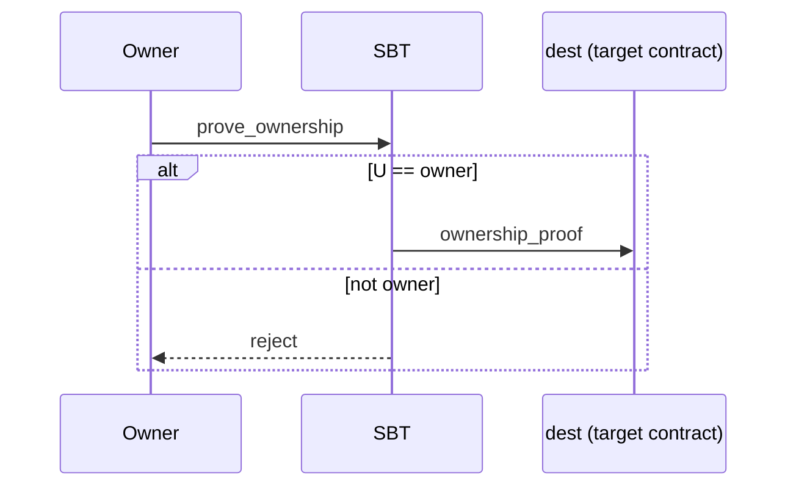
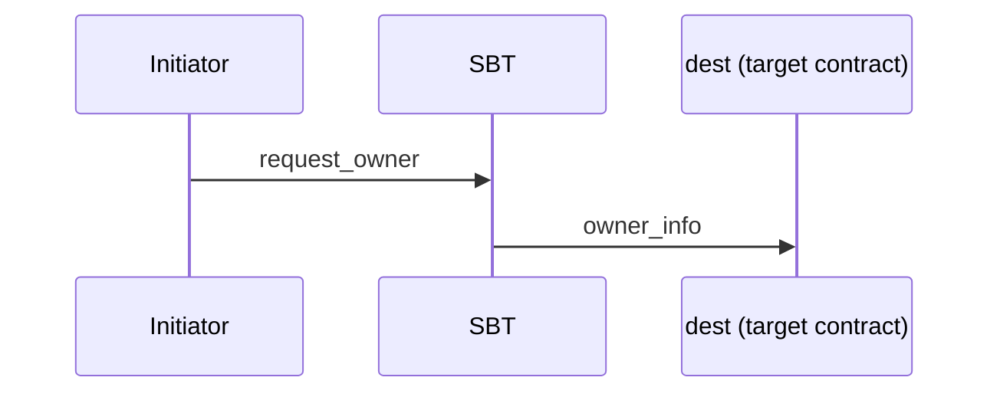
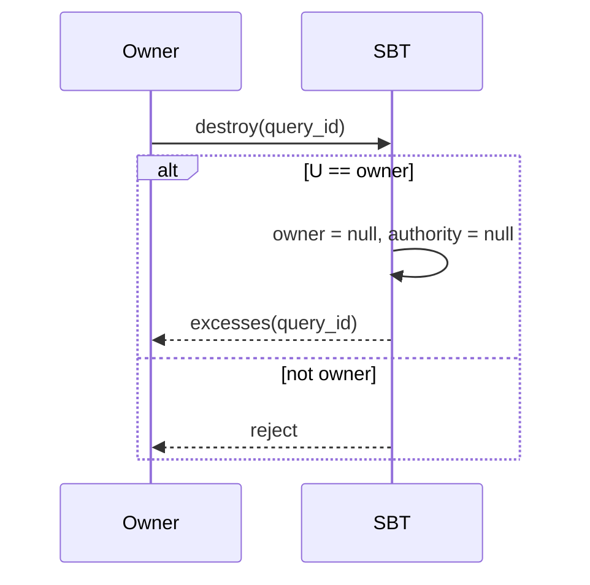
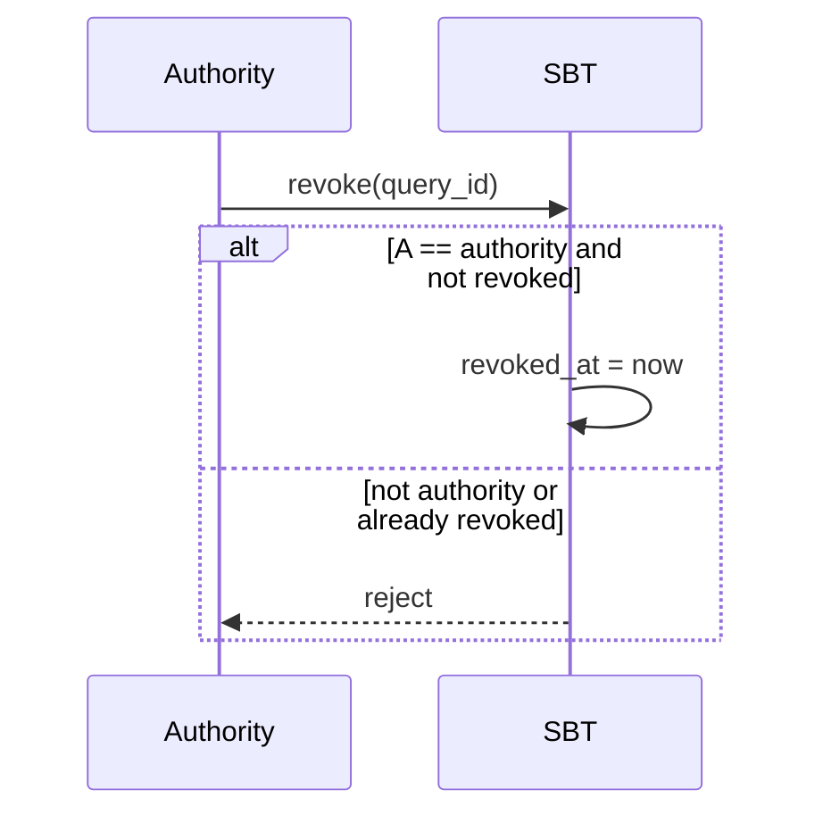

SBT is a variation of an NFT Item, but has some differences.

SBT standards provide only a general scheme of interaction, leaving the specific implementation of related contracts to developers.

**Nota bene: in all schemes below you will see the `query id` field. Nowadays the field is almost deprecated, and protocols itself doesn't need it.
It is mostly used for easier off-chain parsing and other web2 processing**.

## Bound to single owner

The `owner` is set at mint time and never changes. Below is a simple explanation of the key operations and their message flows.

## Prove ownership

Allows the `owner` to ask the SBT to send a proof to a target contract confirming that they own this SBT. You may include arbitrary `forward_payload` and optionally attach `content`.

```tlb title="TL-B"
;; Inbound message to SBT
prove_ownership#04ded148 query_id:uint64 dest:MsgAddress
  forward_payload:^Cell with_content:Bool = InternalMsgBody;

;; SBT response to the target contract (if checks pass)
ownership_proof#0524c7ae query_id:uint64 item_id:uint256 owner:MsgAddress
  data:^Cell revoked_at:uint64 content:(Maybe ^Cell) = InternalMsgBody;
```

`Inbound to SBT`. Prove ownership message contains the following data:

| Name              | Type       | Description                                                                                                                                                 |
| ----------------- | ---------- | ----------------------------------------------------------------------------------------------------------------------------------------------------------- |
| `query_id`        | uint64     | Links the request `prove_ownership` and the response `ownership_proof` to each other. To ensure this process works correctly, always use a unique query ID. |
| `dest`            | MsgAddress | Address of the target contract to receive the proof.                                                                                                        |
| `forward_payload` | Cell       | Arbitrary data forwarded to the target contract.                                                                                                            |
| `with_content`    | Bool       | If `true`, attach SBT `content`.                                                                                                                            |

`SBT -> dest (target contract)`. Ownership proof message contains the following data:

| Name         | Type       | Description                                                                                                                                                  |
| ------------ | ---------- | ------------------------------------------------------------------------------------------------------------------------------------------------------------ |
| `query_id`   | uint64     | Links the request `prove_ownership` and this `ownership_proof` response to each other. To ensure this process works correctly, always use a unique query ID. |
| `item_id`    | uint256    | Identifier of the SBT item.                                                                                                                                  |
| `owner`      | MsgAddress | Current owner address.                                                                                                                                       |
| `data`       | Cell       | Custom data forwarded to the target contract.                                                                                                                |
| `revoked_at` | uint64     | Revoke time if SBT is revoked, `0` otherwise.                                                                                                                |
| `content`    | maybe Cell | SBT content if it was requested with `with_content=true`.                                                                                                    |

Rejected if the sender is not the `owner`.



## Request current owner

Any initiator may ask the SBT to send the current `owner` (and optionally the `content`) to a target contract.

```tlb title="TL-B"
;; Inbound message to SBT
request_owner#d0c3bfea query_id:uint64 dest:MsgAddress
  forward_payload:^Cell with_content:Bool = InternalMsgBody;

;; SBT response to the target contract
owner_info#0dd607e3 query_id:uint64 item_id:uint256 initiator:MsgAddress owner:MsgAddress
  data:^Cell revoked_at:uint64 content:(Maybe ^Cell) = InternalMsgBody;
```

`Inbound to SBT`. Request owner message contains the following data:

| Name              | Type       | Description                                                                                                                                          |
| ----------------- | ---------- | ---------------------------------------------------------------------------------------------------------------------------------------------------- |
| `query_id`        | uint64     | Links the request `request_owner` and the response `owner_info` to each other. To ensure this process works correctly, always use a unique query ID. |
| `dest`            | MsgAddress | Address of the target contract to receive the response.                                                                                              |
| `forward_payload` | Cell       | Arbitrary data forwarded to the target contract.                                                                                                     |
| `with_content`    | Bool       | If `true`, attach SBT `content` in the response.                                                                                                     |

`SBT -> dest (target contract)`. Owner info message contains the following data:

| Name         | Type       | Description                                                                                                                                           |
| ------------ | ---------- | ----------------------------------------------------------------------------------------------------------------------------------------------------- |
| `query_id`   | uint64     | Links the request `request_owner` and this `owner_info` response to each other. To ensure this process works correctly, always use a unique query ID. |
| `item_id`    | uint256    | Identifier of the SBT item.                                                                                                                           |
| `initiator`  | MsgAddress | Address of the requester.                                                                                                                             |
| `owner`      | MsgAddress | Current owner address.                                                                                                                                |
| `data`       | Cell       | Custom data forwarded to the target, equals to `forward_payload`.                                                                                     |
| `revoked_at` | uint64     | Revoke time if revoked, `0` otherwise.                                                                                                                |
| `content`    | maybe Cell | SBT content if it was requested.                                                                                                                      |



## Destroy

The `owner` can destroy the SBT contract. This clears the `owner` and `authority` fields, and sends remaining balance back to the sender via an `excesses` message.

```tlb title="TL-B"
;; Internal message to SBT
destroy#1f04537a query_id:uint64 = InternalMsgBody;

;; Excess returned to the sender
excesses#d53276db query_id:uint64 = InternalMsgBody;
```

`Inbound to SBT`. Destroy message contains the following data:

| Name       | Type   | Description                                                                                                                                  |
| ---------- | ------ | -------------------------------------------------------------------------------------------------------------------------------------------- |
| `query_id` | uint64 | Links the request `destroy` and the response `excesses` to each other. To ensure this process works correctly, always use a unique query ID. |

`SBT -> sender`. Excesses message contains the following data:

| Name       | Type   | Description                                                                                                                                   |
| ---------- | ------ | --------------------------------------------------------------------------------------------------------------------------------------------- |
| `query_id` | uint64 | Links the request `destroy` and this `excesses` response to each other. To ensure this process works correctly, always use a unique query ID. |

Rejected if the sender is not the `owner`.



## Revoke SBT

The `authority` can mark the SBT as revoked. Revoking twice is disallowed.

```tlb title="TL-B"
;; Inbound message to SBT
revoke#6f89f5e3 query_id:uint64 = InternalMsgBody;
```

`Inbound to SBT`. Revoke message contains the following data:

| Name       | Type   | Description                                                                                                                  |
| ---------- | ------ | ---------------------------------------------------------------------------------------------------------------------------- |
| `query_id` | uint64 | Identifies the `revoke` request for off-chain parsing. To ensure this process works correctly, always use a unique query ID. |

Rejected if:

- the sender is not the `authority`;
- the SBT was already revoked.



---

### Quick field reference

- `item_id`: identifier of the SBT item (analogous to an NFT item)
- `owner`: current owner
- `authority`: the address allowed to revoke the SBT
- `content`: SBT content (may be attached optionally)
- `revoked_at`: Unix timestamp of revoke (`0` means not revoked)

See more:

- SBT Standard [TEP-85](https://github.com/ton-blockchain/TEPs/blob/c5bfe285ef91810fab02c5352593f5a1455458bf/text/0085-sbt-standard.md)
