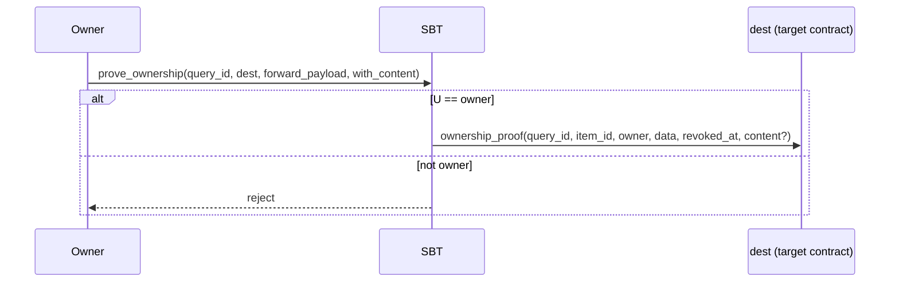
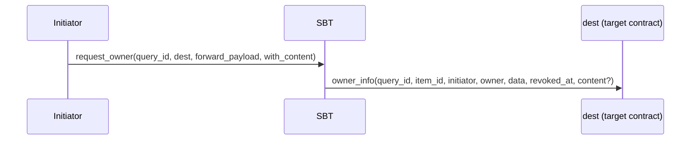
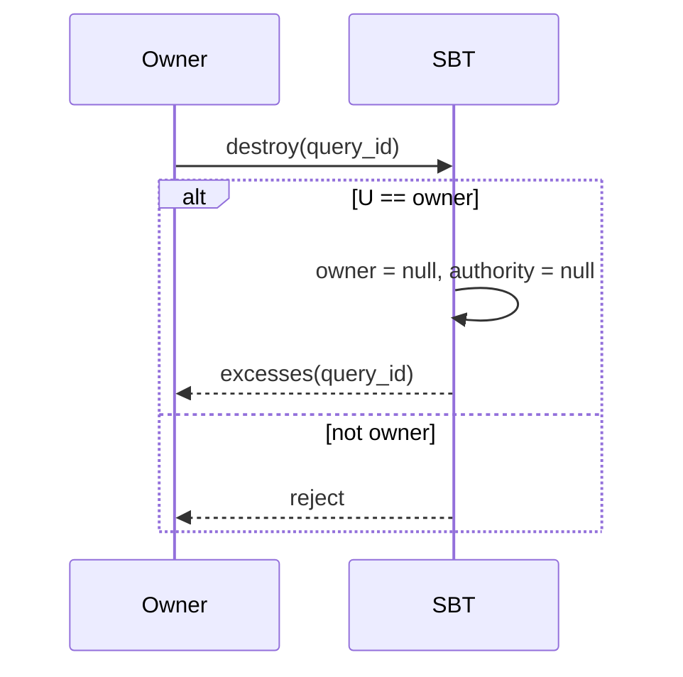
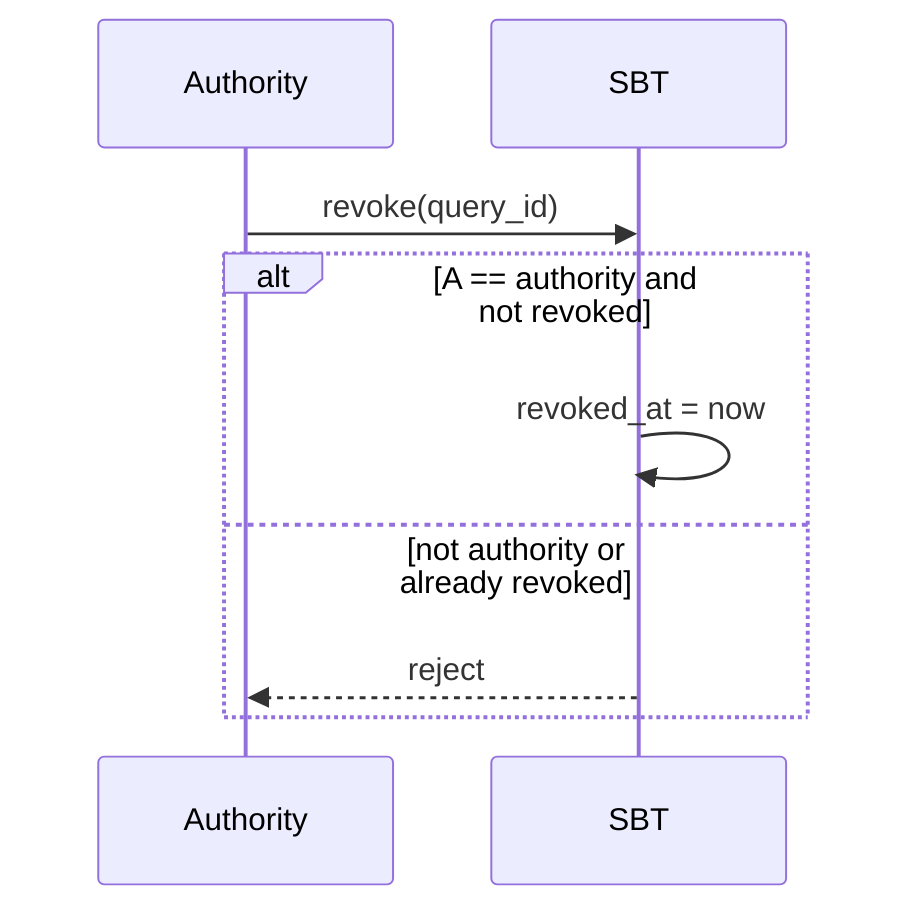

SBT is like an NFT but without transfers. The `owner` is set at mint time and never changes. Below is a simple explanation of the key operations and their message flows.

## 1) Prove ownership — `prove_ownership`

Allows the `owner` to ask the SBT to send a proof to a target contract confirming that they own this SBT. You may include arbitrary `forward_payload` and optionally attach `content`.

```tlb title="TL-B"
;; Inbound message to SBT
prove_ownership#04ded148 query_id:uint64 dest:MsgAddress
  forward_payload:^Cell with_content:Bool = InternalMsgBody;

;; SBT response to the target contract (if checks pass)
ownership_proof#0524c7ae query_id:uint64 item_id:uint256 owner:MsgAddress
  data:^Cell revoked_at:uint64 content:(Maybe ^Cell) = InternalMsgBody;
```

- `query_id`: arbitrary request identifier
- `dest`: address of the target contract to prove ownership to
- `forward_payload`: arbitrary data for the target contract
- `with_content`: if `true`, attach SBT `content`
- `revoked_at`: revoke time if SBT is revoked, `0` otherwise

Rejected if the sender is not the `owner`.



## 2) Request current owner — `request_owner`

Any initiator may ask the SBT to send the current `owner` (and optionally the `content`) to a target contract.

```tlb title="TL-B"
;; Inbound message to SBT
request_owner#d0c3bfea query_id:uint64 dest:MsgAddress
  forward_payload:^Cell with_content:Bool = InternalMsgBody;

;; SBT response to the target contract
owner_info#0dd607e3 query_id:uint64 item_id:uint256 initiator:MsgAddress owner:MsgAddress
  data:^Cell revoked_at:uint64 content:(Maybe ^Cell) = InternalMsgBody;
```

- `initiator`: address of the requester
- Other fields mirror `prove_ownership`



## 3) Destroy the contract — `destroy`

The `owner` can destroy the SBT contract. This clears the `owner` and `authority` fields, and sends remaining balance back to the sender via an `excesses` message.

```tlb title="TL-B"
;; Internal message to SBT
destroy#1f04537a query_id:uint64 = InternalMsgBody;

;; Excess returned to the sender
excesses#d53276db query_id:uint64 = InternalMsgBody;
```

Rejected if the sender is not the `owner`.



## 4) Revoke SBT — `revoke`

The `authority` can mark the SBT as revoked. Double-revoke is disallowed.

```tlb title="TL-B"
;; Inbound message to SBT
revoke#6f89f5e3 query_id:uint64 = InternalMsgBody;
```

Rejected if:
- the sender is not the `authority`;
- the SBT was already revoked.



---

### Quick field reference

- `item_id`: identifier of the SBT item (analogous to an NFT item)
- `owner`: current owner
- `authority`: the address allowed to revoke the SBT
- `content`: SBT content (may be attached optionally)
- `revoked_at`: Unix timestamp of revoke (`0` means not revoked)
