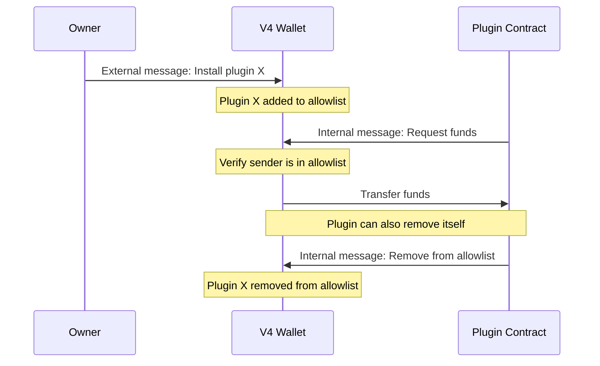
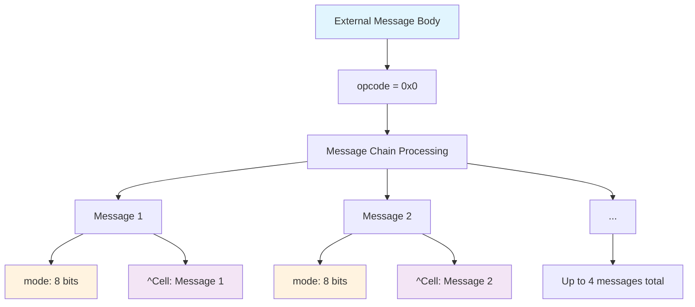

import { Aside } from '/snippets/aside.jsx';

This version retains all the functionality of the previous versions and introduces plugins.

Plugins enable developers to implement custom logic that integrates with wallet functionality. When a plugin is installed on a wallet through a signed transaction, it can initiate Toncoin transfers to specified addresses upon receiving an internal message from another smart contract. Plugin operations are executed based on predefined conditions and message triggers.

Here you can view [wallet V4 source code](https://github.com/ton-blockchain/wallet-contract).

## Plugins

<Aside
  type="danger"
>
  Installing third-party plugins can be dangerous and may lead to wallet drainage. Only install plugins from trusted sources and ensure you understand their functionality before installation.
</Aside>

Plugins are essentially other smart contracts on TON that developers are free to implement as they wish. In relation to the wallet, they are simply addresses of smart contracts stored in a dictionary in the wallet's persistent memory. These plugins are allowed to request funds and remove themselves from the "allowed list" by sending internal messages to the wallet.

### Plugin interaction flow



## Persistent memory layout

Here we will break down wallet V4 storage structure.

```tlb
contract_state$_ seqno:# wallet_id:(## 32) public_key:(## 256) plugins:(HashmapE 256 int1) = ContractState;
```

- `seqno`: 32-bit long sequence number.
- `subwallet_id`: 32-bit long subwallet_id. This is a number that allows you to create multiple wallets with the same private key but different addresses.
- `public_key`: 256-bit long public key.
- `plugins`: dictionary containing plugins (may be empty).

## Receiving internal messages

All previous versions of wallets had a straightforward implementation for receiving internal messages. They simply accepted incoming funds from any sender, ignoring the internal message body if present, or in other words, they had an empty `recv_internal` method. However, as mentioned earlier, the fourth version of the wallet introduces two additional available operations. Let's take a look at the internal message body layout:

- `opcode` (optional): 32-bit long operation code. This is an optional field. Any message containing less than 32 bits in the message body, an incorrect opcode, or a sender address that isn't registered as a plugin will be considered a simple transfer, similar to previous wallet versions.
- `query_id`: 64-bit long integer. This field has no effect on the smart contract's behavior; it is used to track chains of messages between contracts.

1. opcode = `0x706c7567`, request funds operation.
   - `Toncoin`: [VARUINT16](/tvm/instructions#fa02-stgrams) amount of requested Toncoin.
   - `extra_currencies`: dictionary containing the amount of requested extra currencies (may be empty).
1. opcode = `0x64737472`, request removal of the plugin that sent this message from the "allowed list".

TL-B for plugin operations:

```tlb
request_funds#706c7567 amount:Coins extra_currencies:ExtraCurrencyCollection = InternalMsgBody;

self_destroy#64737472 = InternalMsgBody;
```

## External message body layout

```tlb
signed_request$_
  signature:    bits512      // 512
  subwallet_id: #            // 32
  valid_until:  #            // 32
  msg_seqno:    #            // 32
  opcode:       #            // 32
= SignedRequest;
```

- `signature`: 512-bit long [Ed25519](https://en.wikipedia.org/wiki/EdDSA#Ed25519) signature.
- `subwallet_id`: 32-bit long subwallet ID.
- `valid_until`: 32-bit long Unix time integer.
- `msg_seqno`: 32-bit long sequence number.
- `opcode`: 32-bit long operation code.

Next, let's explore the types of messages:

### Simple send (opcode = 0x0)

The simple send operation processes a chain of messages, where each message contains a mode and a reference to the actual message cell:



**Processing logic:**

```func
if (op == 0) { ;; simple send
  while (cs.slice_refs()) {
    var mode = cs~load_uint(8);
    send_raw_message(cs~load_ref(), mode);
  }
}
```

- `mode`: up to four 8-bit integers defining the sending mode for each message.
- `out_msg`: up to four references to cells containing messages.

### Deploy and install plugin (opcode = 0x1)

```tlb
deploy_and_install_plugin#01
  workchain:(## 8)
  balance:Coins
  state_init:^Cell
  body:^Cell
= OutAction;
```

Deploys a new plugin contract and adds it to the wallet's plugin allowlist:

- `workchain`: 8-bit workchain ID where the plugin will be deployed
- `balance`: Initial Toncoin balance for the plugin contract
- `state_init`: Cell reference containing the plugin's initial state and code
- `body`: Cell reference containing the deployment message body

### Install plugin (opcode = 0x2)

```tlb
wc_n_address#_ wc:(## 8) hash:(## 256) = WorkchainWithAddress;

install_plugin#02
  wc_n_address:WorkchainWithAddress
  balance:Coins
  query_id:(## 64)
= OutAction;
```

Adds an existing plugin contract to the wallet's allowlist:

- `wc_n_address`: Combined 8-bit workchain ID and 256-bit plugin address
- `balance`: Toncoin amount to send during installation (unused in current implementation)
- `query_id`: 64-bit identifier for tracking the operation

### Remove plugin (opcode = 0x3)

```tlb
wc_n_address#_ wc:(## 8) hash:(## 256) = WorkchainWithAddress;

remove_plugin#03
  wc_n_address:WorkchainWithAddress
  balance:Coins
  query_id:(## 64)
= OutAction;
```

Removes a plugin from the wallet's allowlist:

- `wc_n_address`: Combined 8-bit workchain ID and 256-bit plugin address
- `balance`: Toncoin amount (unused in current implementation)
- `query_id`: 64-bit identifier for tracking the operation

The fourth version provides standard functionality through the `0x0` opcode, similar to previous versions (see [wallet overview](/standard/wallets/history) for details on message layout). The `0x2` and `0x3` operations allow manipulation of the plugin dictionary. Note that in the case of `0x2`, you need to deploy the plugin with that address yourself. In contrast, the `0x1` opcode also handles the deployment process with the `state_init` field.

## Exit codes

| Exit code | Description                                                             |
| --------- | ----------------------------------------------------------------------- |
| 33        | `seqno` check failed, replay protection triggered                       |
| 34        | `subwallet_id` does not match the stored one                            |
| 35        | `Ed25519 signature` check failed                                        |
| 36        | `valid_until` check failed, transaction confirmation attempted too late |
| 39        | Plugins dictionary manipulation failed (0x1-0x3 recv_external opcodes) |
| 80        | Not enough funds for the funds request                                  |
| 0         | Standard successful execution exit code.                                |

## Get methods

1. `int seqno()` returns current stored seqno.
1. `int get_public_key()` returns current stored public key.
1. `int get_subwallet_id()` returns current subwallet ID.
1. `int is_plugin_installed(int wc, int addr_hash)` checks if plugin with defined workchain_id and address hash is installed. Returns `-1` (true) if the plugin is installed, `0` (false) if not installed.
1. `tuple get_plugin_list()` returns list of plugins.
