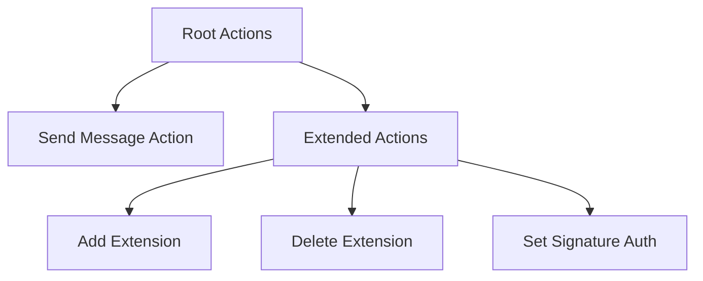

This article provides overview of wallet V5 public interfaces, how to interact with them and serialize used data structures.

There are several ways how you can interact with deployed V5 wallet smart contract:

- Send external signed message
- Send internal signed message
- Send internal message from extension
- Call get-methods

Let's first explore message structure, that is used to perform different actions on wallet contract.

## Message structure

Message structure for V5 wallet contract is quite cumbersome and hard to read, it's made for optimal (de-)serialization and not optimized for understanding. It is described in [TL-B](/language/TL-B/overview) language and includes snake-cell pattern. We will try to get a grip of it by breaking down core data structures and how they are used.

You can skip to [Examples section](#examples), where we would use existing high-level libraries that abstract low level logic from the user.

### TL-B

This is TL-B for V5 wallet actions, it includes some [complex TL-B patterns](/language/TL-B/complex-and-non-trivial-examples.mdx). You can also find it on [GitHib](https://github.com/ton-blockchain/wallet-contract-v5/blob/321186127e8cc5e395ad3b2f1870839237c56f5f/types.tlb), in the wallet repo.

```tlb expandable
// Standard actions from block.tlb:
out_list_empty$_ = OutList 0;
out_list$_ {n:#} prev:^(OutList n) action:OutAction = OutList (n + 1);
action_send_msg#0ec3c86d mode:(## 8) out_msg:^(MessageRelaxed Any) = OutAction;

// Extended actions in W5:
action_list_basic$_ {n:#} actions:^(OutList n) = ActionList n 0;
action_list_extended$_ {m:#} {n:#} action:ExtendedAction prev:^(ActionList n m) = ActionList n (m+1);

action_add_ext#02 addr:MsgAddressInt = ExtendedAction;
action_delete_ext#03 addr:MsgAddressInt = ExtendedAction;
action_set_signature_auth_allowed#04 allowed:(## 1) = ExtendedAction;

signed_request$_             // 32 (opcode from outer)
  wallet_id:    #            // 32
  valid_until:  #            // 32
  msg_seqno:    #            // 32
  inner:        InnerRequest //
  signature:    bits512      // 512
= SignedRequest;             // Total: 688 .. 976 + ^Cell

internal_signed#73696e74 signed:SignedRequest = InternalMsgBody;
internal_extension#6578746e query_id:(## 64) inner:InnerRequest = InternalMsgBody;
external_signed#7369676e signed:SignedRequest = ExternalMsgBody;

actions$_ out_actions:(Maybe OutList) has_other_actions:(## 1) {m:#} {n:#} other_actions:(ActionList n m) = InnerRequest;

// Contract state
contract_state$_ is_signature_allowed:(## 1) seqno:# wallet_id:(## 32) public_key:(## 256) extensions_dict:(HashmapE 256 int1) = ContractState;
```

Three types of messages that were described above can be seen here:

```tlb
internal_signed#73696e74 signed:SignedRequest = InternalMsgBody;
internal_extension#6578746e query_id:(## 64) inner:InnerRequest = InternalMsgBody;
external_signed#7369676e signed:SignedRequest = ExternalMsgBody;
```

Each of them includes the same `InnerRequest` field that dictates whats need to be done by wallet contract. In case of signed messages, the request needs to be verified, so `InnerRequest` is wrapped in `SignedRequest` structure, which contains necessary information for this.

Let's break down these data structures.

### Signed Request

Signed message is a message that was signed using owners private key from his dedicated keypair, method from asymmetric cryptography. Later this message will be verified on-chain using public key stored in wallet smart contract - [read more](/standard/wallets/how-it-works#how-ownership-verification-works) about how ownership verification works.

Before V5 standard, there was only one way to deliver signed message to wallet contract - via external-in message. However, external messages has certain limitations, e.g. you can only send external-out messages from the smart contracts themselves. This means that it wasn't possible to deliver signed message from inside the blockchain, from another smart contract. V5 standard adds this functionality, partially enabling [gassless transaction](/standard/wallets/v5#preparing-for-gasless-transactions).

Besides `InnerRequest` field that contains actual actions that will be performed, `Signed message` structure contains usual wallet message fields that were in-place in previous versions, read more about them [here](/standard/wallets/how-it-works).

### Inner Request

V5 wallet supports two main types of actions that can be performed:



The action structure allows for:
- **Send Message Actions**: Standard message sending with specified modes
- **Extended Actions**: Advanced wallet management operations
  - **Add Extension**: Register new extension addresses
  - **Delete Extension**: Remove extension addresses
  - **Set Signature Auth**: Enable/disable signature-based authentication

## Examples
