import { Aside } from "/snippets/aside.jsx";

This article provides overview of wallet V5 public interfaces, how to interact with them and serialize used data structures.

<Aside>
  Note, that many of the things we implement in this article are for education purposes and they might need to be refined before production use.

  Moreover, all these V5 wallet contract interfaces are implemented in [`@ton/ton`](https://github.com/ton-org/ton) client library as WalletV5 contract wrapper class.
</Aside>

There are several ways how you can interact with deployed V5 wallet smart contract:

- Send external signed message
- Send internal signed message
- Send internal message from extension

Let's first explore message structure, that is used to perform different actions on wallet contract.

## TL-B

This is TL-B for V5 wallet actions, it includes some [complex TL-B patterns](/languages/tl-b/complex-and-non-trivial-examples.mdx). You can also find it on [GitHub](https://github.com/ton-blockchain/wallet-contract-v5/blob/321186127e8cc5e395ad3b2f1870839237c56f5f/types.tlb), in the wallet repo.

```tlb expandable
// Contract state
contract_state$_
  is_signature_allowed: (## 1)
  seqno:                #
  wallet_id:            #
  public_key:           (## 256)
  extensions_dict:      (HashmapE 256 int1)
= ContractState;

// Extended actions in W5:
add_extension#02 addr:MsgAddressInt = W5ExtendedAction;
delete_extension#03 addr:MsgAddressInt = W5ExtendedAction;
set_signature_auth_allowed#04 allowed:Bool = W5ExtendedAction;

// note: `m = extended actions count - 1`, so the last ref is not empty cell
extended_list_last$_ action:W5ExtendedAction = W5ExtendedActionList 0;
extended_list_action$_ {n:#} action:W5ExtendedAction prev:^(W5ExtendedActionList n) = W5ExtendedActionList (n + 1);

// `OutList m` is standard actions from block.tlb:
w5_actions_request$_ {m:#} {n:#} out_actions:(Maybe ^(OutList m)) extended_actions:(Maybe (W5ExtendedActionList n)) = W5InnerRequest m n;

w5_signed_request$_ {m:#} {n:#}
  wallet_id:    #
  valid_until:  #
  msg_seqno:    #
  inner:        (W5InnerRequest m n)
  signature:    bits512
= W5SignedRequest m n;

// actions_count = m, extended_actions_count - 1 = n
w5_internal_signed_request#73696e74 {m:#} {n:#} request:(W5SignedRequest m n) = W5MsgBody m n;
w5_external_signed_request#7369676e {m:#} {n:#} request:(W5SignedRequest m n) = W5MsgBody m n;

w5_extension_action_request#6578746e {m:#} {n:#} query_id:uint64 request:(W5InnerRequest m n) = W5MsgBody m n;

// opcode detection, actual InternalMsgBody / ExternalMsgBody is in W5MsgBody
w5_internal_signed_request#73696e74 rest:Any = InternalMsgBody;
w5_external_signed_request#7369676e rest:Any = InternalMsgBody;
w5_extension_action_request#6578746e rest:Any = InternalMsgBody;
```

Three types of messages that were described above can be seen here:

```tlb
w5_internal_signed_request#73696e74 {m:#} {n:#} request:(W5SignedRequest m n) = W5MsgBody m n;
w5_external_signed_request#7369676e {m:#} {n:#} request:(W5SignedRequest m n) = W5MsgBody m n;
w5_extension_action_request#6578746e {m:#} {n:#} query_id:uint64 request:(W5InnerRequest m n) = W5MsgBody m n;
```

Each of them includes the same `W5InnerRequest` field that dictates whats need to be done by wallet contract. In case of signed messages, the request needs to be verified, so `W5InnerRequest` is wrapped in `W5SignedRequest` structure, which contains necessary information for this.

Let's break down these data structures.

## Message structure

Message structure for V5 wallet contract is quite cumbersome and hard to read, it's made for optimal (de-)serialization and not optimized for understanding. It is described in [TL-B](/languages/tl-b/overview) languages and includes snake-cell pattern. We will try to get a grip of it by breaking down core data structures and how they are used.

You can skip to [Examples section](#examples), where we would use existing high-level libraries that abstract low level logic from the user.

## Inner Request

Inner request is defined as follows:

```tlb
w5_actions_request$_ {m:#} {n:#}
  out_actions:(Maybe ^(OutList m))
  extended_actions:(Maybe (W5ExtendedActionList n))
= W5InnerRequest m n;
```

V5 wallet supports two main types of actions that can be performed:


The action structure allows for:

- **Send Message Actions**: Standard message sending with specified mode
- **Extended Actions**: Advanced wallet management operations
  - **Add Extension**: Register new extension addresses
  - **Delete Extension**: Remove extension addresses
  - **Set Signature Auth**: Enable/disable signature-based authentication

As you can see in TL-B, `out_actions` are snake-cell list of ordinary out messages, followed then by binary flag `has_other_actions` and `other_actions` extended action list.

#### Inner Request Structure

The Inner Request serialization follows this structure:


#### Serialization Layout

The Inner Request is serialized in the following order:


## Signed Request

Signed message is a message that was signed using owners private key from his dedicated keypair, method from asymmetric cryptography. Later this message will be verified on-chain using public key stored in wallet smart contract - [read more](/standard/wallets/how-it-works#how-ownership-verification-works) about how ownership verification works.

Before V5 standard, there was only one way to deliver signed message to wallet contract - via external-in message. However, external messages has certain limitations, e.g. you can only send external-out messages from the smart contracts themselves. This means that it wasn't possible to deliver signed message from inside the blockchain, from another smart contract. V5 standard adds this functionality, partially enabling [gasless transaction](/standard/wallets/v5#preparing-for-gasless-transactions).

Besides `W5InnerRequest` field that contains actual actions that will be performed, `W5SignedRequest` structure contains usual wallet message fields that were in-place in previous versions, read more about them [here](/standard/wallets/how-it-works).

## Examples

Here we will take a look at code examples in Typescript using low level serialization library _@ton/core_.

### How to create Inner Request

As per message structure section above, `Inner Request` consists of 2 kinds of actions, basic _send message_ actions and _extended actions_ that affect contract behavior.

Let's write code that handles packing for extended actions:

```ts expandable
import {
    Address,
    beginCell,
    Builder,
    Cell
} from '@ton/core';

// declare actions as tagged union
export type OutActionAddExtension = {
    type: 'addExtension';
    address: Address;
}

export type OutActionRemoveExtension = {
    type: 'removeExtension';
    address: Address;
}

export type OutActionSetIsPublicKeyEnabled = {
    type: 'setIsPublicKeyEnabled';
    isEnabled: boolean;
}

export type OutActionExtended = OutActionSetIsPublicKeyEnabled | OutActionAddExtension | OutActionRemoveExtension;

// store each action content as described in its TL-B specification:
// 8 bits for action tag and then useful payload

const outActionAddExtensionTag = 0x02;
function storeOutActionAddExtension(action: OutActionAddExtension) {
    return (builder: Builder) => {
        builder.storeUint(outActionAddExtensionTag, 8).storeAddress(action.address)
    }
}

const outActionRemoveExtensionTag = 0x03;
function storeOutActionRemoveExtension(action: OutActionRemoveExtension) {
    return (builder: Builder) => {
        builder.storeUint(outActionRemoveExtensionTag, 8).storeAddress(action.address)
    }
}

const outActionSetIsPublicKeyEnabledTag = 0x04;
function storeOutActionSetIsPublicKeyEnabled(action: OutActionSetIsPublicKeyEnabled) {
    return (builder: Builder) => {
        builder.storeUint(outActionSetIsPublicKeyEnabledTag, 8).storeUint(action.isEnabled ? 1 : 0, 1)
    }
}

// entry point for storing any extended action
export function storeOutActionExtendedV5R1(action: OutActionExtended) {
    switch (action.type) {
        case 'setIsPublicKeyEnabled':
            return storeOutActionSetIsPublicKeyEnabled(action);
        case 'addExtension':
            return storeOutActionAddExtension(action);
        case 'removeExtension':
            return storeOutActionRemoveExtension(action);
        default:
            throw new Error('Unknown action type' + (action as OutActionExtended)?.type);
    }
}

// and now the hard part - list snake-cell serialization;
// we will use this function recursively, to store actions as reference cells one by one
function packExtendedActionsRec(extendedActions: OutActionExtended[]): Cell {
    const [first, ...rest] = extendedActions;

    let builder = beginCell()
        .store(storeOutActionExtendedV5R1(first));

    if (rest.length > 0) {
        // if there are more actions, store them recursively
        builder = builder.storeRef(packExtendedActionsRec(rest));
    }

    return builder.endCell();
}
```

Now we have to deal with basic action serialization. However, since these are the messages that are described in [`block.tlb`](/languages/tl-b/overview), we can use contract-agnostic code from serialization library to store them.

Here is a code snippet for storing V5 wallet actions as per `Inner Request` TL-B:

```ts expandable
import {
    beginCell,
    Builder, Cell,
    loadOutList,
    OutActionSendMsg, SendMode,
    Slice,
    storeOutList
} from '@ton/core';

// helper functions
export function isOutActionExtended(action: OutActionSendMsg | OutActionExtended): action is OutActionExtended {
    return (
        action.type === 'setIsPublicKeyEnabled' || action.type === 'addExtension' || action.type === 'removeExtension'
    );
}

export function isOutActionBasic(action: OutActionSendMsg | OutActionExtended): action is OutActionSendMsg {
    return !isOutActionExtended(action);

}

// main entrypoint for storing any actions list
export function storeOutListExtendedV5(actions: (OutActionExtended | OutActionSendMsg)[]) {
    const extendedActions = actions.filter(isOutActionExtended);
    const basicActions = actions.filter(isOutActionBasic);

    return (builder: Builder) => {
        // here we use "storeOutList", serialization function from @ton/core
        const outListPacked = basicActions.length ? beginCell().store(storeOutList(basicActions.slice())) : null;
        builder.storeMaybeRef(outListPacked);

        if (extendedActions.length === 0) {
           // has_more_actions flag to false
            builder.storeUint(0, 1);
        } else {
            const [first, ...rest] = extendedActions;

            builder
            // has_more_actions flag to true
                .storeUint(1, 1)
            // here we use our store function from previous code section
                .store(storeOutActionExtendedV5(first));
            // if there are more actions - store them one by one
            if (rest.length > 0) {
                builder.storeRef(packExtendedActionsRec(rest));
            }
        }
    }
}
```

With this, we can serialize and store list of actions, in next section we will learn how to use them to send signed message.

### How to create and send Signed Request

There are several additional arguments that we need to create signed message besides the list of actions from previous section:

- `walletId`
- `seqno`
- `privateKey`
- `validUntil`

You can read more about where to obtain them and what there purpose is in [How it works](/standard/wallets/how-it-works) section.

In this code snippet we will learn how to create signed serialized message.

```ts expandable
import { sign } from "@ton/crypto";

export type WalletV5BasicSendArgs = {
    seqno: number;
    validUntil: number;
    privateKey: Buffer;
}

// w5_internal_signed_request#73696e74 {m:#} {n:#} request:(W5SignedRequest m n) = W5MsgBody m n;
// w5_external_signed_request#7369676e {m:#} {n:#} request:(W5SignedRequest m n) = W5MsgBody m n;
export type WalletV5SendArgsSinged = WalletV5BasicSendArgs
    & { authType?: 'external' | 'internal';};

// w5_extension_action_request#6578746e {m:#} {n:#} query_id:uint64 request:(W5InnerRequest m n) = W5MsgBody m n;
export type Wallet5VSendArgsExtensionAuth = WalletV5BasicSendArgs & {
    authType: 'extension';
    queryId?: bigint;
}

export type WalletV5SendArgs =
    | WalletV5SendArgsSinged
    | Wallet5VSendArgsExtensionAuth;

const OpCodes = {
    authExtension: 0x6578746e,
    authSignedExternal: 0x7369676e,
    authSignedInternal: 0x73696e74
}

export function createWalletTransferV5R1<T extends WalletV5SendArgs>(
    args: T extends Wallet5VSendArgsExtensionAuth
    // action types are from Inner Request section
        ? T & { actions: (OutActionSendMsg | OutActionExtended)[]}
        : T & { actions: (OutActionSendMsg | OutActionExtended)[], walletId: (builder: Builder) => void }
): Cell {
    // Check number of actions
    if (args.actions.length > 255) {
        throw Error("Maximum number of OutActions in a single request is 255");
    }

    // store each message type according to its TL-B

    if (args.authType === 'extension') {
        return beginCell()
            .storeUint(OpCodes.authExtension, 32)
            .storeUint(args.queryId ?? 0, 64)
            // use storeOutListExtendedV5
            .store(storeOutListExtendedV5(args.actions))
            .endCell();
    }

    const signingMessage = beginCell()
        .storeUint(args.authType === 'internal'
            ? OpCodes.authSignedInternal
            : OpCodes.authSignedExternal, 32)
        .store(args.walletId);


    // now we store common part for both messages
    signingMessage.storeUint(args.timeout || Math.floor(Date.now() / 1e3) + 60, 32); // Default timeout: 60 seconds

    signingMessage
        .storeUint(args.seqno, 32)
        .store(storeOutListExtendedV5(args.actions));

    // now we need to sign message
    const signature = sign(signingMessage.endCell().hash(), args.secretKey);

    return beginCell().storeBuilder(signingMessage).storeBuffer(signature).endCell();
}
```

Now what is left is sending the message. The way we send created message is dependent on the message type.

#### Sending external\_signed message

After obtaining signed message cell we need to serialize it as external message and send it to the blockchain.

```ts
import {
    Address,
    beginCell,
    Cell,
    external,
    storeMessage
} from '@ton/core';

// with authType = 'external'
const msgCell = createWalletTransferV5(...);

const v5WalletAddress = Address.parse("EQ....");

const serializedExternal = external({
  to: v5WalletAddress,
  body: msgCell
});

// BoC: bag of cells
const boc = beginCell()
  .store(storeMessage(serializedExternal))
  .endCell()
  .toBoc();
```

You can send this BoC to the network in any convenient way, e.g. with API provider like [TonCenter /message](https://toncenter.com/api/v3/index.html#/api%2Fv2/api_v3_post_v2_message) or with your own [liteserver](/ecosystem/node/overview).

#### Sending internal\_extension and internal\_signed

These two types of messages are internal messages, meaning that they need to come from another contract. However strange that may sound, the easiest way to send internal message from another contract is to ask another wallet contract to send internal message to our wallet contract with body that will contain our constructed message.

```mermaid
graph LR
    A["👤 User"] --> B["📱 V4 Wallet Contract<br/>(Sender)"]

    B -->|"Internal message with body:<br/>🔐 internal_signed (#73696e74)<br/>or<br/>🔧 internal_extension (#6578746e)"| C["🏦 V5 Wallet Contract<br/>(Receiver)"]

    C --> D["⚡ Execute Actions<br/>on V5 wallet"]

    classDef user fill:#e3f2fd,stroke:#1976d2,stroke-width:2px
    classDef v4wallet fill:#fff3e0,stroke:#f57c00,stroke-width:2px
    classDef v5wallet fill:#e8f5e8,stroke:#388e3c,stroke-width:2px
    classDef action fill:#ffebee,stroke:#d32f2f,stroke-width:2px

    class A user
    class B v4wallet
    class C v5wallet
    class D action
```



For simplicity, we will use wallet V4 contract with existing client serialization library that will take care of all low level stuff.

```ts expandable
import {beginCell, toNano, TonClient, WalletContractV4, internal, fromNano} from "@ton/ton"
import {getHttpEndpoint} from "@orbs-network/ton-access"
import {mnemonicToPrivateKey} from "@ton/crypto"

// v4 wallet mnemonic
const mnemonics = "dog bacon bread ..."

const endpoint = await getHttpEndpoint({network: 'testnet'})
const client = new TonClient({
    endpoint: endpoint,
})
const keyPair = await mnemonicToPrivateKey(mnemonics.split(" "))
const secretKey = keyPair.secretKey
const workchain = 0 // we are working in basechain.
const deployerWallet = WalletContractV4.create({
    workchain: workchain,
    publicKey: keyPair.publicKey,
})

const deployerWalletContract = client.open(deployerWallet)


// with authType = 'internal' or 'extension'
const internalMsgBody = createWalletTransferV5(...);

// here we use function from previous section to create V5 wallet message cell
// next, we will send it as internal message using V4 wallet

// address of our V5 wallet contract
const v5WalletAddress = Address.parse("EQ....");

const seqnoForV4Wallet: number = await deployerWalletContract.getSeqno()

await deployerWalletContract.sendTransfer({
    seqno,
    secretKey,
    messages: [
        internal({
            to: v5WalletAddress,
            value: toNano("0.05"),
            body: internalMsgBody,
        }),
    ],
})
```
