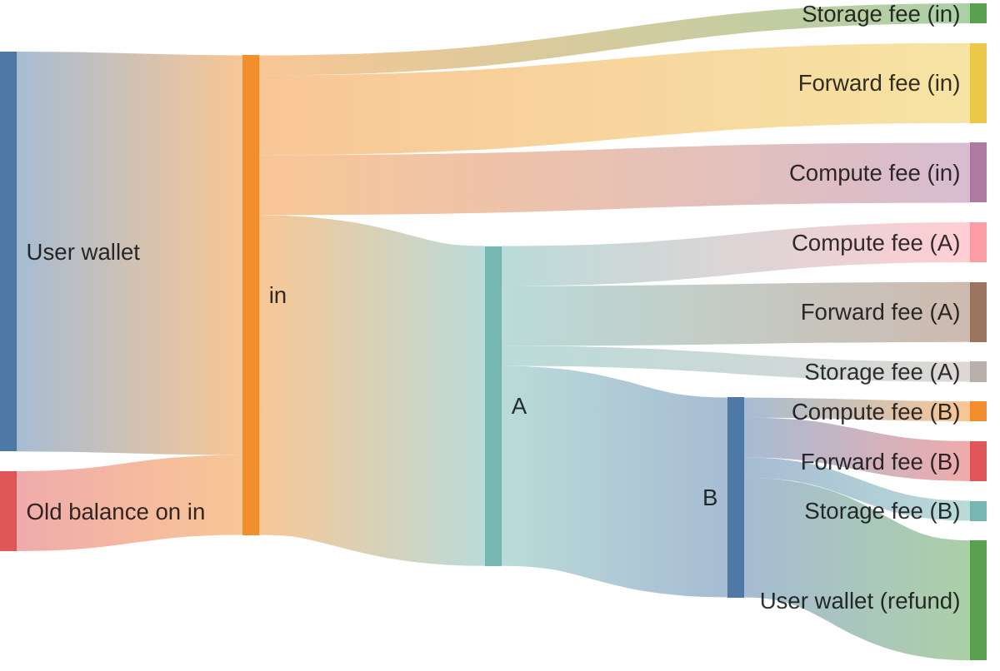

import {Aside} from "/snippets/aside.jsx";

Let's call contracts, that receives user's message **in** contracts. Other contracts in contract system are called **internal** contracts. That is not global terminology, just local to the current article.

So, on this diagram of toncoins flow **A** and **B** are **internal** contracts.



It is crucial to understand, that there is no separate message balance and contract balance. After the message is received, coins are added to contract balance, and then the contract is executed.

<Aside type="note">
  Any contract system includes entry contracts that receive messages directly from users. These contracts must verify that the attached TON is sufficient to cover fees for all contracts in the subsequent trace. If an entry contract accepts a user message—by “accept” we do not mean calling `accept_message()`, but semantic acceptance (no throw and no asset returns)—it must guarantee that the message will not later fail due to insufficient attached TON.
</Aside>

The reason for this requirement is that reverting the contract system state is usually not possible, because the toncoins are already spent.

In case you are writing a contract system, where correctness depends on successful execution of the rest of the transaction trace, then you need to guarantee that there are enough attached toncoins in an incoming message to cover all fees. This article describes how to compute those fees.

Define variables for limits and initialize them with zero. We will raise them further to actual values.

Use descriptive names indicating the operation and contract.
We recommend creating a dedicated constants file.

```tact
const GasSwapRequest: Int = 0;
```

Run tests covering all execution paths. If you miss a path, it might be the most expensive.
Extract resource consumption from `send()` method return value. The sections below describe ways to compute consumption of different kinds of resources.
Use `expect(extractedValue).toBeLessThanOrEqual(hardcodedConstant)` to verify that the hardcoded limit is not exceeded.

```typescript
import {findTransactionRequired} from "@ton/test-utils";

const result = await contract.send(...);
const vaultTx = findTransactionRequired(result.transactions, {
    on: contract.address,
    op: 0x12345678,
});
expect(getGas(vaultTx)).toBeLessThanOrEqual(GasSwapRequest);
```

On the first run, use an error message to set the constant to the actual value used.

```text
expect(received).toBeLessThanOrEqual(expected)

Expected: <= 0n
Received:    11578n
```

```tact
const GasSwapRequest: Int = 12000;
```

### Compute fees

There are two kinds of values: gas units and toncoins.

The price of contract execution is fixed in gas units. However, the price of the gas itself is determined by the blockchain configuration.

One can convert to toncoins in the contract code using current blockchain config parameters:

```tact
let fee = getComputeFee(hardcodedGasValue, isAccountInMasterchain);
```

This function uses the [`GETGASFEE`](/tvm/instructions#f836-getgasfee) TVM opcode.

### Forward fees

In general, you can calculate message size at runtime using `computeDataSize()` which uses [`CDATASIZE`](/tvm/instructions#f941-cdatasize):
And then, calculate forward fee using `getForwardFee()` which uses [`GETFORWARDFEE`](/tvm/instructions#f838-getforwardfee)

ComputeDataSize have the second argument - maximum number of cells to visit. If it is ok to set in in _8192_ since it is the [limit for message size](/ton/limits#message-and-transaction-limits).

```tact
let size = computeDataSize(msg.toCell(), 8192);
let fwdFee = getForwardFee(size.cells, size.bits, isAccountInMasterchain);
```

<Warning>
  `computeDataSize()` function consumes large, unpredictable amount of gas. If at all it is possible to precompute the size, it is recommended to do so.
</Warning>

### Optimized forward fee calculation

If the size of the outgoing message is bounded by the size of the incoming message, we can estimate the forward fee of an outgoing message to be no larger than the forward fee of the incoming message, that was already computed by TVM. Thus, we don't have to calculate it again. Note, that this estimation is correct only for contract system in the same workchain.

```tolk
fun onInternalMessage(in: InMessage) {
    val fwdFee = in.originalForwardFee;
    // ...
}
```

### Additional forward fee calculation

Forward fee is calculated using such formula

```
fwdFee = basePrice + priceForCells * cells + priceForBits * bits
```

So, when one want to send message, with `a + b` cells and `x + y` bits, the forward fee won't be `getForwardFee(a + b, x + y)`, but rather `basePrice + priceForCells * (a + b) + priceForBits * (x + y)`.

For this case, we can use `getSimpleForwardFee()` which uses [`GETSIMPLEFORWARDFEE`](/tvm/instructions#f839-getsimpleforwardfee). This function does not add basePrice (called `lump_price` in config) into account.

So the price of sending message with `a + b` cells and `x + y` bits is `getForwardFee(a, x) + getSimpleForwardFee(b, y)`.

For example, when deploying contracts as part of the operation:

```tact
deploy(DeployParameters{
    init: initOf TargetContract(params),
    value: 0,
    mode: SendRemainingBalance,
    body: msg.toCell(),
});
```

The `init` field adds significant message size. Calculate forward fees using actual cell and bit counts, summing the base message and the `StateInit`: `getForwardFee(msgCells, msgBits) + getSimpleForwardFee(stateInitCells, stateInitBits)`.

### Complex forward fee calculation

Sometimes, out message is larger than the input one. In that cases combined approach can be used.

```tolk
fun onInternalMessage(in: InMessage) {
    val origFwdFee = in.originalForwardFee;
    // Out message will consist of fields from in message, plus some extra fields.
    // We can estimate forward fee for out message using forward fee for in message.
    let additionalFwdFee = getSimpleForwardFee(additionalFieldsSize.cells, additionalFieldsSize.bits, isAccountInMasterchain);
    let totalFwdFee = origFwdFee + additionalFwdFee;
    // Remember to multiply those by the number of hops in the trace.
}
```

### Storage fees

<Aside>
  For calculating storage fees, you need to know the maximum possible size of the contract in `cells` and `bits`. This might not be the trivial task, especially if the contract is storing a `hashmap` in the data. In any case, the approach is the same here. Write test, that will occupy maximum possible size and calculate that. [Helper function for this](#helper-functions)
</Aside>

We cannot predict storage fees that we have to pay for sending messages because it depends on how long the target contract didn't pay storage fee.
Storage fees are different from forward and compute fees in that term, they should be handled in **in** contracts and in **internal** contracts.

Two distinct approaches exist:

**Approach 1: Maintain a positive reserve**

Always keep a minimum balance on the all contracts in your system. Storage fees deduct from this reserve, which replenishes with each user interaction.
Do not hardcode TON; instead, hardcode the maximum possible contract size in cells and bits.

Note, this is supposed to be the code in **internal** contracts.

```tact
const secondsInFiveYears: Int = 5 * 365 * 24 * 60 * 60;
receive(msg: Transfer) {
    let minTonsForStorage: Int = getStorageFee(maxCells, maxBits, secondsInFiveYears, isAccountInMasterchain);
    nativeReserve(max(oldBalance, minTonsForStorage), ReserveAtMost);
    // Process operation with remaining value...
}
// Also this contract probably will require some code, that will allow owner to withdraw TONs from this contract.
```

In this approach, **in** contract should calculate maximum possible storage fees for all contracts in trace.

```
const secondsInFiveYears: Int = 5 * 365 * 24 * 60 * 60;
receive(msg: UserIn) {
    // Suppose trace will be *in* -> *A* -> *B*
    let storageForA = getStorageFee(maxCellsInA, maxBitsInA, secondsInFiveYears, isAccountInMasterchain);
    let storageForB = getStorageFee(maxCellsInB, maxBitsInB, secondsInFiveYears, isAccountInMasterchain);
    let totalStorageFees = storageForA + storageForB;
    let otherFees = ...;
    require(messageValue() >= totalStorageFees + otherFees, "Not enough toncoins");
}
```

<Aside
  type="caution"
>
  Verify the hardcoded contract size in tests.
</Aside>

**Approach 2: Cover storage on demand**

In the worst case the storage fee for a single message is [`freeze_due_limit`](/ton/config#param-20-and-21%3A-gas-prices). Otherwise, the contract likely is already frozen and a transaction chain is likely to fail anyway.

So if we reserve storage debt from incoming messages. Allow the balance to remain at zero or with small debt.

Note, this is supposed to be the code in the **internal** contracts.

```tact
receive(msg: Operation) {
    // Reserve original balance plus any storage debt
    nativeReserve(myStorageDue(), ReserveAddOriginalBalance | ReserveExact);

    // Send remaining value onward
    send(SendParameters{
        value: 0,
        mode: SendRemainingBalance,
        // ...
    });
}
```

This simplifies fee calculation at the start of the operation—you do not need to pre‑calculate storage fees. The `myStorageDue()` function returns the amount needed to bring the balance to zero (or zero if it is already positive).

<Aside type="tip">
  If the incoming message is non‑bounceable, storage fees are deducted from the incoming message’s balance before processing. For bounceable messages, storage fees are deducted from the contract’s balance. So, if all messages to **internal** contracts are unbounceable, and you use this, there is no need to reserve toncoins for storage in **internal** contracts.
</Aside>

If we expect that the rest of trace uses `n` unique contracts, then it won't take more than `n` freeze limits to pay their storage fees. So, in **in** contract, the check should be:

```tact
receive(msg: Operation) {
    // The trace is still *in* -> *A* -> *B*
    let freezeLimit = getFreezeLimit(isAccountsInMasterchain);
    let otherFees = ...;
    // n equals 3 because *in* -> *A* -> *B*
    require(messageValue() >= freezeLimit * 3 + otherFees, "Not enough toncoins");
}
```

For contracts using this approach, confirm there is no excess accumulation:

```typescript
it("should not accumulate excess balance", async () => {
    await pool.sendSwap(amount);

    const balance = (await blockchain.getContract(pool.address)).balance;
    expect(balance).toEqual(0n);
});
```

This confirms that all incoming value was consumed or forwarded, with none left behind. It helps identify any bugs that cause accumulation of TON on any contract.

## Implement fee validation

So, final code in **in** contract could look like this:

```tact
receive(msg: SwapRequest) {
    let ctx = context();
    let fwdFee = ctx.readForwardFee();

    // Count all messages in the operation chain
    // IMPORTANT: We know that each of messages is less or equal to `SwapRequest`.
    let messageCount = 3;  // *in* -> vault → pool → vault

    // Calculate minimum required
    let minFees =
        messageCount * fwdFee +
        getComputeFee(GasSwapRequest, isInMasterchain) + // Operation in first vault
        getComputeFee(GasPoolSwap, isInMasterchain) + // Operation in pool
        getComputeFee(GasVaultPayout, isInMasterchain) + // Operation in second vault
        3 * getFreezeLimit();

    require(ctx.value >= msg.amount + minFees, "Insufficient TON attached");

    // Send remaining value for fees...

    // Also, you may need to handle fee on this exact contract, if this contract is supposed not to hold users TONs.
    // You can do that in any of 2 ways
}
```

## Helper functions

Getting gas for transaction in sandbox is quite easy:

```ts
function getComputeGasForTx(tx: Transaction): bigint {
    if (tx.description.type !== "generic") {
        throw new Error("Expected generic transaction");
    }
    if (tx.description.computePhase.type !== "vm") {
        throw new Error("Expected VM compute phase");
    }
    return tx.description.computePhase.gasUsed;
}
```

To calculate the size of a message in cells, use this function:

```ts
const calculateCellsAndBits = (root: Cell, visited: Set<string> = new Set<string>()) => {
    const hash = root.hash().toString("hex")
    if (visited.has(hash)) {
        return {cells: 0, bits: 0}
    }
    visited.add(hash)

    let cells = 1
    let bits = root.bits.length
    for (const ref of root.refs) {
        const childRes = calculateCellsAndBits(ref, visited)
        cells += childRes.cells
        bits += childRes.bits
    }
    return {cells, bits, visited}
}
```

To extract a contract’s size in tests, use this function:

```ts
export async function getStateSizeForAccount(
    blockchain: Blockchain,
    address: Address,
): Promise<{cells: number; bits: number}> {
    const accountState = (await blockchain.getContract(address)).accountState
    if (!accountState || accountState.type !== "active") {
        throw new Error("Account state not found")
    }
    if (!accountState.state.code || !accountState.state.data) {
        throw new Error("Account state code or data not found")
    }
    const accountCode = accountState.state.code
    const accountData = accountState.state.data
    // Code and data likely do not share cells
    const codeSize = calculateCellsAndBits(accountCode)
    const dataSize = calculateCellsAndBits(accountData, codeSize.visited)

    return {
        cells: codeSize.cells + dataSize.cells,
        bits: codeSize.bits + dataSize.bits,
    }
}
```

Remember to verify your message-size constants across all possible paths in tests. Otherwise, your gas estimates might be wrong.

## See also

- [Phases and fees](/ton/phases-and-fees) — TON fee structure and components
- [TVM instructions](/tvm/instructions) — Reference for `GETGASFEE`, `GETFORWARDFEE`, `CDATASIZE`
