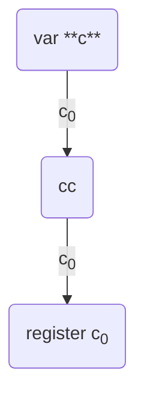

[Continuation](https://en.wikipedia.org/wiki/Continuation) is a value that contains executable code. Continuations are used whenever non-linear code execution is required:

- conditions
- loops
- function calls
- throwing and catching exceptions

Continuation can be thought as "pointer to a code", with an important distinction that, unlike pointers on other machines, it's not a number.

## Ordinary continuation

The most common kind of continuations are the ordinary continuations, which are just code Slices, containing (the remainder of) TVM bitcode. Optionally, it can contain any of the additional parameters:

- **Stack**. A list of values that will be pushed on stack before continuation is executed.
- **Savelist**. A list of values for registers before continuation is executed.
- **Codepage**. Bitcode version used to run this continuation.
- **Number of arguments (`nargs`)**. Number of values from call-side stack to push onto new stack before continuation is executed.

## Control flow

### Jumps

The simplest way to change `cc` is to use [`JMPREF`](/tvm/instructions#db3d-jmpref) instruction. It just sets `cc` to the reference operand of `JMPREF` (stack and registers are not affected).

The following rules are applied during the jump:

- Initialize a new stack with the target continuation initial stack
- Move `nargs` elements from the caller stack to the new stack, if the target continuation has `nargs`
- If the target continuation `nargs` is not defined, move all elements from the caller stack to the new stack
- Pop register values from target continuation savelist

Due to the limitation of the `Cell` type, one continuation can contain no more than 1023 bits of bitcode. To execute longer functions, we could pass `JMPREF` as a last instruction, which will continue execution of a function in a new continuation.

```fift Fift
// some instructions
<{
  // next instructions that exceed the 1023-bit limit are placed in a child cell
}> JMPREF
```

To simplify things, TVM has an _implicit jump_ mechanism, which automatically jumps to the next reference of `cc` when there are no more instructions to execute.

### Calls

_Call_ is a special type of jump, which also saves `cc` to `c0`, so the callee can pass execution back to the caller. That is how [`CALLREF`](/tvm/instructions#db3c-callref) works.

```fift Fift
2 PUSHINT
3 PUSHINT
<{
  ADD
}> CALLREF // returns 5
```

After `ADD` is executed, there are no more instructions to execute in `cc`, and also no references for implicit jumps. _Implicit return_ sets `cc` back to `c0`, which was a previous `cc`. Let's look at the _composition_ of continuations which `CALLREF` produces:



During the call, the remaining of the current continuation is saved to `c0`. Also, current `c0` is pushed to the savelist of `cc` to restore its original value after return. If we would call function `f1`, then call `f2` inside `f1` and `f3` inside `f2`, there will be a callstack formed by savelists of continuations: `c0` value inside `f3` can be represented as `(rest of f2) ◦0 (rest of f1) ◦0 (rest of the caller)`. `a ◦i b` is a continuation composition operator, which saves continuation `b` as a c<sub>i</sub> register of continuation `b`, so, we can say that `b` is executed after `a` by register c<sub>i</sub>.

## Extraordinary continuations

### Quit

**TL-B**: `vmc_quit$1000 exit_code:int32 = VmCont`

Exits TVM with `exit_code`. During [initialization of TVM](/tvm/initialization), `c0` is set to `Quit(0)`, and `c1` to `Quit(1)`.

### ExcQuit

**TL-B**: `vmc_quit_exc$1001 = VmCont`

Default exception handler. Terminates TVM with exception code popped from the stack. During [initialization of TVM](/tvm/initialization), `c2` is set to `ExcQuit`.

### PushInt

**TL-B**: `vmc_pushint$1111 value:int32 next:^VmCont = VmCont`

Pushes `value` on the stack and jumps to `next`. This continuation is only used in [`BOOLEVAL`](/tvm/instructions#edf9-booleval) instruction.

### Envelope

**TL-B**: `vmc_envelope$01 cdata:VmControlData next:^VmCont = VmCont`

Updates current VM state with `cdata` and jumps to `next`.

### Repeat

**TL-B**: `vmc_repeat$10100 count:uint63 body:^VmCont after:^VmCont = VmCont`

Executes `body` `count` times, then jumps to `after`. Under the hood, it just sets `body` `c0` to `Repeat(count - 1, body, after)` if `count > 0`, otherwise jumps to `after`. Used in [`REPEAT`](/tvm/instructions#e4-repeat) and variants.

### Again

**TL-B**: `vmc_again$110001 body:^VmCont = VmCont`

Executes `body` infinite times by setting `body` `c0` to `Again(body)`. Used in [`AGAIN`](/tvm/instructions#ea-again) and variants.

### Until

**TL-B**: `vmc_until$110000 body:^VmCont after:^VmCont = VmCont`

Pops bool from stack, jumps to `body` with `c0 = Until(body, after)` if bool is `false`, otherwise jumps to `after`. Used in [`UNTIL`](/tvm/instructions#e6-until) and variants.

### WhileCondition

**TL-B**: `vmc_while_cond$110010 cond:^VmCont body:^VmCont after:^VmCont = VmCont`

Represents a branching point of a while loop. Pops a bool from the stack, jumps to `body` with `c0 = WhileBody(cond, body, after)` if the bool is `true`, otherwise jumps to `after`. Used in [`WHILE`](/tvm/instructions#e8-while) and variants.

### WhileBody

**TL-B**: `vmc_while_body$110011 cond:^VmCont body:^VmCont after:^VmCont = VmCont`

Represents a delayed iteration of a while loop. Jumps to `cond` with `c0 = WhileCondition(cond, body, after)`. It is assumed that the evaluation of `cond` leaves a bool at the top of the stack for the following `WhileCondition` to check. Used in [`WHILE`](/tvm/instructions#e8-while) and variants.
